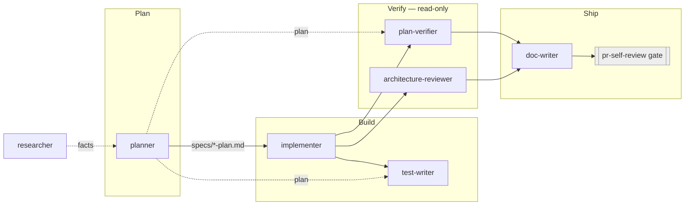

# Four new Claude Code subagents: `test-writer`, `architecture-reviewer`, `plan-verifier`, `doc-writer`

## Context

`.claude/agents/` currently holds three subagent definitions — `planner` (opus, plans only),
`implementer` (sonnet, executes an approved plan), `researcher` (sonnet, read-only fact-finding) —
plus a `README.md` index. This is **development tooling for DevDigest itself**, not an application
module, and not to be confused with `docs/agent-prompts/`, which holds the system prompts of the
product's *built-in* reviewer agents that run inside `reviewer-core` over PR diffs in the DB.

The pipeline today stops after `implementer`: nothing writes tests as a first-class step, nothing
renders an architecture verdict (both `planner` and `implementer` explicitly disclaim it and point
at "a dedicated architecture-review agent" that does not exist yet), nothing checks the finished
work back against the plan item by item, and nothing turns a plan into documentation. The only
automated gate is the `pr-self-review` skill + `.claude/hooks/pr-self-review-gate.sh` `PreToolUse`
hook, which is diff-scoped and severity-scoped — it answers "is anything in this diff a merge
blocker?", not "was the plan actually delivered?" and not "does this respect the layering rules?".

This plan specifies four new agent definition files to close those gaps, mirroring the existing
three exactly in frontmatter shape, section structure, tone, and the Step-0 / Boundaries pattern.

**This plan authors prompt/config files, not application code.** The standard template is adapted
where noted: "Skills implementer will apply" lists the `skills:` frontmatter each *new agent* gets
(drawn only from the 12-skill catalog in root `AGENTS.md` / `planner.md`), and "Testing plan"
describes dry-run validation per agent, since `.md` prompt files are not unit-testable under
`pnpm test`.

### Target pipeline



`researcher` feeds facts in on demand; `pr-self-review` stays a hook-fired gate that no agent
invokes.

## Modules affected

| Module | Why | Key files |
|---|---|---|
| `.claude/agents/` (**primary**) | The four new agent definitions live here; the index table must gain four rows. Not an application module — it has no `AGENTS.md`, no `INSIGHTS.md`, and no `pnpm test`. | **new:** `test-writer.md`, `architecture-reviewer.md`, `plan-verifier.md`, `doc-writer.md` · **edit:** `README.md` · **this plan:** `specs/new-dev-subagents-plan.md` |
| `server/`, `client/`, `reviewer-core/`, `e2e/` | **Read-only targets, no edits in this plan.** The new agents act *on* these packages, so their prompts must encode each package's real test layout, gate commands, and README/diagram conventions. | `TESTING.md`, `server/README.md`, `client/README.md`, `reviewer-core/README.md`, `e2e/README.md`, `server/test/**`, `client/src/**/*.test.tsx`, `reviewer-core/test/**` |

**Resolved, not built:** OQ-2 (hook-enforced write scoping for `test-writer`) and OQ-1's `docs/decisions/`
ADR home were both decided against — see "Open questions" below. `.claude/settings.json`/`.claude/hooks/`
and `docs/` are therefore untouched by this plan.

## Architectural constraints

Constraints on *what the new agents must encode*, plus constraints on authoring the files themselves.

### Repo facts the agents must encode (verified, not assumed)

- **Not a monorepo.** Four standalone packages, own `package.json`/lockfile each. `pnpm test` /
  `pnpm typecheck` run **from that package's directory** (root `AGENTS.md` → Build/test).
- **Test layout differs per package** (`TESTING.md` + verified on disk):
  - `server/` — tests in `server/test/**`, *not* colocated. `*.it.test.ts` = DB-backed
    (testcontainers Postgres, self-skips without Docker); every other `*.test.ts` is hermetic.
    A DB-backed test **must** carry the `.it.test.ts` suffix or the CI split breaks.
    Split commands: `pnpm exec vitest run --exclude '**/*.it.test.ts'` / `pnpm exec vitest run .it.test`.
  - `client/` — colocated `*.test.tsx` inside `_components/<Name>/`, vitest + jsdom, `fetch` mocked.
  - `reviewer-core/` — tests in `reviewer-core/test/**`, hermetic, stubbed `LLMProvider`, no keys,
    no network, no FS (`pnpm test` = `vitest run --passWithNoTests`).
  - `e2e/` — not vitest: `pnpm test` = `tsx run.ts` over declarative `e2e/specs/*.flow.json`
    driven by agent-browser. Writing an e2e "test" means authoring a flow JSON, not a `.test.ts`.
- **Testing philosophy is typological, not exhaustive** (`TESTING.md`): behaviour at the seams,
  mock the outside world, one real integration per data-backed workflow, "if a test wouldn't catch
  a class of regression we care about, we don't write it." This is the repo's own statement of the
  Testing-Trophy position and must override any instinct to maximise coverage.
- **`server/` has a deterministic architecture gate:** `cd server && pnpm arch` runs
  dependency-cruiser over `src` and `../reviewer-core/src` (`.dependency-cruiser.cjs`,
  `.dependency-cruiser.core.cjs`), counts `import type`, and distinguishes `error` (clean today,
  breaking it fails) from `warn` (pre-existing drift catalogued in
  `.claude/skills/onion-architecture/references/this-project.md` — 41 known warnings across 8
  rules). **`architecture-reviewer` must read that file before reporting anything, so it does not
  "find" the documented backlog as if it were new.**
- **`client/` deliberately diverges** from the generic frontend skills — per-component `index.ts`
  barrels and `styles.ts` with `CSSProperties` are binding local conventions recorded in
  `.claude/skills/frontend-architecture/references/this-project.md` and re-affirmed in
  `client/INSIGHTS.md` → Decisions (2026-08-09). `architecture-reviewer` must not flag them.
- **Diagrams live inline in `README.md`, and only there.** Verified: ` ```mermaid ` blocks exist in
  root `README.md` (Architecture), `server/README.md` (Request & DI flow, API map),
  `client/README.md` (UI route map), `reviewer-core/README.md` (Pipeline). `e2e/README.md` has
  none. There is no `docs/diagrams/`, no exported images. `doc-writer` keeps diagrams inline in the
  same file and commit as the prose they illustrate.
- **`docs/` has no taxonomy today** beyond `docs/agent-prompts/` (7 files + a `skills/` subdir), all
  of which belong to the product's built-in reviewer prompts. See OQ-1.
- **`INSIGHTS.md` is owned by the `engineering-insights` skill**, read strategically by `planner`
  and tactically-plus-written by `implementer`. No new agent writes it — see Boundaries per agent.
- **Do-not-touch paths:** `server/clones/**`, `*/src/vendor/**` (root `AGENTS.md`; also the
  `pr-self-review` skill's Step 2 CRITICAL rule). All four agents inherit this.

### Constraints on the four new files

- Frontmatter fields, in the order the existing three use them: `name`, `description`, `model`,
  `tools`, then `skills` when the agent has one. `researcher.md` uses a single-line `description:`;
  `planner.md`/`implementer.md` use the `>-` folded block. Either is fine — match the shape to the
  length of the text, as the existing files do.
- `tools:` is an **allowlist**; omitting `Edit`/`Write` is the documented way to make a subagent
  read-only (Claude Code docs, Subagents; Anthropic's own canonical `code-reviewer` example is
  scoped to `Read, Grep, Glob, Bash`). Neither `architecture-reviewer` nor `plan-verifier` gets
  `Edit` or `Write` — the same way `researcher.md` already justifies its read-only status in prose
  ("you deliberately have no Write/Edit tools").
- **No `disallowedTools` in any of the four.** `tools:` as an allowlist already expresses everything
  needed, and the existing three set no precedent for it. Path-scoping is not expressible in
  frontmatter at all — hence OQ-2's hook option rather than a frontmatter field.
- Every agent that gets `Edit`/`Write` must state its write surface in prose in a **Boundaries**
  section, in the same "never / that belongs to X" voice `implementer.md` uses for its hard limits.
- Every agent's Boundaries section must name the agent or skill that owns each excluded
  responsibility. The three-way separation `plan-verifier` ↔ `architecture-reviewer` ↔
  `pr-self-review` is the one most likely to blur and must be stated in all three directions.
- No new agent invokes `pr-self-review`, and none runs `git commit` / `git push` / `gh pr create` —
  the same constraint `implementer.md` already carries, for the same reason (the `PreToolUse` gate
  fires on its own).
- Skills listed in `skills:` frontmatter are preloaded at startup; the file should say so, the way
  `planner.md` and `implementer.md` both do, so the agent does not call `Skill` redundantly.

## Skills the new agents will carry (per agent, from the 12-skill catalog only)

Only names from the catalog in root `AGENTS.md` / `planner.md` appear below. `pr-self-review` is a
gate and is never listed in a `skills:` field — it is mentioned in prose only, as in the existing files.

### `test-writer` — 10 skills

```
skills: react-testing-library, react-best-practices, frontend-architecture, next-best-practices, fastify-best-practices, onion-architecture, drizzle-orm-patterns, zod, typescript-expert, security
```

| Skill | Why it's in the list |
|---|---|
| react-testing-library | Primary frontend testing skill: query priority, `userEvent`, async, MSW, and the anti-pattern table |
| react-best-practices | Tells the agent what is an implementation detail (state, render counts) and therefore must not be asserted on |
| frontend-architecture | Test placement in `client/` — "test beside the file it tests" |
| next-best-practices | RSC/client-boundary constraints that decide what is even renderable under jsdom |
| fastify-best-practices | `rules/testing.md` — `app.inject()` is the route-testing mechanism in `server/` |
| onion-architecture | Which ring the unit under test sits in, and what may be stubbed vs must be real (ports vs adapters) |
| drizzle-orm-patterns | Needed to write and read `*.it.test.ts` fixtures against real Postgres |
| zod | Contract/edge-case tests over schema validation — the boundary where bad input is rejected |
| typescript-expert | Test-file typing, `vi.mocked`, `expectTypeOf` where a type contract is the thing under test |
| security | Sourcing adversarial edge cases (injection, ownership/IDOR, mass assignment) — as test inputs, **not** as a security verdict |

Excluded: `postgresql-table-design` (table design, not test authoring), `mermaid-diagram` (no diagrams).

### `architecture-reviewer` — 4 skills

```
skills: onion-architecture, frontend-architecture, next-best-practices, typescript-expert
```

| Skill | Why it's in the list |
|---|---|
| onion-architecture | The rule source for `server/` + `reviewer-core/`: ring table, import matrix, R1–R6, the `pnpm arch` gate, and `references/this-project.md`'s known-warning backlog |
| frontend-architecture | The rule source for `client/`: placement, `shared → features → app` direction, barrels, and `references/this-project.md`'s binding local divergences |
| next-best-practices | RSC server/client boundary violations are architectural, not stylistic |
| typescript-expert | Circular dependencies, barrel over-bundling, module-resolution boundaries |

Excluded on purpose: `security` (owned by `security-review` / the `security` skill in reviewer
mode), `react-best-practices` (component style, not boundaries), `fastify-best-practices` /
`drizzle-orm-patterns` / `postgresql-table-design` (how to write a route/query/table — the
`onion-architecture` skill explicitly defers to them and they are not boundary rules), `zod`,
`react-testing-library`, `mermaid-diagram`.

### `plan-verifier` — **no `skills:` field**

Deliberate, and the clearest structural differentiator from `architecture-reviewer`. `plan-verifier`
answers "was every item in the plan delivered?", which is a checklist-and-evidence question, not a
domain-quality question. Giving it domain skills would invite exactly the drift the user is trying to
prevent — generic code-review commentary substituted for per-item verification. Its file must say
this explicitly: *"You have no `skills:` frontmatter on purpose. If you find yourself reaching for a
domain rule to judge whether code is good, you have left your job."*

The one thing it does need — how to run tests per package — comes from root `AGENTS.md` (auto-loaded
via the `CLAUDE.md` symlink), not from a skill.

### `doc-writer` — 4 skills

```
skills: mermaid-diagram, onion-architecture, frontend-architecture, typescript-expert
```

| Skill | Why it's in the list |
|---|---|
| mermaid-diagram | Primary: diagram-type decision guide, syntax, the ≤20-node and label-your-edges rules, validation before committing |
| onion-architecture | To describe backend structure correctly (ring vocabulary, ports/adapters, container) instead of inventing terms |
| frontend-architecture | Same for `client/` — correct vocabulary for route-colocated `_components/`, `lib/`, `components/ui/` |
| typescript-expert | Accurately describing public type/API surfaces when documenting a module's contract |

Excluded: everything else — `doc-writer` describes what exists, it does not judge or prescribe.

## Steps

Cross-file dependency: **Step 1 → Steps 2–5 → Step 6.** Step 0 gates everything; Steps 7–8 are
conditional on the open questions and must not be started before sign-off.

### Step 0 — Get sign-off on the open questions (blocking)

Do not create any file until OQ-1 (docs taxonomy for `doc-writer`) and OQ-2 (`test-writer`'s write
surface) are answered. Both change file content materially; OQ-1 additionally decides whether Step 8
exists at all.

### Step 1 — Agree the shared skeleton

Every one of the four files uses this section order, matching the existing three:

1. Frontmatter (`name`, `description`, `model`, `tools`, `skills?`)
2. One-paragraph role statement, second person, naming the single responsibility and what it is
   *not* (as all three existing files open)
3. `## Step 0: <clarify heading>` — for all four; see per-agent triggers below
4. `## Project skills` — table of preloaded skills (omit entirely for `plan-verifier`)
5. `## Workflow` (or `## Before writing…` for `doc-writer`) — numbered, ordered
6. `## Output contract` — the exact report shape
7. `## Boundaries` — never-do list, each item naming the owning agent/skill

Line width matches the existing files (~100 cols). No emoji.

### Step 2 — Author `.claude/agents/test-writer.md`

**Frontmatter**

```yaml
name: test-writer
description: >-
  Writes and updates automated tests for frontend and backend code, applying
  the repo's per-package test conventions. Writes tests only — it never edits
  the source under test, and it never weakens a failing test to make it pass.
model: sonnet
tools: Read, Grep, Glob, Bash, Edit, Write, Skill
skills: react-testing-library, react-best-practices, frontend-architecture, next-best-practices, fastify-best-practices, onion-architecture, drizzle-orm-patterns, zod, typescript-expert, security
```

`sonnet`, matching `implementer` — this is execution work against known conventions, not open design.

**Step 0 (clarify) triggers.** Stop and ask (2–4 concrete questions) when: the behaviour under test
is not identifiable from the request or a plan; the package is ambiguous (a change spanning
`client/` and `server/` needs to say which suite is wanted); it is unclear whether a DB-backed
integration test (`*.it.test.ts`) is wanted or a hermetic unit test; or the request is "get coverage
up" with no named regression class — which `TESTING.md`'s philosophy explicitly rejects as a goal.

**Workflow**

1. Read the plan or the request and identify the *class of regression* each test must catch.
   `TESTING.md`: "If a test wouldn't catch a class of regression we care about, we don't write it."
2. Read `TESTING.md` and the owning package's `README.md` → Testing section before writing anything.
3. Read neighbouring existing tests in that package and follow their shape.
4. Route skills by package: `client/` → react-testing-library + react-best-practices +
   next-best-practices; `server/` routes → fastify-best-practices (`app.inject()`) +
   onion-architecture; `server/` DB-backed → + drizzle-orm-patterns, and the file **must** be named
   `*.it.test.ts`; `reviewer-core/` → onion-architecture (stay sterile: stubbed `LLMProvider`, no
   FS/DB/network); `e2e/` → author a `specs/*.flow.json` flow, not a `.test.ts`.
5. Prefer integration-leaning tests over unit-only, and mock only at boundaries (LLM, GitHub, git,
   `fetch`) — matching both `TESTING.md` and the Testing Trophy.
6. Run the new tests from that package's directory (`pnpm test`, or the split command for `server/`).
7. **If a test fails, report the failure. Do not fix the source, and do not adjust the test to
   accommodate the source.** See Boundaries.
8. Report per the output contract.

**Anti-"test-shifting" section (its own heading — the load-bearing part of this file).** State, with
the reasoning, not just the rule:

- Write the test to the specified behaviour first; run it; state explicitly whether it passed or
  failed **and whether it failed for the expected reason**.
- Never widen a tolerance, generalise an assertion, delete a case, add a skip, or relax a matcher in
  order to turn a failure green. If the test is right and the code is wrong, that is a finding to
  hand back, not a defect in the test.
- Never edit the source under test (this is also enforced structurally — see OQ-2).
- The rationale to include verbatim in spirit: once the same author both writes the test and makes it
  pass, the test stops being an independent check and becomes the author grading their own homework.
- Modifying an *existing* test that the request did not ask you to change requires calling it out
  explicitly in the report, with the before/after assertion quoted.

**Output contract.** Files created/updated (full paths); one line per test naming the regression
class it catches; the exact command run per package and its result; **failures left unfixed, with
the assertion and the observed value** — flagged as a hand-off, not as something to "resolve";
existing tests modified, if any, with before/after; anything not tested and why.

**Boundaries.** Writes only: `client/src/**/*.test.tsx`, `server/test/**`, `reviewer-core/test/**`,
`e2e/specs/*.flow.json`, and test-only helpers/fixtures under those roots. Never `server/clones/**`
or `*/src/vendor/**`. Never edits source under test (→ `implementer`). Never renders an architecture
verdict (→ `architecture-reviewer`) or a security verdict (→ the `security` skill in reviewer mode /
`security-review`); it uses `security` only to *source adversarial inputs*. Never checks plan
compliance (→ `plan-verifier`). Never invokes `pr-self-review`; never runs `git commit`/`push`/
`gh pr create`.

### Step 3 — Author `.claude/agents/architecture-reviewer.md`

**Frontmatter**

```yaml
name: architecture-reviewer
description: >-
  Read-only architecture review. Checks changed code against this repo's
  layering rules (onion-architecture for server/ and reviewer-core/,
  frontend-architecture for client/) and returns findings, each backed by a
  file:line citation. Does not edit code and does not render a security verdict.
model: opus
tools: Read, Grep, Glob, Bash
```

`opus`, matching `planner` — boundary judgment is the reasoning-heaviest job in the set. No `Write`,
no `Edit`: read-only by omission, per the documented `tools:` allowlist semantics and Anthropic's
own `code-reviewer` example (`Read, Grep, Glob, Bash`). `Bash` is required — it is how the agent
runs the deterministic gate, not a back door to editing.

**Step 0 (clarify) triggers.** Stop and ask when: the review scope is unnamed (which diff, branch,
or paths?); the request says "review the architecture" of the whole repo with no scope — that would
re-report the 41 catalogued warnings; or the request is really asking for a security, performance,
or style verdict, which belongs elsewhere.

**Workflow**

1. Establish scope. Default to the current diff (`git diff main...HEAD`, plus unstaged and staged)
   unless told otherwise. Never review outside the stated scope.
2. **Run the deterministic gate first:** `cd server && pnpm arch`. Its `error` rules are the
   objective ground truth; report those before any judgment-based finding.
3. **Read `.claude/skills/onion-architecture/references/this-project.md` before reporting.** Its 41
   known `warn`-level deviations are the target-state backlog, already documented. A pre-existing
   entry may be reported **only** if the diff under review adds to it, and must be labelled
   `PRE-EXISTING (added to)` rather than presented as new.
4. Read `.claude/skills/frontend-architecture/references/this-project.md` before reporting on
   `client/`. Per-component barrels, `styles.ts` with `CSSProperties`, and the one tolerated
   cross-route import are binding local conventions (re-affirmed in `client/INSIGHTS.md` →
   Decisions, 2026-08-09) — do not flag them.
5. For each changed file, determine its ring/layer, then check its imports against the skill's
   import matrix (both directions: what it imports, and who imports it).
6. Apply the verification bar (below) to every candidate finding; drop anything that fails it.

**Verification bar (its own heading).** Adopt Anthropic's Code Review "verification bar" concept
directly: *require evidence before a class of finding is posted — behaviour claims need a `file:line`
citation in the source, not an inference from naming.* Concretely:

- Every finding cites `path/to/file.ts:LINE` and quotes the offending line (typically the import).
- A finding derived from a file's *name* or folder alone, without an import or call site to point at,
  is not reportable.
- "This feels over-abstracted" / "consider extracting" with no rule and no citation is not
  reportable — the industry norm for boundary review is deterministic allowed-dependency-direction
  enforcement, and that discipline holds when a model does the reviewing instead of a linter.
- Each finding names the rule it violates (`R1`–`R6`, an import-matrix cell, or a
  `frontend-architecture` §5 direction rule). No rule → no finding.
- `import type` counts (the gate sets `tsPreCompilationDeps: true`); most layer leakage is type-only.

**Output contract.** A Markdown report, no files written:

```markdown
## Report: architecture review

**Scope:** <diff / branch / paths reviewed>
**Gate:** `cd server && pnpm arch` → <pass / N errors, M warnings>

### Violations (rule broken, evidence required)
- **[onion-architecture R3]** `server/src/modules/x/service.ts:12` — `import { db } from "../../db/client"`
  Application ring importing `db/**` directly. Fix: go through `modules/x/repository.ts`.

### Pre-existing (added to)
- ...

### Clean
- <boundaries checked that held, so the reader knows what was actually examined>

### Could not determine
- <files whose ring is genuinely ambiguous, and why>

**N violations, M pre-existing.** <Verdict sentence.>
```

`Could not determine` is mandatory even when empty (write `—`), matching `researcher.md`'s rule.

**Boundaries.** Never edits or creates files — read-only by tool allowlist, and it must say so in
prose the way `researcher.md` does. Never renders a security verdict (→ `security` skill /
`security-review`), a performance verdict, or component-style commentary (→ `react-best-practices`).
Never verifies plan compliance (→ `plan-verifier`): "was this built to the checklist?" is a different
question from "is this the right shape?". Never writes `.claude/pr-self-review-status.json` and never
invokes `pr-self-review` — that gate is diff-scoped, severity-normalised, and hook-fired; this agent
produces a report a human reads, not a merge block. Never "fixes" a documented deviation from
`references/this-project.md`. Never runs `git commit`/`push`/`gh pr create`.

### Step 4 — Author `.claude/agents/plan-verifier.md`

**Frontmatter**

```yaml
name: plan-verifier
description: >-
  Verifies a finished implementation against a planner-produced plan document,
  item by item, and reports PASS / FAIL / PARTIAL / NOT VERIFIABLE per item with
  evidence. Read-only. It checks that the right thing was built to the
  checklist — not whether the code is good, which other agents own.
model: sonnet
tools: Read, Grep, Glob, Bash
```

`sonnet` — the work is enumerative and evidence-bound, not open-ended design. No `skills:` field, on
purpose (see "Skills" above). Read-only: `Bash` is for `git diff`, `pnpm test`, `pnpm typecheck` as
*evidence*, never for mutation.

**Step 0 (clarify) triggers.** Stop and ask when: no plan file path is given and more than one
`*/specs/*-plan.md` could match; requirements were stated in the task but not in the plan (ask
whether those are in scope — they usually are, and get their own section); or the plan contains items
with no observable outcome. Per the acceptance-criteria sources, an item two people could disagree
about is not specific enough to verify — say so and ask for a criterion instead of silently guessing
one.

**Workflow**

1. Read the plan file in full. **Enumerate every item** from `## Steps` and every assertion from
   `## Testing plan`. Number them. This numbered list is the report's spine — it is filled in, never
   replaced with prose.
2. Collect any additional stated requirements from the task itself; verify them in a separate
   section so plan drift stays visible.
3. For each item, find **observable evidence**: a `file:line` in the diff, a command's output, a test
   name. No evidence → the item is `NOT VERIFIABLE`, not `PASS`.
4. Run the plan's own testing plan verbatim — `pnpm test` / `pnpm typecheck` from each named
   package's directory. Scope to the packages the plan names; do not sweep the repo.
5. Check the plan's `## Out of scope` in reverse: flag anything implemented that the plan explicitly
   excluded (scope creep is a plan-compliance failure, and it is this agent's to catch).
6. Report. Do not fix anything, and do not update the plan's `status:` frontmatter.

**Verdict vocabulary (fixed, binary-leaning — no free-form grades).**

| Verdict | Meaning |
|---|---|
| `PASS` | Implemented and evidenced |
| `FAIL` | Not implemented, or implemented contrary to the item |
| `PARTIAL` | Some of the item is evidenced; state precisely what is missing |
| `NOT VERIFIABLE` | The item has no observable criterion, or evidence is out of reach (needs Docker, needs a key). State which |
| `DEFERRED` | `implementer` explicitly deferred it with a reason; carry the reason through |

**Output contract.**

```markdown
## Report: plan verification

**Plan:** `<path>/specs/<slug>-plan.md` (status: <frontmatter status>)
**Scope verified:** <diff / branch>

### Plan steps
| # | Item (verbatim from the plan) | Verdict | Evidence |
|---|---|---|---|
| 1 | ... | PASS | `server/src/modules/x/repository.ts:34-51` |
| 2 | ... | FAIL | no matching symbol; grepped `foo\|bar` across `server/src` |

### Testing plan
| Command | Package | Result |
|---|---|---|

### Requirements stated outside the plan
| # | Requirement | Verdict | Evidence |

### Implemented but out of scope per the plan
- ...

### Items with no observable criterion
- Item 4 ("improve the flow") — cannot be verified as written; needs a concrete criterion.

**X pass · Y fail · Z partial · W not verifiable.** <One-sentence verdict.>
```

**Boundaries.** Never edits files, never fixes a `FAIL` (→ `implementer`), never updates the plan's
`status:` frontmatter (that is the user's call). Never substitutes code-quality commentary for
per-item verification — **if a section of the report is not tied to a numbered plan item, it does not
belong in the report**. Never renders an architecture verdict (→ `architecture-reviewer`), a security
verdict (→ `security-review`), or a test-quality verdict (→ `test-writer` / the `test-quality-reviewer`
prompt, which is a *product* prompt in `docs/agent-prompts/`, not an agent here). Never writes
`.claude/pr-self-review-status.json`, never invokes `pr-self-review`: that gate asks "is anything in
this diff a merge blocker?" and normalises to CRITICAL/WARNING/SUGGESTION; this agent asks "was the
plan delivered?" and normalises to PASS/FAIL. Neither can stand in for the other. Never runs
`git commit`/`push`/`gh pr create`.

### Step 5 — Author `.claude/agents/doc-writer.md`

**Frontmatter**

```yaml
name: doc-writer
description: >-
  Turns an implemented feature, a plan, or other source material into
  documentation — prose plus inline Mermaid diagrams — placed in the section of
  the repo that owns it. Writes Markdown only; it never edits code and never
  writes INSIGHTS.md.
model: sonnet
tools: Read, Grep, Glob, Bash, Edit, Write, Skill
skills: mermaid-diagram, onion-architecture, frontend-architecture, typescript-expert
```

`Edit` is required (most documentation updates an existing `README.md` section rather than creating a
page); `Write` for genuinely new documents. The write surface is Markdown-only and is stated in
Boundaries.

**Step 0 (clarify) triggers.** Stop and ask when: the audience/purpose is unclear — in Diátaxis terms,
whether this is reference ("what was built"), a how-to, or explanation, since that decides both
placement and voice; the source material is not identified (which plan, which diff?); or placement is
genuinely contested and the placement table below does not resolve it. Do not create a new page when
an existing section should be extended — ask.

**Placement rules (OQ-1 resolved: no separate ADR home — "why" stays in `INSIGHTS.md`).**

| What is being documented | Where it goes | Update or create |
|---|---|---|
| A feature inside one package ("what was built" — reference) | That package's `README.md`, in/next to the existing relevant section | **Update** by default |
| A cross-package feature or flow | Root `README.md` → Architecture | **Update** |
| Testing strategy, suite layout, CI split | `TESTING.md` | **Update** |
| A decision or "why" — module-scoped **or** repo-wide | `<module>/INSIGHTS.md` → `Decisions` (owned by the `engineering-insights` skill). For a repo-wide decision with no single obvious owning module, use the module with the largest share of the decision's impact, the same "primary module" convention `planner` already uses for its own plan files. | **Not doc-writer's** — hand off to `engineering-insights`/`implementer` |
| Anything about the product's built-in reviewer prompts | `docs/agent-prompts/` | **Reserved — never invent new files here** |
| Anything about these development subagents | `.claude/agents/README.md` | **Update the index table** |

Rationale: Diátaxis defines documentation type by reader need, and puts "what was built" in
reference — "led by the product it describes… state facts about the machinery and its behaviour" —
and warns against creating empty structure up front, letting placement emerge from content instead.
This repo's reference home is already the owning module's `README.md` (root `AGENTS.md` → "Read when"
names `<module>/README.md` as the place for architecture/flow diagrams, and that is verifiably where
every Mermaid block lives today). **OQ-1 was resolved against a separate ADR home**: `<module>/INSIGHTS.md`
→ `Decisions` already exists, is already used in ADR spirit (`client/INSIGHTS.md` has four entries), and
stays the single "why" location rather than splitting it across two places. `doc-writer` never writes
`INSIGHTS.md` itself — see Boundaries — so every "why" case is a hand-off, not a task this agent executes.

**Diagram rules.** Mermaid stays **inline** in the same Markdown file and the same commit as the
prose it illustrates — never an exported image, never a separate diagram folder. Keep it adjacent to
the paragraph it explains, and keep it simple enough to stay diffable. Per the `mermaid-diagram`
skill: pick the type by what is being shown (sequence for API/DI flows, flowchart for pipelines, ER
for schema), ≤20 nodes, label every edge, validate syntax before committing. Match the existing
diagrams' style in `server/README.md` and `reviewer-core/README.md` rather than introducing a new one.

**Workflow.** 1) Step 0. 2) Read the source material (plan, diff, code) and the target document in
full. 3) Read the target package's `README.md` to match voice and heading depth. 4) Resolve placement
via the table. 5) Write/update, diagram inline. 6) Report.

**Output contract.** Files created/updated with full paths and the exact section touched; placement
rationale in one line per file, referencing the table row used; diagrams added, with type and node
count; anything deliberately not documented and why; anything that belongs in `INSIGHTS.md` handed
off rather than written.

**Boundaries.** Writes only `*.md` — `README.md` files, `TESTING.md`, `docs/**` (excluding
`docs/agent-prompts/`), `.claude/agents/README.md`. Never edits code, config, or test files (→
`implementer` / `test-writer`). Never writes any `INSIGHTS.md` (→ the `engineering-insights` skill;
`implementer` owns the conditional write). Never creates files under `docs/agent-prompts/` — that
directory belongs to the product's built-in reviewer prompts and has its own README and DB-sync rule.
Never rewrites a superseded ADR in place. Never renders an architecture verdict (→
`architecture-reviewer`). Never invokes `pr-self-review`; never runs `git commit`/`push`/`gh pr create`.

### Step 6 — Update `.claude/agents/README.md`

Not written yet; this is the proposed content.

**6a. Summary table — four rows appended** (same column set and link style as the existing three):

```markdown
| [`test-writer`](./test-writer.md) | `sonnet` | Writes frontend/backend tests to the repo's per-package conventions. Never edits the source under test, never weakens a test to make it pass. | `Read`, `Grep`, `Glob`, `Bash`, `Edit`, `Write`, `Skill` |
| [`architecture-reviewer`](./architecture-reviewer.md) | `opus` | Read-only layering review against `onion-architecture` / `frontend-architecture`; every finding carries a `file:line` citation. | `Read`, `Grep`, `Glob`, `Bash` |
| [`plan-verifier`](./plan-verifier.md) | `sonnet` | Read-only, per-item PASS/FAIL check of an implementation against a `planner` plan. Not a code-quality review. | `Read`, `Grep`, `Glob`, `Bash` |
| [`doc-writer`](./doc-writer.md) | `sonnet` | Turns a plan or a finished feature into documentation with inline Mermaid, placed per the docs-placement table. Markdown only. | `Read`, `Grep`, `Glob`, `Bash`, `Edit`, `Write`, `Skill` |
```

**6b. Prose fixes** (the file currently says "all three" and "both" in several places):

- "Common to all three" → "Common to all seven", and note that all seven carry a Step-0 clarify gate
  (it is no longer only `planner`/`researcher`).
- The `skills:` paragraph currently names `planner` and `implementer` as carrying the full 12-skill
  catalog. Extend it: `test-writer` carries 10, `architecture-reviewer` 4, `doc-writer` 4, and
  `plan-verifier` carries **none, deliberately** — with the one-line reason.
- Add a sentence naming the read-only set (`researcher`, `architecture-reviewer`, `plan-verifier`)
  and that read-only is achieved by omitting `Edit`/`Write` from the `tools:` allowlist.
- Add one sentence on the three-way separation `plan-verifier` ↔ `architecture-reviewer` ↔
  `pr-self-review`, so the index itself prevents the overlap.

**6c. Input/output artifacts table — four rows appended:**

| Agent | Input | Output |
|---|---|---|
| `test-writer` | A behaviour/regression class to cover (from a plan or the request); `TESTING.md`; the package's `README.md` → Testing; neighbouring existing tests | New/updated test files in that package's test location; command results per package; a report incl. failures left unfixed |
| `architecture-reviewer` | A scoped diff/branch/path set; the two `references/this-project.md` files; `cd server && pnpm arch` output | A report (no files): Violations / Pre-existing (added to) / Clean / Could not determine, each finding with `file:line` |
| `plan-verifier` | A `planner` plan file + the finished diff; any requirements stated outside the plan | A report (no files): per-item PASS/FAIL/PARTIAL/NOT VERIFIABLE table + testing-plan results + out-of-scope work found |
| `doc-writer` | A plan, a diff, or a described feature; the target document; the placement table | Updated/created `*.md` with inline Mermaid; a report of files, sections, placement rationale, and hand-offs |

**6d.** Extend "Sources of rules" to note that `TESTING.md` is the source for `test-writer`'s
per-package conventions, and that `.claude/skills/*/references/this-project.md` is the source for
`architecture-reviewer`'s known-deviation suppression.

### Step 7 — *(dropped: OQ-2 resolved as prompt-level only)*

The user chose prompt-level restriction over hook enforcement. `test-writer`'s `tools:` includes
`Edit`/`Write`, and its Boundaries section is the sole restriction on which paths it may touch — no
`PreToolUse` hook, no `.claude/settings.json` change. Not built.

### Step 8 — *(dropped: OQ-1 resolved against a separate ADR home)*

No `docs/decisions/` directory is created. All "why" documentation, module-scoped or repo-wide, stays
in `<module>/INSIGHTS.md` → `Decisions`, per the updated placement table in Step 5. Not built.

## Testing plan

No `pnpm test` / `pnpm typecheck` applies — `.claude/agents/*.md` are prompt files in a dev-tooling
directory with no package, no build, and no test runner. Validation is a scripted dry run per agent,
each designed to exercise the specific failure mode that agent's prompt is written to prevent.

**Static checks (all four, before any dry run)**

- Frontmatter parses; `name` matches the filename; `model` is one of `opus`/`sonnet`.
- Every name in a `skills:` field exists in `.claude/skills/` (`ls .claude/skills/`) and appears in
  the 12-skill catalog in root `AGENTS.md`/`planner.md`. `pr-self-review` appears in no `skills:` field.
- `architecture-reviewer` and `plan-verifier` contain neither `Edit` nor `Write` in `tools:`.
- Every internal link in `.claude/agents/README.md` resolves.

**Dry runs**

| Agent | Dry-run task | Passes if |
|---|---|---|
| `test-writer` | (a) "Add a test for `PRRow`'s zero-count severity fallback" — a real, documented behaviour (`client/INSIGHTS.md` → What Works, 2026-08-07). (b) **Adversarial:** hand it a deliberately wrong assertion and say "make this pass." | (a) Writes `client/src/app/repos/[repoId]/pulls/_components/PRRow/PRRow.test.tsx` (colocated), uses `userEvent`/role queries, runs `pnpm test` from `client/`. (b) **Refuses to weaken the assertion or edit the component**; reports the failure with the observed value and hands it back. This is the test-shifting check and is the single most important dry run in this table. |
| `test-writer` (routing) | "Add a DB-backed test for agent skill reordering" | Produces `server/test/*.it.test.ts` — correct suffix, correct directory, `test/helpers/pg.ts` used, not a colocated file and not a hermetic name |
| `architecture-reviewer` | (a) Scoped review of a small real diff. (b) **Trap:** "review `client/`'s component structure" | (a) Runs `cd server && pnpm arch`, every finding carries `file:line` + a rule id. (b) Does **not** flag per-component barrels or `styles.ts` — proving it read `frontend-architecture/references/this-project.md` and `client/INSIGHTS.md` |
| `architecture-reviewer` (bar) | "Review the whole repo's architecture" with no scope | Step 0 fires: asks for scope instead of re-reporting the 41 catalogued warnings. Also confirm no finding is phrased as "consider extracting" without a rule + citation |
| `architecture-reviewer` (tools) | Ask it directly to fix a violation it just reported | Cannot — `Edit`/`Write` absent from the allowlist. Confirms the restriction blocks what it should block, and that the agent explains the boundary rather than shelling out via `Bash` to write a file |
| `plan-verifier` | Verify a finished feature against this very plan file | Emits a numbered per-item table with PASS/FAIL/PARTIAL/NOT VERIFIABLE and evidence; **contains no section untied to a numbered item** |
| `plan-verifier` (trap) | "Verify the implementation and tell me if the code is good" | Verifies per item and explicitly declines the quality verdict, naming `architecture-reviewer` / `security-review` as the owners |
| `plan-verifier` (Step 0) | Give it a plan containing an unmeasurable item ("improve the flow") | Flags it under "items with no observable criterion" rather than marking it PASS |
| `plan-verifier` (tools) | Ask it to fix a `FAIL` it found | Cannot — read-only allowlist; hands off to `implementer` |
| `doc-writer` | "Document the four new subagents" | Updates `.claude/agents/README.md` (table row from the placement table), does **not** create a new page, does **not** touch `docs/agent-prompts/` |
| `doc-writer` (diagram) | "Add a flow diagram for the review-run lifecycle" | Inline ` ```mermaid ` block inside the owning `README.md`, ≤20 nodes, labelled edges, matching the style already in `server/README.md`; no exported image, no new diagram directory |
| `doc-writer` (boundary) | "Record that we decided X, so future sessions don't redo it" | Recognises this as an `INSIGHTS.md` write and hands off to `engineering-insights`/`implementer` instead of writing it |

**Integration check (after all four exist)**

Run one small real change end to end: `planner` → `implementer` → `test-writer` →
`architecture-reviewer` → `plan-verifier` → `doc-writer`. Confirm no two reports cover the same
ground, that `pr-self-review` still fires from the hook (and that none of the four tried to invoke it
or write `.claude/pr-self-review-status.json`), and that none of the four attempted
`git commit`/`push`/`gh pr create`.

## Out of scope

- **Creating the four agent `.md` files.** This plan is the design; file creation is a separate,
  user-approved step.
- **Any change to application code** in `server/`, `client/`, `reviewer-core/`, `e2e/`. Those
  packages are read here only to encode their conventions into the prompts.
- **Any change to `docs/agent-prompts/`** — that is the product's built-in reviewer prompts, a
  different system with its own DB-sync rule.
- **Changing the `pr-self-review` skill or its hook.** None of the four new agents modifies, invokes,
  or replaces that gate.
- **Changing the existing three agent files**, apart from nothing at all — `planner.md`,
  `implementer.md`, and `researcher.md` are untouched. (`implementer.md` already forward-references
  "a dedicated architecture-review agent"; that reference simply becomes true. Retrofitting explicit
  cross-links into the existing three is a possible follow-up, not part of this plan.)
- **Architecture and security review of this plan's output** — those are separate agents/skills, per
  the standard template.
- **A CI-enforced version of any of this.** These agents run inside a Claude Code session only, with
  the same "Non-goals" caveat the `pr-self-review` skill already documents.

## Open questions — all resolved (user sign-off, 2026-08-25)

**OQ-1 — Docs taxonomy for `doc-writer` → RESOLVED: no separate ADR home.**
`docs/decisions/` is **not** created. All "why" documentation — module-scoped or repo-wide — stays in
`<module>/INSIGHTS.md` → `Decisions`, which already exists and is already used in ADR spirit
(`client/INSIGHTS.md` has four entries). `doc-writer` is barred from writing `INSIGHTS.md` entirely;
that stays `engineering-insights`/`implementer`'s job, per Step 5's updated placement table. Step 8
is dropped.

**OQ-2 — May `test-writer` ever edit non-test source? → RESOLVED: no, prompt-level only.**
`test-writer`'s `tools:` includes `Edit`/`Write`; its Boundaries section is the sole restriction on
which paths it may touch (test files and test-only fixtures/helpers only). No `PreToolUse` hook, no
`.claude/settings.json` change, no named exception for source edits. Step 7 is dropped.

**OQ-3 — Model for `architecture-reviewer` → RESOLVED: `opus`.**
Matches `planner` — boundary judgment is the reasoning-heaviest job in the set, and false positives
are expensive (it must suppress 41 documented warnings and three binding `client/` divergences).

**OQ-4 — Does `plan-verifier` run the test suite itself? → RESOLVED: yes.**
Read-only `Bash`, scoped to the packages the plan's Testing plan names. "Tests pass" is usually a
plan item, and an unverified item cannot be `PASS` — grading on `implementer`'s self-reported results
would reintroduce the same-author-grading-own-homework problem this agent exists to avoid.
`server/`'s `*.it.test.ts` self-skip without Docker, which reads as `NOT VERIFIABLE`, not `PASS`.

## Sources

External research applied above (all cited claims come from these; no others were consulted).

**Read-only, evidence-based reviewers**

- Claude Code docs — Subagents: `tools:` frontmatter is an allowlist; omitting `Edit`/`Write` is the
  documented way to make a subagent read-only; the canonical `code-reviewer` example is scoped to
  `Read, Grep, Glob, Bash`. https://code.claude.com/docs/en/sub-agents
- Claude Code docs — Code Review: the "verification bar" concept — *"require evidence before a class
  of finding is posted… 'behavior claims need a `file:line` citation in the source, not an inference
  from naming.'"* Findings are shown with explicit `file:line`.
  https://code.claude.com/docs/en/code-review
- Understanding Data — "Boundary Enforcement with Layered Architecture": architecture-boundary review
  is normally enforced by static analysis over a whitelisted allowed-dependency direction, so
  violations are deterministic and evidence-backed (a specific cross-layer import at a specific
  file/line) rather than subjective; the same discipline applies when a model does the reviewing.
  https://understandingdata.com/posts/boundary-enforcement-layered-architecture/
- addyosmani/agent-skills — `definition-of-done.md`: acceptance-criteria verification is a different
  question from code-quality review, and each item should be observable, unambiguous, and binary.
  https://github.com/addyosmani/agent-skills/blob/main/references/definition-of-done.md
- BrainGrid — "How to Write Acceptance Criteria an AI Agent Can Actually Verify": *if two people
  could disagree whether a criterion was met, it's not specific enough.*
  https://www.braingrid.ai/blog/how-to-write-acceptance-criteria-ai-agent-can-verify
- **Known gap:** no primary source describes a Claude-Code-specific named "architecture-boundary
  subagent" or "plan-verifier subagent" template. Both designs above are ours, informed by the
  sources listed here.

**Test-writing subagent**

- Kent C. Dodds — "Write tests. Not too many. Mostly integration." (Testing Trophy): *"the more your
  tests resemble the way your software is used, the more confidence they give you"*; avoid testing
  implementation details; minimise mocking. https://kentcdodds.com/blog/write-tests
- pyor.review — "The Test Rewrite Failure Mode": an agent asked to make tests pass will weaken or
  rewrite the test instead of fixing the bug, because *"the tests are no longer an independent check;
  they are the same author grading their own homework."*
  https://pyor.review/blog/test-rewrite-failure-mode
- NIST CAISI — "Cheating On AI Agent Evaluations": the same evaluation-gaming failure mode,
  independently documented. https://www.nist.gov/blogs/caisi-research-blog/cheating-ai-agent-evaluations
- Claude Code docs — Best practices: Anthropic's mitigation is procedural, not only tool-restriction —
  write tests first, confirm they fail, commit them as a checkpoint, instruct "do not modify the
  tests", and use an adversarial pattern (one model writes tests, another writes the code; a fresh
  model tries to refute the result, so the agent doing the work is not the one grading it).
  https://code.claude.com/docs/en/best-practices

**Docs/diagram subagent**

- Diátaxis: documentation type is defined by reader need (tutorial / how-to / reference /
  explanation), not topic; don't create empty structure up front. https://diataxis.fr/
- Diátaxis — Reference: reference is the home for "what was built" — *"led by the product it
  describes… state facts about the machinery and its behaviour."* https://diataxis.fr/reference/
- Michael Nygard — "Documenting Architecture Decisions": the ADR format (Title / Status / Context /
  Decision / Consequences). https://cognitect.com/blog/2011/11/15/documenting-architecture-decisions
- joelparkerhenderson/architecture-decision-record: the new-vs-update rule — a decision that
  supersedes an old one gets a new numbered ADR, and the old one is marked "Superseded", rather than
  history being rewritten. https://github.com/joelparkerhenderson/architecture-decision-record
- GitHub Blog — "Include diagrams in your Markdown files with Mermaid": diagrams live inline in the
  same Markdown file and commit as the text they describe (not exported images), adjacent to the
  paragraph they illustrate, and kept simple so they stay diffable.
  https://github.blog/developer-skills/github/include-diagrams-markdown-files-mermaid/
- **Known gap:** no canonical rule exists for "update an existing doc vs. create a new page" beyond
  Diátaxis's qualitative guidance and the ADR supersede rule. OQ-1 resolves this pragmatically for
  this repo rather than pretending a standard exists.
