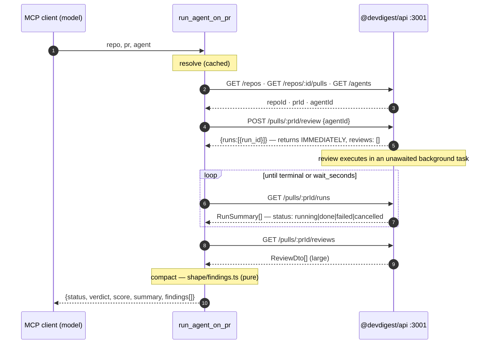

# @devdigest/mcp

A local **MCP (stdio) server** over the running DevDigest API. It is a thin HTTP
client + protocol adapter: five tools that forward to `@devdigest/api` on
`http://localhost:3001`. It owns no data, no Postgres pool, no job runner and no
LLM key — every capability it exposes is already an endpoint on the API.

Design rationale, per-tool detail, and the decisions behind every choice live in
[`specs/mcp-server-plan.md`](./specs/mcp-server-plan.md).

## Precondition: the API must already be running

This server does **not** boot, supervise, or health-gate `@devdigest/api`. Start
it first:

```sh
./scripts/dev.sh
# or: docker compose up -d && cd server && pnpm db:migrate && pnpm dev
```

Confirm with `curl -s localhost:3001/health` → `{"status":"ok"}`. Migrations do
not run on boot — a fresh clone that skipped `pnpm db:migrate` surfaces as a 500
from the API, and the error message is passed through. If the API is down, every
tool returns:

> Cannot reach the DevDigest API at http://localhost:3001. Start it first:
> ./scripts/dev.sh (or: cd server && pnpm dev). It must be running before any
> devdigest tool works.

## Tools

| Tool | What it answers |
|---|---|
| `list_agents` | Which review agents exist, and what `agent` value is valid for `run_agent_on_pr`. |
| `run_agent_on_pr` | Review this PR with this agent — **one call**. Creates the run, waits for it to finish, returns compact findings. Takes up to several minutes. |
| `get_findings` | The findings from the most recent completed review of a PR. |
| `get_conventions` | The coding conventions DevDigest has already extracted for a repo. **Cache-only** — never triggers extraction. |
| `get_blast_radius` | Registered and discoverable, returns a structured `not_implemented`. Reserved for a later release. |

All arguments are flat primitives: `repo` (`"owner/name"`), `pr` (number),
`agent` (name or id). Never a nested object.

### `run_agent_on_pr` — the three-step orchestration



`run_agent_on_pr` costs real money (an LLM run) and reaches the open internet
(`openWorldHint: true`, `idempotentHint: false`). **Confirmation is the host's
job** — a conforming MCP client prompts the user before the call. This server
deliberately does not add a `confirm` argument; that would duplicate a decision
the host already owns and break the flat-arguments rule.

## Register the server

The client spawns the process from its own cwd, so use an **absolute path**.

```sh
claude mcp add devdigest -- pnpm --dir /abs/path/to/dev-digest/mcp start
```

Or check it into the repo root as `.mcp.json`:

```json
{
  "mcpServers": {
    "devdigest": {
      "command": "pnpm",
      "args": ["--dir", "/abs/path/to/dev-digest/mcp", "start"],
      "env": { "DEVDIGEST_API_BASE": "http://localhost:3001" }
    }
  }
}
```

## Configuration

No secrets. `~/.devdigest/secrets.json` is not read here.

| Var | Default | Purpose |
|---|---|---|
| `DEVDIGEST_API_BASE` | `http://localhost:3001` | Where `@devdigest/api` listens |
| `DEVDIGEST_MCP_HTTP_TIMEOUT_MS` | `30000` | Per-request HTTP timeout |
| `DEVDIGEST_MCP_RUN_TIMEOUT_MS` | `300000` | How long `run_agent_on_pr` waits for a review |
| `DEVDIGEST_MCP_LOG_LEVEL` | `warn` | `silent` \| `warn` \| `debug` (stderr only) |

## Develop

```sh
pnpm install
pnpm typecheck
pnpm test          # hermetic — no network, no API, no Docker
pnpm dev           # tsx watch (stderr logging only)
pnpm inspect       # MCP Inspector UI wrapping this server (tsx src/index.ts)
pnpm test:live     # MANUAL — needs a running API; never in CI
```

`pnpm inspect` runs the [MCP Inspector](https://github.com/modelcontextprotocol/inspector)
(pinned, via `pnpm dlx` — no dependency added) against a fresh `tsx src/index.ts`.
It opens a browser UI to call each tool by hand and watch the JSON-RPC traffic.
Env vars are read as usual: `DEVDIGEST_API_BASE=... pnpm inspect`. For a
non-interactive check, `pnpm dlx @modelcontextprotocol/inspector@2.4.0 --cli tsx
src/index.ts --method tools/list`.

`pnpm test:live` is the only check that catches API-shape drift. Run it after
any `server/` contract change touching agents, repos, pulls, reviews, or
conventions.

## Dependencies

| Package | Version | Note |
|---|---|---|
| `@modelcontextprotocol/server` | **`2.0.0`** (pinned exact, not `^`) | SDK v2 + its `/stdio` subpath. The fastest-moving dependency here — a caret range is how a working server breaks on a fresh install months later. |
| `zod` | `^4.2.0` (resolves `4.4.3`) | SDK v2 requires zod ≥ 4.2.0. This package declares its own zod 4 and does not vendor or alias `@devdigest/shared` (zod 3). |
