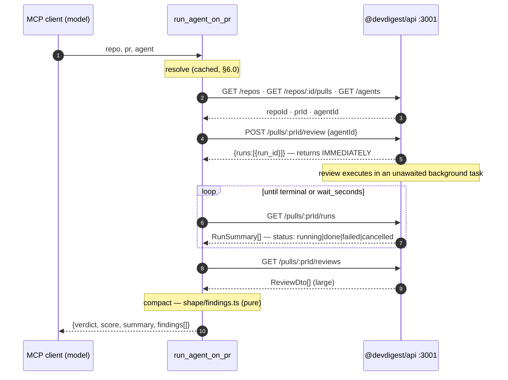

# `@devdigest/mcp` — a local MCP server over the running DevDigest API

> **Why this file lives here.** The repo convention is `<module>/specs/<feature-slug>-plan.md`
> (root `AGENTS.md` "Read when"; precedent `server/specs/smart-diff-plan.md`,
> `server/specs/intent-layer-plan.md`). There is no root-level `specs/` and
> `reviewer-core/` has none either. The primary — and only — module this plan
> creates code in is the new package, so the plan is its first file:
> `mcp/specs/mcp-server-plan.md`. Creating `mcp/specs/` is the package's
> directory-name decision made concrete; see §1 if you want it renamed.

## Context

The root README's roadmap lists `devdigest-mcp` as an L04 deliverable
(`README.md:85`). This plan builds it: a **fifth standalone package** — sibling
to `server/`, `client/`, `reviewer-core/`, `e2e/` — that exposes DevDigest's
review capability to any MCP client (Claude Code, Claude Desktop, an agent) over
**stdio**.

Five tools, no more:

| Tool | What it answers |
|---|---|
| `list_agents` | Which review agents exist, and what `agent` value is valid |
| `run_agent_on_pr` | Review this PR with this agent — **one call**, findings back |
| `get_findings` | What did the last review of this PR say |
| `get_conventions` | What conventions has DevDigest extracted for this repo (**cache-only**) |
| `get_blast_radius` | Registered, discoverable, and honestly `not_implemented` |

The package is a **thin HTTP client + protocol adapter**. It owns no data, no
Postgres pool, no job runner, no LLM key. Every capability it exposes already
exists as an endpoint on `@devdigest/api`.

### The four design principles this plan is written against

These come from the user's reference material and are the acceptance criteria
for the tool surface, not decoration. Every per-tool section in §6 states how it
satisfies each one.

1. **Result, not operation.** `run_agent_on_pr` does create → wait → fetch
   internally. The caller never sees a run id, never polls, never makes a second
   call to get findings.
2. **Flat arguments.** `repo` (`"owner/name"`), `pr` (number), `agent` (name or
   id) are three separate primitives — never one nested object. Non-Anthropic
   models in particular mis-serialize nested arguments.
3. **Compact structured response.** Only the fields actually forwarded.
   `GET /pulls/:id/reviews` on a real PR is tens of thousands of tokens; the
   compact projection is a few hundred.
4. **Errors lead forward.** Every failure message names the next action. "Agent
   `secrity` not found — call `list_agents` for valid names" beats a 404.

### The precondition, stated once and enforced in code

**The `server/` API must already be running before this MCP server is useful.**
`./scripts/dev.sh`, or `docker compose up -d && cd server && pnpm db:migrate &&
pnpm dev`. This plan does **not** boot, supervise, or health-gate the API — it
detects the failure and says so (§4, connection-refused mapping). Migrations
still don't run on boot (root `CLAUDE.md`), so a fresh clone that skipped
`pnpm db:migrate` will surface as a 500 from the API; the error mapper passes
the API's own message through.

## Modules affected

| Module | Why | Key files |
|---|---|---|
| **`mcp/` (new, primary owner)** | The entire feature. New standalone package: own `package.json`, own lockfile, own `tsconfig.json`, own test suite. | all new — see §2 for the tree |
| `server/` | **Read-only dependency. Not edited.** The MCP server consumes eight existing endpoints over HTTP. No route, contract, schema, migration, or container change is required or permitted by this plan. | consumed: `src/modules/agents/routes.ts:105`, `src/modules/repos/routes.ts:33`, `src/modules/pulls/routes.ts:26`, `src/modules/reviews/routes.ts:27,101,129`, `src/modules/conventions/routes.ts:48` |
| `client/` | Not touched. Cited only as the precedent for the HTTP-client shape (`client/src/lib/api.ts`). | — |
| `reviewer-core/` | Not touched. Cited only as the precedent for a standalone package's `tsconfig.json`. | — |
| `e2e/` | Not touched. See Out of scope. | — |
| root | `README.md` package table + roadmap row, `AGENTS.md` map table, and a new `.github/workflows/mcp.yml` with a `mcp/**` path filter. | `README.md:12-18,85`, `AGENTS.md`, `.github/workflows/mcp.yml` (new) |

**If this plan makes you edit a file under `server/src/`, stop.** That is a
signal the design drifted from "thin HTTP client" into "second backend", which
is the thing §3 explicitly rejects.

## Architectural constraints

### The confirmed decision: HTTP client, not in-process import

The MCP server talks to `http://localhost:3001` with `fetch`, exactly as
`client/` does. **Do not import `server/`'s DI container.** The reasons, in
descending weight:

1. `server/package.json` has no `main` and no `exports` field — it is an
   application, not a consumable module. Only `reviewer-core/` is designed for
   source-level reuse, and only because it is DB-free and sterile
   (`onion-architecture` R6).
2. A second process constructing `Container` would open its **own Postgres
   pool**, run its **own secrets bootstrap**, and start its **own
   `JobRunner`** — and `buildApp` awaits a stale-run reaper on boot that marks
   every `agent_runs` row still `running` as failed (`server/src/app.ts:80-95`,
   whose comment explicitly says *"assumes a SINGLE API instance per DB"*).
   Two containers against one DB would have the MCP process reap the API's
   live runs.
3. There is no auth to negotiate: the app runs on no-auth defaults —
   `LocalNoAuthProvider` resolves the single workspace named `default`
   (`server/src/adapters/auth/local.ts:28-37`, `server/src/db/seed.ts:327`).
   No token, no header, no session. `getContext` is workspace scoping, not
   authentication (`server/src/modules/_shared/context.ts`).

CORS is irrelevant here — `app.register(cors, { origin: [config.webOrigin] })`
(`server/src/app.ts:99`) governs browsers; a Node `fetch` is not subject to it.
No CORS change is needed and none should be made.

### Onion architecture: the spirit applies, the gate does not

**Decision: `pnpm arch` / dependency-cruiser does NOT extend to `mcp/`, and that
is deliberate — not an oversight.** `server/package.json`'s `arch` script cruises
exactly two trees, `src` and `../reviewer-core/src`, with two configs
(`.dependency-cruiser.cjs`, `.dependency-cruiser.core.cjs`). Neither knows about
`mcp/`. Adding a third config would mean maintaining a rule set for a
~500-line package with no Drizzle, no Fastify, no adapters, and no modules —
the rules the gate exists to enforce have no referents here.

What **does** carry over is the one rule (`onion-architecture` §1): dependencies
point inward. The package's four layers, and the import direction between them:

| Layer | Folder | May import | Must not import |
|---|---|---|---|
| **Core (pure)** | `src/shape/` | nothing but `zod` | `src/api/`, the SDK, `node:*` |
| **Infrastructure** | `src/api/` | `src/shape/` types, `zod` | the MCP SDK, `src/tools/` |
| **Application** | `src/tools/` | `src/api/`, `src/shape/` | `@modelcontextprotocol/server/stdio` |
| **Composition root / presentation** | `src/index.ts` | everything | — |

Concretely: `src/shape/` holds the compaction functions (a `ReviewDto` → a
compact findings list) and is testable with no network and no SDK — the same
property that makes `reviewer-core` testable without keys or Docker. `index.ts`
is the only file that calls `serveStdio` and the only file that constructs the
API client. **Enforce this by review and by the fact that `shape/`'s tests
import nothing else**, not by a new tool.

### Package-standalone rules (root `CLAUDE.md`)

- **Not a monorepo.** `mcp/` gets its own `package.json` and its own lockfile.
  Do not add a root `pnpm-workspace.yaml`, do not add `mcp/` to any other
  package's dependencies. (Note the existing split: `server/` and `client/` use
  `pnpm-lock.yaml`; `reviewer-core/` and `e2e/` use npm's `package-lock.json`.
  Root `CLAUDE.md` names pnpm ≥10 as the stack — **use pnpm**, matching the two
  packages that actually run as services.)
- **Secrets.** `mcp/` needs **no secret of any kind**. It sends no API key,
  no `GITHUB_TOKEN`, no auth header — the LLM and GitHub credentials stay
  entirely inside `server/`, read from `~/.devdigest/secrets.json` by the
  server's own `SecretsProvider`. `mcp/` therefore does **not** read
  `~/.devdigest/secrets.json`, and must not learn how to. Its only config is a
  base URL and two timeouts, which are not secrets → plain environment
  variables with sane defaults (§5).
- **`AGENTS.md` + symlink.** Every package has `AGENTS.md` with a git-tracked
  `CLAUDE.md` symlink beside it. Create it with `ln -s AGENTS.md CLAUDE.md`;
  never write a `CLAUDE.md` file.

### The shared-contracts decision (this one has a hard forcing constraint)

**Decision: `mcp/` does NOT vendor `@devdigest/shared` and does NOT tsconfig-alias
it. It declares its own minimal zod schemas covering only the fields it
forwards.**

There are three existing patterns in the repo and none of them fit:

| Pattern | Who does it | Why it doesn't fit `mcp/` |
|---|---|---|
| Own vendored copy | `client/src/vendor/shared/` | Creates a **third** hand-maintained byte-copy. `client/INSIGHTS.md` (Codebase Patterns, 2026-08-06) records this as a silent failure mode: adding a field on the server side does **not** reach the copy, with no build error and no test failure. Two copies is already a hazard; three is worse. |
| tsconfig path alias into `server/`'s copy | `reviewer-core/tsconfig.json` (`"@devdigest/shared": ["../server/src/vendor/shared/index.ts"]`) | Blocked by zod versions — see below. |
| Re-declare locally | *(new)* | ✅ |

**The forcing constraint is zod.** The current MCP TypeScript SDK v2
(`@modelcontextprotocol/server@2.0.0`) has a hard peer dependency on
**zod ≥ 4.2.0**, while every existing package here pins **zod `^3.24.1`** and the
shared contracts are authored against zod 3. A path alias would compile
zod-3-authored schemas (`.nullish()`, `z.string().url()`, `.default()` inside
`z.enum`-adjacent shapes) against a zod-4 runtime inside `mcp/`'s own
`node_modules` — a class of breakage that produces confusing type errors at best
and silently different parse behaviour at worst. Standalone packages have
independent `node_modules`, so this is avoidable simply by not crossing the
boundary.

It is also the *right* answer independently of zod, because of **principle 3**:
`mcp/` forwards a strict subset of every response. `ReviewRecord` has 12 fields
and nests `FindingRecord`'s 15; the compact projection uses 6 and 6. Typing
against the full contract would invite forwarding fields nobody asked for.

**How to keep the local schemas honest** (the real risk of this choice is
drifting from the API without noticing):

- Every local schema is a **`.passthrough()`-free, partial** view: declare only
  the consumed fields, parse with `safeParse`, and on failure return a
  forward-guiding tool error naming the endpoint and the field that didn't
  match, rather than throwing a raw `ZodError` at the MCP client.
- Head `src/api/schemas.ts` with a comment block citing the upstream contract
  and line for each schema (e.g. `// ← Agent, server/src/vendor/shared/contracts/knowledge.ts:259-275`).
- The optional live integration check (§8) is what actually catches drift.
  Document that: hermetic tests validate the *shape we expect*; only the live
  check validates the *shape the API sends*.

### Insights consulted

- `server/INSIGHTS.md` — nothing on MCP or outbound HTTP clients. The Decisions
  entry (2026-08-18, relocating `feature-models.ts`) does not bear on this. The
  Codebase Patterns entry on `waitForPrRuns` **does** bear on it, and is
  resolved in §6.2's race analysis.
- `client/INSIGHTS.md` — the vendored-contracts-are-separate-copies pattern
  (2026-08-06) is load-bearing for the decision above.

## Skills implementer will apply

| Area | Skills |
|---|---|
| `mcp/` package | `typescript-expert` (strict tsconfig incl. `noUncheckedIndexedAccess`, discriminated unions for the tool-result type, `satisfies` for the tool registry), `zod` (`safeParse` at every boundary — `parse-use-safeparse`; `schema-use-unknown-not-any`; `type-use-z-infer`; input schemas flat and small — `schema-avoid-optional-abuse`), `security` (A05 — `repo`/`agent` are model-controlled strings that become URL path segments and filter predicates: `encodeURIComponent` every interpolation and never build a path from raw input; A09 — never log a full response body to stderr; A10 — fail-closed on an unreachable API rather than returning an empty success) |
| Placement | `onion-architecture` — **for its one rule only** (dependencies point inward, §"Architectural constraints"). Its folder/ring table governs `server/` and `reviewer-core/`; it does not govern `mcp/`, and `pnpm arch` is explicitly not extended. |
| Docs | `mermaid-diagram` (the §6.2 sequence diagram; `mcp/README.md`) |
| Session | `engineering-insights` (read at start — done; record at end into a new `mcp/INSIGHTS.md`) |

Not applicable, and deliberately so: `fastify-best-practices`, `drizzle-orm-patterns`,
`postgresql-table-design` (no server, no ORM, no schema), `frontend-architecture`,
`next-best-practices`, `react-best-practices`, `react-testing-library` (no UI).

`pr-self-review` is **not** invoked by this plan — it runs automatically via the
existing `PreToolUse` hook before `git push` / `gh pr create`.

---

## 1. Package identity and location

**Recommendation: folder `mcp/`, package name `@devdigest/mcp`.**

- The existing folders are named for the **role** (`server`, `client`,
  `reviewer-core`, `e2e`); the product name lives in the npm **scope**
  (`@devdigest/api`, `@devdigest/web`). `mcp/` + `@devdigest/mcp` follows that
  exactly. `devdigest-mcp/` would be the only folder repeating the scope.
- The root README's roadmap says `devdigest-mcp` (`README.md:85`) — read that as
  the *lesson deliverable's* name, the same way "Smart Diff" is a feature name
  and `modules/smart-diff/` is the folder. Step G2 updates the README's package
  table with the real folder name.
- If the product decision is to match the README literally, this is a
  `git mv` and a one-line `package.json` edit; **this plan file moves with the
  folder.** Raised as Open Question 1 so it is decided once, before the tree
  exists.

`package.json`: `"name": "@devdigest/mcp"`, `"private": true`, `"type": "module"`,
`"version": "0.0.0"`, and a `description` in the style of the other four
(`reviewer-core/package.json` is the model: one sentence saying what it is and
what it is not).

Scripts, matching the repo's per-package vocabulary (`dev` / `test` /
`typecheck`, root `CLAUDE.md`):

```
"dev":       "tsx watch src/index.ts"        // stderr logging only — see §5
"start":     "tsx src/index.ts"              // what an MCP client actually spawns
"typecheck": "tsc --noEmit -p tsconfig.json"
"test":      "vitest run"
"test:live": "tsx test/live.manual.ts"       // NOT part of `test`; needs the API up
```

`tsconfig.json`: copy `reviewer-core/tsconfig.json` (ES2022 / ESNext /
`moduleResolution: "Bundler"` / `strict` / `noUncheckedIndexedAccess` / `noEmit`)
and **delete the `paths` block entirely** — that block is exactly the
`@devdigest/shared` alias this package does not use.

## 2. The tree

```
mcp/
  package.json            pnpm-lock.yaml       tsconfig.json      vitest.config.ts
  AGENTS.md               CLAUDE.md -> AGENTS.md
  README.md               INSIGHTS.md
  specs/mcp-server-plan.md            ← this file
  src/
    index.ts              composition root: config → client → register 5 tools → serveStdio
    config.ts             env → validated Config (zod)
    api/
      client.ts           fetch wrapper: base URL, JSON, ApiError, error mapping
      schemas.ts          minimal zod views of the 6 consumed response shapes
      resolve.ts          owner/name → repoId, number → prId, name|id → agentId (+ cache)
    tools/
      registry.ts         the 5 definitions, in one array — the tools/list surface
      list-agents.ts      get-findings.ts      get-conventions.ts
      run-agent-on-pr.ts  get-blast-radius.ts
      result.ts           ok() / toolError() — the two MCP result shapes, one place
    shape/                PURE. no fetch, no SDK, no node:*
      findings.ts         ReviewDto-ish → compact findings (+ severity ordering, caps)
      agents.ts           Agent-ish → compact agent row
      conventions.ts      ConventionCandidate-ish → compact rule row
  test/
    *.test.ts             hermetic — injected fetch stub, no network
    live.manual.ts        optional, manual, needs a running API
```

## 3. The MCP SDK: which package, which transport

**Transport: stdio. Not HTTP, not SSE.** This server is spawned as a child
process by a local MCP client (Claude Code / Claude Desktop) on the same
machine, one process per client, with no network surface and no
authentication story. The HTTP transports exist for remote/multi-client
servers and would add an auth requirement, a port to bind, and a CORS/origin
policy — all of which this deployment shape has no use for. stdio also means
the API base URL never leaves the machine.

**Package: `@modelcontextprotocol/server` (SDK v2) + its `/stdio` subpath.**
Verified against the registry and the docs site on 2026-08-28:

| | v1 | v2 |
|---|---|---|
| package | `@modelcontextprotocol/sdk@1.30.0` (monolithic) | `@modelcontextprotocol/server@2.0.0` (+ `@modelcontextprotocol/client`, `/core`) |
| zod peer | `^3.25 \|\| ^4.0` | **`^4.2.0` required** |
| node | ≥18 | **≥20** |
| stdio entry | `new StdioServerTransport()` + `server.connect(t)` | `serveStdio(factory)` |
| status | previous line | **the stable release line**, implementing the 2026-07-28 spec |

Node ≥20 is satisfied — the repo requires ≥22. Skeleton:

```ts
import { McpServer } from '@modelcontextprotocol/server';
import { serveStdio } from '@modelcontextprotocol/server/stdio';

serveStdio(() => {
  const server = new McpServer({ name: 'devdigest', version: '0.1.0' });
  for (const tool of tools) server.registerTool(tool.name, tool.config, tool.handler);
  return server;
});
```

`registerTool(name, { title?, description, inputSchema, outputSchema?, annotations? }, handler)`.
Three v2 details the implementer must not get wrong:

- **`inputSchema` must be an explicit `z.object({...})`.** Raw shapes
  (`{ repo: z.string() }`) are still auto-wrapped but are deprecated in v2.
- **`outputSchema` must be a Standard Schema object**, never a raw shape.
- When a tool declares `outputSchema`, the server **MUST** return conforming
  `structuredContent` — and **SHOULD** also return the serialized JSON in a
  text block for backwards compatibility. Do both. (2026-07-28 spec, *Tools →
  Structured Content*.)

Pin the SDK to an exact version in `package.json` (not `^`) and record the
resolved version in `mcp/README.md`. This is the fastest-moving dependency in
the repo; a caret range across a v2.x minor is how a working MCP server breaks
on a fresh `pnpm install` months later.

## 4. `src/api/client.ts` — the HTTP client

Model it on `client/src/lib/api.ts` (which already solves three of the four
problems here), with one structural change: **the `fetch` implementation is
injected**, so hermetic tests need no global monkey-patching.

```ts
export interface ApiClient {
  get<T>(path: string, schema: ZodType<T>): Promise<T>;
  post<T>(path: string, body: unknown, schema: ZodType<T>): Promise<T>;
}
export function createApiClient(opts: {
  baseUrl: string;
  timeoutMs: number;
  fetch?: typeof globalThis.fetch;   // ← DI seam for tests
}): ApiClient;
```

Behaviour, and where each rule comes from:

| Concern | Rule |
|---|---|
| Base URL | `config.apiBase`, default `http://localhost:3001` (§5). Paths are appended; **every interpolated segment goes through `encodeURIComponent`** (`security` A05 — `repo` and `agent` are model-controlled). |
| Headers | Set `content-type: application/json` **only when a body is actually sent**. `client/src/lib/api.ts:26-30` records why: a body-less POST otherwise trips Fastify's *"Body cannot be empty when content-type is application/json"*. `POST /pulls/:id/review` always sends `{agentId}`, so this bites only if someone adds a body-less call later. |
| Timeout | `AbortSignal.timeout(config.timeoutMs)` on every request. A hung fetch inside a stdio server is invisible to the user — the client just waits. |
| Error envelope | The API returns `ApiErrorBody` = `{ error: { code, message, details } }` (`server/src/vendor/shared/contracts/platform.ts:278-285`, produced by the handler at `server/src/app.ts:126-175`). Parse it; carry `status`, `code`, `message` onto an `ApiError`. Never surface `details` verbatim — it can contain full zod issue arrays. |
| Response validation | `schema.safeParse(json)`. On failure throw a distinct `ApiShapeError` naming the endpoint — this is the drift detector for §"shared-contracts decision". |
| **Connection refused** | The single most likely failure in normal use. `fetch` rejects with a `TypeError`/`ECONNREFUSED` → map to a fixed, forward-guiding message: <br>`Cannot reach the DevDigest API at http://localhost:3001. Start it first: ./scripts/dev.sh (or: cd server && pnpm dev). It must be running before any devdigest tool works.` <br>Adapted from `client/src/lib/api.ts:33-39`, extended with the actual command. |

### Which HTTP failure becomes which kind of MCP error

The 2026-07-28 spec defines two mechanisms, and the split matters because
clients treat them differently: *"Clients **SHOULD** provide tool execution
errors to language models to enable self-correction"*, while protocol errors are
*"less likely to result in successful recovery."*

| Failure | Mechanism | Why |
|---|---|---|
| Unknown tool name | **Protocol error** (JSON-RPC `-32602`) | Handled by the SDK. Not our code. |
| `pr` sent as `"12"` instead of `12`; missing `repo` | **Protocol error** | The SDK rejects against `inputSchema` before the handler runs. Do not re-validate in the handler. |
| Repo / PR / agent not found (404, or client-side resolution miss) | **`isError: true`** | Self-correctable: the model can call `list_agents` or fix the repo string. This is where principle 4 lives. |
| 422 validation from the API | **`isError: true`** | Pass the API's `message` through, prefixed with what we were doing. |
| 429 on `POST /pulls/:id/review` | **`isError: true`** | Actionable: "wait ~60s". Do **not** silently retry (§6.2). |
| API unreachable / 5xx / timeout | **`isError: true`** | Not model-correctable, but the *user* can fix it and the message must reach them. Returning a protocol error here buries it. |
| Wait timed out with the run still going | **not an error** | A valid outcome. `structuredContent.status = "timed_out"` + a message pointing at `get_findings` (§6.2). |
| `get_conventions` with nothing cached | **not an error** | A valid empty result. `status = "no_conventions_cached"` + explanation (§6.4). |
| `get_blast_radius` | **not an error** | `status = "not_implemented"` (§6.5). |

`src/tools/result.ts` exposes exactly two constructors so this never gets
decided ad hoc per tool:

```ts
ok(structured: unknown, text?: string)   → { content: [{type:'text', text}], structuredContent, isError: false }
toolError(message: string)               → { content: [{type:'text', text: message}], isError: true }
```

`toolError` takes a **message**, not a code — the message *is* the interface
(principle 4). Every call site passes a sentence that names the next action.

## 5. Configuration

No secrets are involved (§"Package-standalone rules"), so plain env vars with
defaults are correct — `~/.devdigest/secrets.json` is for secrets and must not
be read here.

| Var | Default | Purpose |
|---|---|---|
| `DEVDIGEST_API_BASE` | `http://localhost:3001` | Where `@devdigest/api` listens |
| `DEVDIGEST_MCP_HTTP_TIMEOUT_MS` | `30000` | Per-request timeout. Generous because `GET /repos/:id/pulls` and `GET /pulls/:id` make live GitHub round-trips (§6.2). |
| `DEVDIGEST_MCP_RUN_TIMEOUT_MS` | `300000` (5 min) | How long `run_agent_on_pr` waits for a review (§6.2) |
| `DEVDIGEST_MCP_LOG_LEVEL` | `warn` | `silent` \| `warn` \| `debug` |

`src/config.ts` parses `process.env` through a zod schema with
`z.coerce.number()` for the numerics and `.default()` for each, then
`safeParse` → on failure, write the message to **stderr** and `process.exit(1)`
before the transport opens. A misconfigured server that starts and then fails
every call is worse than one that refuses to start.

> **stdio gotcha, and it is the one that will cost an afternoon:** in a stdio
> MCP server, **stdout is the JSON-RPC wire.** A single `console.log`,
> `process.stdout.write`, or stray `pino` default destination corrupts the
> stream and the client reports an opaque parse failure. **All logging goes to
> `stderr`** (`console.error`, or a tiny leveled writer over
> `process.stderr.write`). State this in `mcp/AGENTS.md` under a "Gotchas"
> heading, in the same voice as `server/AGENTS.md`.

## 6. The tools

### 6.-1 Final tool descriptions — verbatim, do not paraphrase

These five strings are **final**, not illustrative. `implementer` copies them
character-for-character into `registerTool`'s `description` field — do not
rewrite, shorten, "improve," or re-derive them from the per-tool sections
below. The per-tool `Description:` lines in §6.1–§6.5 restate the same text
for narrative context only; this table is the single source of truth if the
two ever disagree.

| Tool | Description (verbatim) |
|---|---|
| `list_agents` | `List the review agents configured in DevDigest. Use this to get a valid agent value for run_agent_on_pr.` |
| `run_agent_on_pr` | `Run a DevDigest review agent on a pull request and return its findings. Creates the run, waits for it to finish, and returns the result — one call, no polling needed. Takes up to several minutes.` |
| `get_findings` | `Get the findings from the most recent completed review of a pull request. Use run_agent_on_pr first if the PR has not been reviewed.` |
| `get_conventions` | `Get the coding conventions DevDigest has already extracted for a repo. Read-only — this never triggers extraction.` |
| `get_blast_radius` | `Not implemented yet. Reserved for impact analysis of a PR's changes (which symbols and callers it affects).` |

Why each string is shaped the way it is — the four design principles (see
Context) are acceptance criteria for *behavior*, and these descriptions are
where a principle becomes something the model reads **before** it ever calls
the tool, not just something the implementation satisfies after the fact:

- **`list_agents`** — the second sentence pre-empts a `run_agent_on_pr`
  failure by naming the dependency (`agent` value) before it's needed.
  Applies principle 4 *preventively*, not just reactively in error text.
- **`run_agent_on_pr`** — "one call, no polling needed" states principle 1 in
  the description itself, so the model doesn't try to split the work into
  separate calls on its own. "Takes up to several minutes" stops a long wait
  from reading as a hang — not one of the four principles directly, but the
  same MCP-best-practice reasoning (§ research: descriptions are where
  non-obvious runtime behavior belongs).
- **`get_findings`** — mirrors `run_agent_on_pr`'s description back
  ("Use run_agent_on_pr first…"), so the two tools' descriptions alone, read
  together from `tools/list`, describe the whole two-tool workflow with zero
  calls spent.
- **`get_conventions`** — "this never triggers extraction" directly protects
  the cache-only decision (§6.4): without it, an empty result reasonably
  reads as a bug rather than an accurate report of "nothing cached yet."
- **`get_blast_radius`** — "Not implemented yet" up front means the model
  learns the tool's status for free from `tools/list`, never spending a call
  to discover it — the stub-honesty rule applied at the description layer,
  not just the response payload.

Naming and length both already satisfy the MCP conventions this plan was
built against: `snake_case`, ≤64 chars (`registry.test.ts` asserts both), and
every description stays under ~200 characters — short enough to sit in
`tools/list` for all five without meaningfully taxing session-start tokens.

### 6.0 Resolution: `owner/name` + PR number → UUIDs

**Investigated, and there is no exact-match endpoint.** The full route inventory
(`grep 'app\.\(get\|post\|put\|delete\)' server/src/modules/*/routes.ts`) shows
`GET /repos` takes no query parameters (`server/src/modules/repos/routes.ts:33`)
and `GET /repos/:id/pulls` takes only `IdParams` — no `?number=`, no filter
(`server/src/modules/pulls/routes.ts:26`). There is no `GET /repos/by-name/...`
and no `GET /repos/:id/pulls/:number`. **Client-side list-and-filter is the only
option**, and adding a query endpoint to `server/` is out of scope for this plan
(Open Question 2).

Three resolvers in `src/api/resolve.ts`:

```
resolveRepo(repo: string)      → GET /repos      → find r.full_name === repo (case-insensitive) → r.id
resolvePull(repoId, pr: number)→ GET /repos/:repoId/pulls → find p.number === pr → p.id
resolveAgent(agent: string)    → GET /agents     → id exact match, else name case-insensitive → a.id
```

Field names, verified against the contracts (**note: snake_case, not camelCase**):

- `Repo.full_name` — `server/src/vendor/shared/contracts/platform.ts:145`.
  Not `fullName`; that is the Drizzle column name, and it never crosses the wire.
- `PrMeta.number` and `PrMeta.id` (`id` is `.nullish()` in the contract —
  treat an absent `id` as unresolvable and say so) — `platform.ts:157-159`.
- `Agent.id` / `Agent.name` / `Agent.enabled` — `knowledge.ts:259-275`.

**Cost, and why caching is not optional.** `GET /repos/:id/pulls` is not a cheap
read: when a `GITHUB_TOKEN` is configured it performs a live
`gh.listPullRequests` and upserts every PR before responding
(`server/src/modules/pulls/routes.ts:41-60`). Resolving a PR therefore costs a
GitHub round-trip. Mitigation:

- An **in-process `Map` cache** for `repo → repoId`, `(repoId, pr) → prId`, and
  `agent → agentId`, TTL ~60s, scoped to the process lifetime. UUIDs are stable;
  the only staleness risk is a repo deleted and re-added mid-session, which
  resolves itself on a 404 (invalidate that key and retry once, then fail
  forward).
- `run_agent_on_pr` resolves all three **once** and reuses them for the whole
  create → wait → fetch sequence.
- Do **not** call `GET /pulls/:id` anywhere in this package. It deletes and
  re-inserts `pr_files` and `pr_commits` on every call
  (`server/src/modules/pulls/routes.ts:218-243`) and returns the full diff —
  the single heaviest read in the app, and none of its payload is forwarded.

**Forward-guiding resolution failures** (all `isError: true`):

| Miss | Message |
|---|---|
| repo | `Repo "acme/paymnts-api" is not in DevDigest. Known repos: acme/payments-api, octocat/hello-world. Add one in the studio (Add repository) if it is missing.` — listing the actual `full_name`s is what makes this self-correcting; cap the list at 20 and say "+N more". |
| PR | `Pull request #421 was not found in acme/payments-api. Imported PR numbers: 7, 12, 18. PRs are imported from GitHub — open the repo in the studio to import more.` |
| agent | `Agent "secrity" not found. Call list_agents to see valid agents. Available: General Reviewer, Security Reviewer, Performance Reviewer.` |
| agent, ambiguous | `agents.name` has **no unique constraint** (`server/src/db/schema/agents.ts:13`), so two agents can share a name. On >1 name match: `Agent name "Security Reviewer" matches 2 agents. Call run_agent_on_pr again with one of these ids: <uuid>, <uuid>.` Never silently pick the first. |
| agent, disabled | `Agent.enabled` is on the contract. A disabled agent still runs if targeted by id (`resolveTargets` only filters on `all:true` — `server/src/modules/reviews/service.ts:49-52`), so **do not block it** — but include `enabled` in `list_agents` output so the model can see it. |

---

### 6.1 `list_agents`

- **Description** (short, complements the schema, does not restate it):
  *"List the review agents configured in DevDigest. Use this to get a valid
  `agent` value for run_agent_on_pr."*
- **Input schema:** `z.object({})`. No arguments. Serialize as
  `{ "type": "object", "additionalProperties": false }` — the spec's recommended
  no-parameter form.
- **Output schema:** `z.object({ count: z.number().int(), agents: z.array(z.object({ id, name, provider, model, enabled })) })`.
- **Annotations:** `readOnlyHint: true`, `idempotentHint: true`,
  `openWorldHint: false` (a fixed local service, not the open internet),
  `destructiveHint: false`.
- **Call:** `GET /agents` → `Agent[]` (`server/src/modules/agents/routes.ts:105`).
- **Compaction (principle 3):** drop `system_prompt` — the single largest field
  on the contract, often thousands of tokens, and useless to a tool caller. Also
  drop `output_schema`, `version`, `strategy`, `ci_fail_on`, `repo_intel`.
  Keep `description` **truncated to 140 chars** — enough to tell General from
  Security, cheap enough at 5 agents. The seeded set is General / Security /
  Performance / Test Quality / API Contract Reviewer (`server/src/db/seed.ts:482-527`,
  documented in `docs/agent-prompts/`), so this is a ~5-row, ~250-token response.
- **Errors:** only "API unreachable" is reachable. An empty `agents: []` is a
  valid result, not an error, but the text must say
  *"No agents are configured. Create one in the DevDigest studio (Agents)."*
- **Principle check:** result not operation ✅ (one call, terminal answer) ·
  flat args ✅ (none) · compact ✅ (5 fields of 13) · errors forward ✅.

---

### 6.2 `run_agent_on_pr` — the one that matters

- **Description:** *"Run a DevDigest review agent on a pull request and return
  its findings. Creates the run, waits for it to finish, and returns the
  result — one call, no polling needed. Takes up to several minutes."*
  (The duration warning belongs in the description: it is what stops a client
  from assuming the tool hung.)
- **Input schema — flat, principle 2:**

```ts
z.object({
  repo:  z.string().describe('GitHub repo as "owner/name", e.g. "acme/payments-api"'),
  pr:    z.number().int().positive().describe('Pull request number, e.g. 42'),
  agent: z.string().describe('Agent name or id — call list_agents for valid values'),
  wait_seconds: z.number().int().min(10).max(900).optional()
       .describe('How long to wait for the review. Default 300.'),
})
```

Four primitives. No object, no array, no enum the caller has to guess.
`wait_seconds` is the only optional and it has a working default —
`schema-avoid-optional-abuse`.

- **Output schema:**

```ts
z.object({
  status:  z.enum(['completed', 'timed_out', 'failed']),
  repo: z.string(), pr: z.number().int(), agent: z.string(),
  verdict: z.string().nullable(),           // approve | comment | request_changes
  score:   z.number().int().nullable(),     // 0-100, higher is better
  summary: z.string().nullable(),
  findings_count: z.number().int(),
  findings: z.array(z.object({
    severity: z.string(), category: z.string(), title: z.string(),
    file: z.string(), line: z.number().int(),
    rationale: z.string(), suggestion: z.string().nullable(),
  })),
  truncated: z.boolean(),                   // true when findings were capped
})
```

- **Annotations:** `readOnlyHint: false`, `idempotentHint: false` (each call
  creates a new `agent_runs` row and costs real money), `destructiveHint: false`
  (it adds a review; it deletes nothing), **`openWorldHint: true`** — the run
  reaches GitHub and an LLM provider. Between `destructiveHint` and
  `idempotentHint: false` + `openWorldHint: true`, a conforming client has what
  it needs to prompt for confirmation. **Recommendation: rely on the client's
  own confirmation UX; do not build an in-tool `confirm: true` argument** — it
  would violate principle 2 (flat, minimal) and duplicate a decision the host
  already owns. Say so in `mcp/README.md` so it is not "fixed" later.

#### The internal three-step orchestration (principle 1)



**Step 1 — create.** `POST /pulls/:prId/review` body `{ agentId }`
(`RunRequest`, `platform.ts:271-275`; route
`server/src/modules/reviews/routes.ts:27-44`). Response
`{ pr_id, runs: [{ run_id, agent_id, agent_name }], reviews: [] }`.

> **The route's own doc-comment is wrong and must not be trusted.**
> `review-api.ts:39-42` says *"The persisted reviews are also returned once the
> (synchronous) run completes."* It is not synchronous: the service creates the
> `agent_runs` rows, then fires
> `void this.executor.executeRuns(...).catch(...)` and returns immediately with
> `reviews: []` (`server/src/modules/reviews/service.ts:117-137`). **Always
> `reviews: []`.** Anyone who reads the comment instead of the code will build a
> tool that returns an empty findings list and looks like it worked. Put this in
> a comment at the call site.

Take `runs[0].run_id`. Never send `{ all: true }` — this tool targets exactly
one agent, and `all` would fan out to every enabled agent's cost.

**Step 2 — wait. Decision: poll `GET /pulls/:prId/runs`, not SSE.**

| Option | Verdict |
|---|---|
| **Poll `GET /pulls/:id/runs`** → `RunSummary[]`, each with `run_id` and `status` (`running \| done \| failed \| cancelled`, `contracts/trace.ts:99-119`) | ✅ **Chosen.** Reads committed DB state, so it survives an API restart mid-run — and the boot reaper marks orphaned `running` rows failed (`server/src/app.ts:80-95`), meaning even the crash case terminates the loop instead of hanging until timeout. No new dependency. |
| SSE `GET /runs/:id/events` (`reviews/routes.ts:48-92`) | ❌ Rejected. Needs an SSE/`text/event-stream` parser (a dependency or hand-rolled `ReadableStream` handling) for no gain: we discard every intermediate event and only need the terminal transition. Worse, the `RunBus` is **in-memory** — if the API restarts, the stream never emits `done` and the tool hangs to timeout. |
| `GET /runs/:id/trace` | ❌ Rejected as the wait signal. The trace is written *after* `completeAgentRun` (`run-executor.ts:318` then `:337+`), so it is a lagging indicator — and it is a huge document we would immediately throw away. |

**The race — checked, and it is safe.** `server/INSIGHTS.md` (Codebase Patterns,
2026-08-12) warns that `agent_runs.status` going terminal is *not* a run's last
write: `run_skills` and `run_traces` land after it. That warning is about traces
and per-run stats. **The review and its findings are persisted *before*
`completeAgentRun`** — `insertReview` at `run-executor.ts:293`, `insertFindings`
at `:305`, then `completeAgentRun` at `:318`. So `status === 'done'` ⇒ the
review is readable. This tool must not read a trace or `run_skills`, and if a
future version does, it needs the insight's `waitForTrace`-style poll instead.

Polling policy:

- Interval **2s for the first 30s, then 5s** — a short review finishes fast, a
  long one shouldn't burn budget. At 2s that is 30 requests/min against a
  **global 120/min** limit (`server/src/app.ts:104-106`); the tight **10/min**
  cap applies only to `POST /pulls/:id/review`
  (`reviews/routes.ts:29`) and this tool issues exactly **one** POST per call.
- If a **poll** returns 429, back off and keep polling — a GET is idempotent
  and safe to retry.
- If the **POST** returns 429, do **not** retry. Return
  `isError: true`: *"DevDigest is rate-limiting review starts (10 per minute).
  Wait about a minute and call run_agent_on_pr again."*
- Terminal `failed` / `cancelled` → `status: 'failed'`, carry `RunSummary.error`
  through verbatim (it is the API's own message, e.g. a missing LLM key) and
  suffix a next action: *"Check the LLM API key in the DevDigest studio
  (Settings) and try again."*
- Timeout → **not an error**. `status: 'timed_out'`, plus text:
  *"The review is still running after 300s. It will finish in the background —
  call get_findings with repo="acme/payments-api" and pr=42 to collect the
  result."* This is principle 4 applied to a non-failure.

**Step 3 — fetch.** `GET /pulls/:prId/reviews` → `ReviewDto[]`
(`reviews/routes.ts:129`; shape at
`server/src/modules/reviews/helpers.ts:18-32`, contract equivalent
`ReviewRecord`/`FindingRecord` at `review-api.ts:15-20,45-57`). **Select the
review whose `run_id` equals our `run_id`** — not "the newest" — so a concurrent
run by another agent can never be mis-attributed. `ReviewDto.run_id` exists
precisely for this.

**Compaction (`src/shape/findings.ts`, pure).** Per finding, keep 7 of 15
fields: `severity`, `category`, `title`, `file`, `line` (= `start_line`;
add `end_line` only when it differs), `rationale`, `suggestion`. Drop `id`,
`review_id`, `confidence`, `kind`, `trifecta_components`, `evidence`,
`accepted_at`, `dismissed_at` — nothing in this tool surface consumes them.
Caps, as named constants in one file:

- `MAX_FINDINGS = 50`, sorted `critical → warning → suggestion`, then by file.
  Set `truncated: true` and say so in the text when findings were dropped.
- `MAX_RATIONALE_CHARS = 600`, `MAX_SUGGESTION_CHARS = 600`, ellipsis-suffixed.
- `MAX_SUMMARY_CHARS = 1000`.

A 40-finding review goes from tens of thousands of tokens to roughly 3–5k. There
is a test for this (§8).

- **Principle check:** result not operation ✅ (three HTTP steps + a poll loop,
  one tool call) · flat args ✅ · compact ✅ (7/15 fields + caps) ·
  errors forward ✅ (every branch above names a next action).

---

### 6.3 `get_findings`

- **Description:** *"Get the findings from the most recent completed review of a
  pull request. Use run_agent_on_pr first if the PR has not been reviewed."*
- **Input:** `z.object({ repo: z.string(), pr: z.number().int().positive(), agent: z.string().optional() })`
  — same three primitives, `agent` optional to narrow to one agent's review.
- **Output:** the same compact object as §6.2 minus `status`, plus
  `other_reviews: z.array(z.object({ agent: z.string(), created_at: z.string() }))`.
- **Annotations:** `readOnlyHint: true`, `idempotentHint: true`,
  `openWorldHint: false`.
- **Call:** one `GET /pulls/:prId/reviews` after resolution. **No standalone
  `GET /findings` endpoint exists** — this endpoint, filtered and flattened
  client-side, is the whole implementation. It shares
  `src/shape/findings.ts` with `run_agent_on_pr` verbatim; do not write a second
  compaction path.
- **Selection:** filter to `kind === 'review'`; if `agent` was supplied, filter
  by `agent_name` (case-insensitive) or `agent_id`; take the newest by
  `created_at`. List every *other* review's agent + timestamp in
  `other_reviews` so the model can see what it is not looking at and narrow
  without guessing — cheap (two fields per review) and directly serves
  principle 4.
- **Errors:**
  - No reviews at all → **`isError: true`**:
    *"No review has been run on acme/payments-api#42 yet. Call
    run_agent_on_pr with repo="acme/payments-api", pr=42 and an agent from
    list_agents."* (Model-correctable, so `isError` is right here — unlike
    `get_conventions`, where the fix is not a tool call.)
  - `agent` supplied but that agent has no review → **`isError: true`**, and
    list which agents *do* have one.
  - Repo/PR miss → §6.0's messages.
- **Principle check:** flat ✅ · compact ✅ (shared projection) · errors
  forward ✅ · result-not-operation ✅ (no run-id bookkeeping exposed).

---

### 6.4 `get_conventions` — cache-only, and loud about it

- **Description:** *"Get the coding conventions DevDigest has already extracted
  for a repo. Read-only — this never triggers extraction."* The second sentence
  is deliberate: it stops a model from expecting the tool to populate an empty
  result by retrying.
- **Input:** `z.object({ repo: z.string() })`.
- **Output:**

```ts
z.object({
  status: z.enum(['ok', 'no_conventions_cached']),
  repo: z.string(),
  count: z.number().int(),
  accepted_count: z.number().int(),
  conventions: z.array(z.object({
    rule: z.string(), category: z.string(),
    evidence: z.string().nullable(),      // "src/lib/api.ts:12-40", pre-joined
    confidence: z.number().nullable(),
    accepted: z.boolean(),
  })),
})
```

- **Annotations:** `readOnlyHint: true`, `idempotentHint: true`,
  `openWorldHint: false`.
- **Call: `GET /repos/:repoId/conventions` — and *only* that**
  (`server/src/modules/conventions/routes.ts:48-55`) → `ConventionCandidate[]`
  (`knowledge.ts:223-235`).
  **`POST /repos/:id/conventions/extract` must not appear anywhere in this
  package.** It samples files, calls an LLM, costs money and minutes, and
  **replaces** the repo's existing candidates (`conventions/routes.ts:36-46`) —
  a destructive, expensive write triggered by a tool the model believes is a
  read. Add a comment at the call site saying so, or the next session will "fix"
  the empty case by wiring it up.
- **Compaction:** collapse `evidence_path` + `evidence_start_line` +
  `evidence_end_line` into one `"path:start-end"` string; **drop
  `evidence_snippet` entirely** — it is raw file content and the single largest
  field on the contract. Drop `id` (nothing here updates a candidate). Sort
  `accepted: true` first, then by confidence descending.
- **The empty case — not an error, but never silent.** `status:
  'no_conventions_cached'`, `conventions: []`, `isError: false`, and text:
  *"No conventions have been extracted for acme/payments-api yet. This tool only
  reads already-extracted conventions — it deliberately does not run the
  extraction pipeline, which calls an LLM. Run it from the DevDigest studio
  (Skills Lab → Conventions) and then call get_conventions again."*
  An empty array with no explanation is exactly the failure principle 4 exists
  to prevent.
- **Repo miss** → §6.0's repo message, `isError: true`.
- **Open decision:** returns *all* persisted candidates with an `accepted` flag,
  not only `accepted: true`. Filtering to accepted-only would return an empty
  result for a repo with extracted-but-unreviewed candidates, which reads as
  "nothing extracted" and is misleading. Raised as Open Question 3.

---

### 6.5 `get_blast_radius` — a real stub

- **Decision: registered in `tools/list`, fully schema'd, returning a structured
  `not_implemented`.** Not omitted, not faked. The tool surface is stable from
  day one, so an MCP client that caches `tools/list` (the spec allows `ttlMs` /
  `cacheScope`) does not need to re-discover the server when L04 lands, and no
  caller ever gets fabricated impact analysis.
- **Description:** *"Not implemented yet. Reserved for impact analysis of a
  PR's changes (which symbols and callers it affects)."* The description is
  where "not yet" belongs — a model reading `tools/list` should not spend a call
  to find out.
- **Input:** `z.object({ repo: z.string(), pr: z.number().int().positive() })`
  — the final signature, declared now so it never changes.
- **Output:**

```ts
z.object({
  status: z.literal('not_implemented'),
  feature: z.literal('blast_radius'),
  message: z.string(),
})
```

- **Exact response** (`isError: false` — nothing failed, and the model cannot
  self-correct its way to an implementation; flagging it `isError` invites a
  retry loop):

```json
{
  "status": "not_implemented",
  "feature": "blast_radius",
  "message": "get_blast_radius is not implemented yet. It is registered so the tool surface stays stable, and will return impacted symbols and callers in a later DevDigest release. For risk signals on this PR today, use get_findings (or run_agent_on_pr if it has not been reviewed)."
}
```

- **Annotations:** `readOnlyHint: true`, `idempotentHint: true`,
  `openWorldHint: false` — describing the tool it will be, not the stub.
- **It makes no HTTP call at all.** It does not resolve `repo`/`pr` (no point
  validating inputs it will not use, and resolution costs a GitHub round-trip).
- **Explicitly out of scope: wiring it to `RepoIntel.getBlastRadius()`.** That
  method exists (`server/src/modules/repo-intel/service.ts:220`, declared at
  `types.ts:147`, documented as *"used by L04"* in
  `server/src/modules/repo-intel/README.md:41`) and the `BlastRadius` contract
  is written (`contracts/brief.ts:57-62`) — but **it has no HTTP route**
  (`repo-intel/routes.ts` exposes only `/index-state` and `/resync`). Wiring it
  would mean adding a server endpoint, which is a `server/` change this plan
  forbids. Deferred to its own lesson and its own plan.

---

## 7. Steps

### Phase A — scaffolding (blocks everything)

- [ ] A1. `mkdir mcp && cd mcp` — decide the folder name first (Open Question 1).
- [ ] A2. `package.json` per §1 (name, `type: module`, the five scripts).
- [ ] A3. `tsconfig.json` — copy `reviewer-core/tsconfig.json`, **delete the
      `paths` block**.
- [ ] A4. `pnpm add @modelcontextprotocol/server zod` (pin the SDK to an exact
      version); `pnpm add -D typescript tsx vitest @types/node`. Commit
      `pnpm-lock.yaml`. Confirm the installed zod is ≥ 4.2.0 and that nothing
      resolves zod 3 — the peer requirement is hard.
- [ ] A5. `vitest.config.ts` (mirror `reviewer-core/vitest.config.ts`).
- [ ] A6. `AGENTS.md` + `ln -s AGENTS.md CLAUDE.md`; `INSIGHTS.md` from the
      standard header (copy `reviewer-core/INSIGHTS.md`'s preamble, empty
      sections); a stub `README.md`.
- [ ] A7. `src/config.ts` (§5) + its test. Verify `pnpm typecheck` is green on a
      near-empty tree before writing tools.

### Phase B — the HTTP layer (needs A)

- [ ] B1. `src/api/schemas.ts` — six minimal zod views, each with a
      `// ← <Contract>, server/src/vendor/shared/contracts/<file>.ts:<lines>`
      header comment: agents list, repos list, pulls list, review-run response,
      reviews list, conventions list.
- [ ] B2. `src/api/client.ts` (§4) — injected `fetch`, `AbortSignal.timeout`,
      `ApiError` / `ApiShapeError`, the connection-refused message.
- [ ] B3. `src/api/resolve.ts` (§6.0) — three resolvers, the TTL cache, the
      ambiguity and not-found paths returning *data* the tool layer turns into
      messages (keep message text in `tools/`, so `api/` stays free of MCP
      vocabulary).
- [ ] B4. Tests for B2/B3 against a stub fetch, including 404, 429, malformed
      body, and connection-refused.

### Phase C — pure shaping (independent of B; do it in parallel)

- [ ] C1. `src/shape/findings.ts` — projection, severity ordering, the three
      caps as named constants, `truncated` flag.
- [ ] C2. `src/shape/agents.ts`, `src/shape/conventions.ts`.
- [ ] C3. Tests: pure, no fetch, no SDK. Include the **size-budget** test (§8).

### Phase D — tools (needs B + C)

**Every `description` field in D2–D6 comes from §6.-1 verbatim — copy the
string, do not retype or paraphrase it.**

- [ ] D1. `src/tools/result.ts` — `ok()` / `toolError()` (§4).
- [ ] D2. `list_agents` (§6.1) — description from §6.-1.
- [ ] D3. `get_conventions` (§6.4) — description from §6.-1; with the "never
      call `/extract`" comment.
- [ ] D4. `get_blast_radius` (§6.5) — description from §6.-1; no HTTP call.
- [ ] D5. `get_findings` (§6.3) — description from §6.-1.
- [ ] D6. `run_agent_on_pr` (§6.2) — description from §6.-1; resolution, POST,
      poll loop with the interval schedule and 429 policy, `run_id`-matched
      fetch, compaction. Comment the `reviews: []` trap at the POST call site.
- [ ] D7. `src/tools/registry.ts` — the five definitions in one array, in a
      **deterministic order** (the spec asks servers to return tools in a stable
      order so clients can cache `tools/list`). `registry.test.ts` (§8) asserts
      each `description` string matches §6.-1 exactly — this is the drift
      guard for D2–D6.

### Phase E — wiring (needs D)

- [ ] E1. `src/index.ts` — config → client → registry → `serveStdio`.
      **stderr-only logging** (§5); a top-level handler that logs and exits
      non-zero rather than leaving a half-dead process attached to a client.
- [ ] E2. `pnpm typecheck && pnpm test` green.

### Phase F — verification (needs E; §9)

- [ ] F1. `test/live.manual.ts` against a running API.
- [ ] F2. Register the server in Claude Code and walk all five tools (§9).

### Phase G — repo integration and wrap-up

- [ ] G1. `.github/workflows/mcp.yml` — copy `reviewer-core.yml`'s shape, path
      filter `mcp/**` + `.github/workflows/mcp.yml`, running
      `pnpm install --frozen-lockfile && pnpm typecheck && pnpm test`.
      **Do not** add `server/src/vendor/shared/**` to the filter — unlike
      `reviewer-core.yml`, this package does not alias it (§"shared-contracts
      decision"), and adding it would be a lie about the dependency graph.
- [ ] G2. Root `README.md`: add the `mcp/` row to the package table
      (`README.md:12-18`) and mark the L04 roadmap row (`:85`). Root
      `AGENTS.md`: add the `mcp/` row to the Map table.
- [ ] G3. `mcp/README.md` — the tool table, the running-API precondition, the
      registration snippet from §9, the pinned SDK version, and the
      "confirmation is the host's job" note (§6.2).
- [ ] G4. Run `engineering-insights` and record anything durable in
      `mcp/INSIGHTS.md` (cap 3; likely candidates: the stdout/stdio trap, the
      stale synchronous doc-comment on `POST /review`, the zod 3 vs 4 boundary).
- [ ] G5. Open a PR describing the tool surface, the HTTP-client decision, and
      the checks performed. `pr-self-review` runs automatically via the
      `PreToolUse` hook — **do not invoke it manually.**

## 8. Testing plan

**`cd mcp && pnpm test && pnpm typecheck`** — hermetic, no network, no API, no
Docker. This mirrors the repo's existing split (`server/`'s `*.it.test.ts` vs
hermetic; `TESTING.md`), with the difference that **`mcp/` has no DB-backed
tier at all** — every test is hermetic and the live tier is manual, because CI
will not have `@devdigest/api` and Postgres running.

Hermetic suite (`test/*.test.ts`), fetch injected via `createApiClient({ fetch })`:

| File | Covers |
|---|---|
| `config.test.ts` | Defaults applied; bad `DEVDIGEST_MCP_RUN_TIMEOUT_MS` rejected with a readable message. |
| `api-client.test.ts` | `ApiErrorBody` parsed into `ApiError` (code + message + status); non-JSON error body survives; 429 distinguished; **`ECONNREFUSED` → the exact "Is it running?" text**; timeout aborts. |
| `resolve.test.ts` | `full_name` matched case-insensitively; PR matched by `number`; agent by id **and** by name; **two agents sharing a name → ambiguity, never first-wins**; cache hit issues one HTTP call for two resolutions; 404 invalidates and retries once. |
| `shape-findings.test.ts` | Field projection exact (7 in, 8 out); severity ordering; `MAX_FINDINGS` cap sets `truncated`; rationale truncation; `end_line` omitted when equal to `start_line`. **Plus the size budget:** a fixture with 40 realistic findings must serialize to under a stated byte cap (~12 KB) — this is principle 3 made into a failing test rather than an intention. |
| `list-agents.test.ts` | `system_prompt` **absent** from the output (regression guard — it is the field most likely to be re-added by accident); empty list returns the "create one in the studio" text, not `isError`. |
| `run-agent-on-pr.test.ts` | The full create → poll → fetch sequence against a scripted fetch: `running`, `running`, `done`; asserts exactly **one** POST; asserts the review is selected by `run_id` when two reviews exist; `failed` carries `RunSummary.error` through; timeout yields `status: 'timed_out'` **and `isError: false`** and mentions `get_findings`; POST 429 is **not** retried and the message says "wait about a minute"; a poll 429 **is** retried. |
| `get-findings.test.ts` | No reviews → `isError: true` naming `run_agent_on_pr`; `agent` filter narrows; `other_reviews` populated. |
| `get-conventions.test.ts` | **`/conventions/extract` is never called** (assert on the recorded request list — this is the cache-only guarantee, and an assertion is the only thing that keeps it true); empty → `no_conventions_cached` + `isError: false` + explanatory text; `evidence` joined to `"path:start-end"`; `evidence_snippet` absent. |
| `get-blast-radius.test.ts` | Returns the exact `not_implemented` payload; `isError: false`; **zero HTTP calls made**. |
| `registry.test.ts` | All **5** tools registered — `get_blast_radius` included (its whole point). Every name `snake_case`, ≤64 chars, matches `/^[a-z][a-z0-9_]*$/`. **Every tool's `description` equals its §6.-1 string exactly (byte-for-byte)** — the drift guard that keeps an implementer from paraphrasing. Annotations present and correct per §6 (the four read tools `readOnlyHint: true`; `run_agent_on_pr` `idempotentHint: false` + `openWorldHint: true`). Registry order is deterministic. |

**Manual / optional live check — `pnpm test:live`, never in CI.**
`test/live.manual.ts` is a plain `tsx` script, not a vitest file, so it can
never be picked up by `pnpm test`. It:

1. asserts `GET /health` responds (and prints the §4 message if not);
2. calls `list_agents`, `get_conventions`, `get_blast_radius` — all read-only
   and free;
3. **prompts before** `run_agent_on_pr`, because it costs money;
4. validates each response against its `outputSchema`.

This is the **only** thing that catches API-shape drift (§"shared-contracts
decision"). Document in `mcp/AGENTS.md` that it should be run after any
`server/` contract change touching agents, repos, pulls, reviews, or
conventions.

## 9. Manual verification — registering and driving the server

**Precondition:** `./scripts/dev.sh` (or `docker compose up -d && cd server &&
pnpm db:migrate && pnpm db:seed && pnpm dev`). Confirm with
`curl -s localhost:3001/health` → `{"status":"ok"}`. At least one repo with an
imported PR must exist (the seed provides `acme/payments-api`).

**Register in Claude Code** (absolute paths — the client spawns the process from
its own cwd):

```sh
claude mcp add devdigest -- pnpm --dir /abs/path/to/dev-digest/mcp start
```

or, checked into the repo as `.mcp.json` at the root:

```json
{ "mcpServers": { "devdigest": {
    "command": "pnpm",
    "args": ["--dir", "/abs/path/to/dev-digest/mcp", "start"],
    "env": { "DEVDIGEST_API_BASE": "http://localhost:3001" } } } }
```

Then walk this, in order — each step also exercises one design principle:

| # | Do | Expect |
|---|---|---|
| 1 | `/mcp` in Claude Code | `devdigest` connected, **5** tools listed including `get_blast_radius` |
| 2 | "list the devdigest review agents" | 5 agents, name + provider + model. **No system prompts in the output** (principle 3) |
| 3 | "run the Security Reviewer on acme/payments-api PR 7" | **One** tool call. It blocks for up to minutes, then returns verdict + findings. Cross-check the studio at :3002 — the same run appears in the PR's Timeline (principle 1) |
| 4 | "what did the last review of acme/payments-api#7 find" | Same findings, no new run created (check the Timeline gains no row) |
| 5 | "get the conventions for acme/payments-api" | Either rules, or the explicit "not extracted yet" message. **Then confirm in the server log that no LLM call was made** and that `conventions` rows are unchanged — the cache-only guarantee, verified observationally |
| 6 | "what's the blast radius of acme/payments-api#7" | The `not_implemented` payload, verbatim. Not an error, not invented data |
| 7 | "run Security Reviewer on acme/nonexistent PR 999" | Forward-guiding error listing real repo names — the model should self-correct without being told (principle 4) |
| 8 | Stop the API (`Ctrl-C` in `server/`), retry step 2 | The exact "Cannot reach the DevDigest API at http://localhost:3001. Start it first: ./scripts/dev.sh…" message |
| 9 | Tail the MCP server's stderr throughout | Logs on **stderr only**. If the client ever reports a JSON parse error, something wrote to stdout (§5) |

## Out of scope

- **Architecture review and security review** — separate agents. This plan
  states the constraints it was designed against; it does not self-certify.
- **Any change to `server/`** — no new endpoint, no contract edit, no migration.
  Including the tempting `GET /repos?full_name=` (Open Question 2).
- **Wiring `get_blast_radius` to `RepoIntel.getBlastRadius()`** — §6.5. Needs a
  server route, which is a `server/` change. Its own lesson, its own plan.
- **Triggering convention extraction** (`POST /repos/:id/conventions/extract`) —
  §6.4. Expensive, LLM-backed, and destructive of existing candidates.
- **A sixth tool**, of any kind. Five is the scope. Obvious candidates
  (`import_pr`, `accept_finding`, `list_repos`, `get_diff`) are each a separate
  decision; `list_repos` in particular is *deliberately* absent — its useful
  content is already inlined into the repo-not-found error message (§6.0), which
  is principle 4 doing the work a tool would otherwise do.
- **MCP resources and prompts.** Tools only. Resources would mean deciding a
  URI scheme for PRs and findings — a design in its own right.
- **Remote / HTTP transport, auth, multi-workspace** — §3. This is a local,
  single-user, no-auth tool.
- **Extending `pnpm arch` / dependency-cruiser to `mcp/`** — decided against in
  "Architectural constraints", not left ambiguous.
- **Vendoring or aliasing `@devdigest/shared`** — decided against, with the zod
  4 requirement as the forcing constraint.
- **`e2e/` coverage.** The e2e suite drives the browser; an MCP stdio server has
  no browser surface.
- **Booting or supervising the API.** Documented as a precondition and detected
  at runtime; never started by this package.

## Open questions

**Resolved by the user (2026-08-28) — decisions final, not defaults:**

1. **Folder name: `mcp/` + `@devdigest/mcp`.** Confirmed. Matches the existing
   role-named-folder / product-named-scope convention; the README roadmap's
   `devdigest-mcp` is read as the lesson deliverable's name, not the folder.
   Unblocks A1 as written — no `git mv` needed.
3. **`get_conventions` returns ALL candidates with an `accepted` flag +
   `accepted_count`.** Confirmed. §6.4 stands as written — do not filter to
   `accepted: true` only.
4. **SDK: try v2 first, escalate to the user before falling back to v1.**
   Confirmed. If `@modelcontextprotocol/server` v2 proves unworkable during
   Phase A/B (e.g. a zod-4 conflict inside `mcp/`'s own tree), **stop and ask**
   rather than silently switching to `@modelcontextprotocol/sdk@1.30.0` — the
   fallback also reopens the shared-contracts decision (§"shared-contracts
   decision"), so it isn't a same-tier substitution.

**Still open — no user decision needed yet, revisit only if it bites:**

2. **Should `server/` gain an exact-match lookup endpoint?** Verified: none
   exists — `GET /repos` takes no query params and `GET /repos/:id/pulls` takes
   only `IdParams`. The plan therefore lists-and-filters client-side with a
   60s in-process cache (§6.0). The cost is real: resolving a PR triggers a live
   GitHub `listPullRequests` + upsert (`pulls/routes.ts:41-60`). Adding
   `GET /repos?full_name=` and `GET /repos/:id/pulls?number=` would make this
   two cheap indexed reads — but it is a `server/` change, which this plan
   forbids itself. **Shipping list-and-filter first**, per the plan's own
   recommendation; revisit only if the latency is actually felt.
