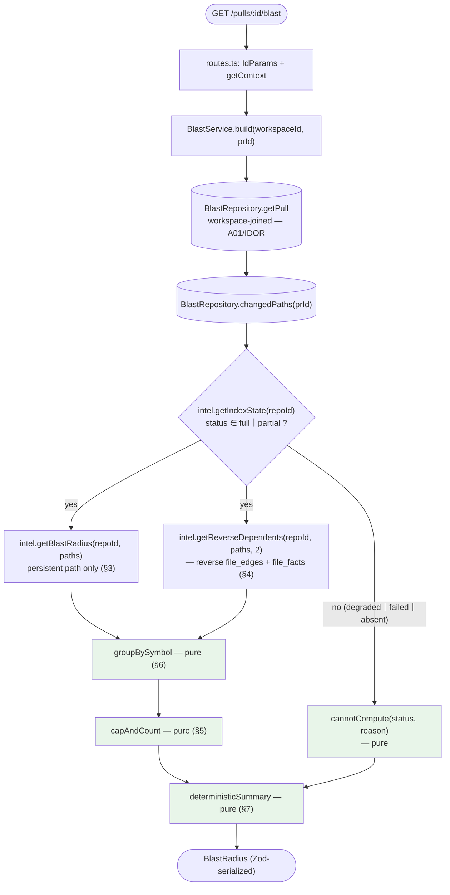

# Blast Radius — an impact map for a PR, served from the index, with no model call on the main path

## Context

A reviewer reading a diff can see *what changed*. The question the diff cannot
answer is **"what else could this touch?"** — who calls the helper that was
rewritten, which HTTP endpoints sit downstream of it, whether a cron job runs
through it. Blast Radius answers that from data the indexer already computed:

1. **Changed symbols** — symbols declared in the PR's changed files.
2. **Callers** — who references those symbols, excluding the declaring file,
   capped at 20 per symbol and ordered by the caller file's PageRank-style
   importance.
3. **Impacted HTTP endpoints and cron jobs** — reached by walking the
   **reverse import graph** out from each changed file, bounded to **2 levels**.
4. Optionally, **one cheap LLM call** that turns the map into a sentence. Nodes
   and edges always come from the index; the model never invents them.

Four things make this a wiring feature rather than an analysis feature, and all
four are already true in the repo today:

1. **The facade method exists and is real.**
   `repoIntel.getBlastRadius(repoId, changedFiles): Promise<BlastResult>`
   (`server/src/modules/repo-intel/service.ts:220`, declared at
   `server/src/modules/repo-intel/types.ts:147`). Its persistent path
   `tryPersistentBlast` (`service.ts:315`) reads `symbols`,
   `references.decl_file`, `file_rank` and `file_facts` straight from Postgres
   — no clone parsing. The 20-cap and the rank sort are already implemented
   (`service.ts:372`, `:386`; `MAX_CALLERS_PER_SYMBOL = 20` at
   `server/src/modules/repo-intel/constants.ts:30`).
2. **The graph and its reverse index exist.** `file_edges` carries
   `(repo_id, from_file, to_file)` with a dedicated reverse-lookup index
   `file_edges_repo_to_idx` on `(repoId, toFile)`, and the schema's own comment
   says that index is *"what blast uses to walk 'who depends on this file?' in
   O(degree)"* (`server/src/db/schema/repo-intel.ts:55-68`). `file_facts`
   holds per-file `endpoints` / `crons`, precomputed by the indexer
   *"so the blast service doesn't have to re-parse the clone on every request"*
   (`:70-88`).
3. **The contract is written** — `ChangedSymbol` / `BlastCaller` /
   `DownstreamImpact` / `BlastRadius`
   (`server/src/vendor/shared/contracts/brief.ts:34-62`), byte-identical in
   both vendored copies (verified: `diff server/src/vendor/shared/contracts/
   brief.ts client/src/vendor/shared/contracts/brief.ts` → no output).
4. **The MCP tool is already registered** as an honest stub returning
   `{status:'not_implemented', feature:'blast_radius'}` with its **final** input
   signature `{repo, pr}` (`mcp/src/tools/get-blast-radius.ts:11-14`), declared
   that way precisely so this lesson does not change the tool surface
   (`mcp/specs/mcp-server-plan.md` §6.5).

**The three gaps this plan closes**, stated up front because they are the whole
of the work:

- **There is no HTTP route.** `repo-intel/routes.ts` exposes only
  `/repos/:id/index-state` and `/repos/:id/resync`. `getBlastRadius` has zero
  call sites in the entire repo.
- **Endpoint impact is 1 hop, not 2.** `BlastResult.impactedEndpoints` is the
  union of `file_facts` for the **direct caller files**
  (`service.ts:376-382`). The spec's 2-level reverse-import walk is not wired
  into it. The precedent for the walk exists — `getCriticalPaths`
  (`service.ts:663-702`) follows `file_edges` up to `BFS_DEPTH = 2`
  (`constants.ts:49`) — but it walks *forward* (importer → imported) and loads
  the whole graph with `repository.getEdges(repoId)` (`repository.ts:432-437`).
- **The facade's shape is flat; the contract's is grouped.** `BlastResult`
  (`types.ts:74-87`) is `{ changedSymbols[], callers[], impactedEndpoints[],
  factsByFile? }`. `BlastRadius` (`brief.ts:57-62`) is
  `{ changed_symbols[], downstream: DownstreamImpact[], summary }` — per-symbol
  grouping plus a **required** `summary` string. Reshaping flat → grouped and
  populating `summary` is the blast service's actual job.

**The defining constraint, and where it differs from its two neighbours.**
`specs/smart-diff-plan.md` forbids a model call absolutely and enforces that
with a one-argument constructor. `specs/intent-layer-plan.md` is *built around*
an LLM round-trip and carries the machinery (feature-model registry,
`input_hash` cache, degrade-on-failure policy) to manage it. Blast Radius sits
between them: **the main path makes no model call and no index rebuild**, and
the optional one-sentence summary — if it ships at all — is a *separate,
opt-in, capped* path that a complete response never depends on. Both halves of
that guarantee are made structural in §2 and §3, not promised in a comment.

**The second defining constraint is honesty about missing data.** The
regression-test-selection literature calls a technique *safe* iff it selects
every test that could be affected: a **false negative is the dangerous error**,
a false positive merely wasteful. Microsoft's Test Impact Analysis takes the
"safe fallback" — anything it cannot reason about means *run everything*. Nx's
`affected` marks **all** projects affected when the lock file changes. And
CodeRabbit ships a standing disclaimer with its own Blast Radius graph: *"an
absent component or relationship means it was not established by the evidence
available … It does not prove that no dependency or downstream impact
exists."* An empty impact map that silently means "we could not compute one"
is the single worst thing this feature can do, because it reads as **"nothing
else is touched"** and buys the reviewer false confidence. §3, §5 and §8 are
written around that.

## Modules affected

| Module | Why | Key files |
|---|---|---|
| `server/` **(primary owner)** | New `modules/blast/` — constants, repository (PR context + changed paths), service (index-state gate, flat→grouped reshape, deterministic summary), one route. **Plus one new `repoIntel` facade method** (`getReverseDependents`) and the repository query behind it — the graph stays owned by `repo-intel`. Container getter + module registry entry. No schema change, no migration. | `src/modules/blast/**` (new: `constants.ts`, `repository.ts`, `service.ts`, `summary.ts`, `routes.ts`), `src/modules/repo-intel/{types.ts:137-172,service.ts,repository.ts,constants.ts}`, `src/platform/container.ts:140-144` (pattern), `src/modules/index.ts:1-13,28-40`, `test/blast-*.test.ts` (new) |
| `client/` | `BlastRadiusPanel` in the Overview tab beside `IntentPanel`; `useBlastRadius` hook; the `blast` i18n namespace already exists (`messages/en/blast.json`) but has **no UI consuming it** | `src/app/repos/[repoId]/pulls/[number]/_components/OverviewTab/OverviewTab.tsx:8-27`, `.../OverviewTab/_components/BlastRadiusPanel/**` (new), `src/app/repos/[repoId]/pulls/[number]/page.tsx:93,149`, `src/lib/hooks/blast.ts` (new), `src/lib/hooks/index.ts:10`, `messages/en/blast.json` |
| `mcp/` | `get_blast_radius` stops being a stub: resolver → `deps.client.get('/pulls/:id/blast')` → compact shape. **Input signature `{repo, pr}` is frozen and must not change.** New `src/shape/blast.ts`; new API view; the tool `description` and `outputSchema` change, which forces matching edits to `test/registry.test.ts` and `specs/mcp-server-plan.md` | `mcp/src/tools/get-blast-radius.ts` (rewrite), `mcp/src/shape/blast.ts` (new), `mcp/src/api/schemas.ts`, `mcp/test/{registry,get-blast-radius}.test.ts`, `mcp/specs/mcp-server-plan.md` §6.-1/§6.5, `mcp/README.md` |
| **Contracts (both vendored copies)** | `BlastRadius` has no index-state field, no truncation count, and no way to say "generated by a model" — all three are required by the acceptance criteria. Widened additively (`.default(...)`), and `BlastRadiusResponse` added beside `SmartDiffResponse` | `server/src/vendor/shared/contracts/{brief.ts:34-62,review-api.ts:68-70}` **and** `client/src/vendor/shared/contracts/{brief.ts,review-api.ts}` |
| `reviewer-core/` | **Not touched — deliberate.** See §1. | — |
| `e2e/` | Not touched in v1 (see Out of scope) | — |

**`reviewer-core/` is not touched, and that is a decision.** Onion R6 keeps
that ring sterile, and Blast Radius assembles no prompt and injects nothing
into a review. The review prompt *already* receives a blast-flavoured
enrichment via `run-executor.ts`'s repo-map + callers digest and its
"high blast-radius" note; feeding this richer map into the prompt is a
different feature with a different cost profile. **Do not create
`reviewer-core/src/blast/`.**

## Architectural constraints

### Onion (`server/`) — the rules this design was checked against

- **R5 — siblings don't import siblings, and this is the sharpest constraint
  in the plan.** `modules/blast/` needs `repo-intel`'s facade, but it must not
  `import type { BlastResult } from '../repo-intel/types.js'`. `pnpm arch`
  runs with `tsPreCompilationDeps: true`, so a **type-only** import trips
  `no-cross-module` exactly as a runtime one does — this repo has already paid
  that price once, when `modules/conventions/service.ts` imported
  `RepoIntel`'s type for a single constructor parameter and would have raised
  the baseline from 41 to 42 (`server/INSIGHTS.md`, Codebase Patterns
  2026-08-12). The fix, then and now: **declare a narrow local interface in
  `modules/blast/` naming only the methods and fields blast actually reads**
  (§2), which `container.repoIntel` satisfies structurally. The live precedent
  is `ConventionsService`'s local `RepoIntelSamples`
  (`server/src/modules/conventions/service.ts:42-50`).
- **R5, second edge — the graph walk goes IN repo-intel, not in blast.**
  Blast must not grow its own `file_edges` code. Doing so would mean either a
  cross-module import or a `blast/repository.ts` querying `file_edges`
  directly, which duplicates graph semantics (edge direction, depth bounding,
  fan-out caps) that `repo-intel` already owns and versions with the indexer.
  See §4 and Open Question 4.
- **A repository may read any table.** `BlastRepository` reads
  `pull_requests` and `pr_files` directly through `db/**` — `pull_requests`
  **workspace-joined**, which is the A01/IDOR control. Precedent and rationale
  are written into `modules/conventions/repository.ts:7-12` and reused by
  `modules/smart-diff/repository.ts:5-15,30-39`.
- **R2 — a service takes ports, not the `Container`.**
  `new BlastService(repo, intel)` — a repository and one narrow port. **No
  `Container`, and on the v1 main path no `llmFor` and no `resolveModel`**
  (§7). Contrast `IntentService`'s five-port constructor
  (`container.ts:125-133`), which looks the way it does *because* it makes a
  paid call.
- **R4 — `routes.ts` stays thin.** Zod schema → `getContext` → one service
  call → return. Model it on `modules/smart-diff/routes.ts:21-34` and
  `modules/intent/routes.ts:21-36`. **Do not copy
  `modules/pulls/routes.ts`**, which queries Drizzle from the handler — that is
  drift D4 in the 41-warning baseline, not a pattern.
- **R3 — Drizzle stops at the repository.** The service works in contract
  types (`BlastRadius`, `DownstreamImpact`); no `*Row` type appears in a
  service or route signature.
- **R6 — `reviewer-core` stays sterile.** Satisfied by not touching it.
- **The gate.** `cd server && pnpm arch` — snapshot **41 warnings across 8
  rules, 0 errors** (`.claude/skills/onion-architecture/references/
  this-project.md:3`). **A new module built this way adds zero.** The one
  place to be careful is the new facade method: `repo-intel/service.ts` is
  already in warn rules D1/D3/D5 — *adding a method to a file already counted
  does not add a warning*, but adding a new concrete-adapter import to it
  would. `getReverseDependents` reads only through `RepoIntelRepository`, so
  it adds nothing. **Verify the count is still 41 before opening the PR.**
- **Rate limiting.** `GET /pulls/:id/blast` is a cheap indexed read → **no
  per-route override**; the global 120/min applies (`server/CLAUDE.md`).
  A per-route cap is required *only* if the optional LLM summary is added, and
  then on its own `POST` endpoint (§7), mirroring intent's refresh split
  (`modules/intent/routes.ts:37-48`, `{max:10, timeWindow:'1 minute'}`).

### Data / schema

**No schema change, no migration, no `pnpm db:generate`.** Every input already
exists: `pull_requests`, `pr_files`, `symbols`, `references`, `file_rank`,
`file_edges`, `file_facts`, `repo_index_state`. The one new query
(`getImportersOf`) hits an index that was created for this exact purpose
(`file_edges_repo_to_idx`, `db/schema/repo-intel.ts:66`).

**Nothing is persisted.** Blast Radius is derived on read; a `blast` table
would need invalidation on every reindex *and* every PR-file refresh, and
would be recomputed from the same three indexed queries anyway. Per
`postgresql-table-design`, denormalise only for a **measured** high-ROI read.
Revisit with a profile, not a guess.

**The one memory-shape concern**, stated because `getCriticalPaths` already
has it: `repository.getEdges(repoId)` (`repository.ts:432-437`) loads **every**
edge for the repo — up to `MAX_INDEXED_FILES = 5000` files' worth of imports —
into JS on each call. §4 does **not** reuse it. It adds a targeted
`getImportersOf(repoId, files)` (`WHERE repo_id = ? AND to_file IN (…)`), one
query per BFS level, two levels, both served by the reverse index.

### Frontend (`client/`) — local conventions override the generic skills

`client/INSIGHTS.md`, Decisions 2026-08-09, is **binding inside `client/`**:

- Per-component `index.ts` barrel + a `styles.ts` exporting `CSSProperties`
  objects. Do **not** "clean these up" toward Tailwind or drop the barrels — a
  partial migration is strictly worse than either end state.
- New component folders live under `_components/<Name>/` with a colocated
  `*.test.tsx` (`client/CLAUDE.md`; only 11 of 38 folders have one today —
  treat the line as the target and add ours).
- Use `@/lib/...` / `@/components/...` aliases in new code, not seven-deep
  `../` chains (Codebase Patterns 2026-08-09).
- **`client/` has no `@testing-library/user-event`.** Every component test
  uses `fireEvent` from `@testing-library/react`; importing `user-event`
  fails at collect time (`client/INSIGHTS.md`, Tool & Library Notes
  2026-08-27). Do **not** copy the `react-testing-library` skill's
  `userEvent.setup()` template here.
- Copy for this panel goes through `next-intl` — the `blast` namespace
  **already exists** at `client/messages/en/blast.json` and is auto-loaded by
  `src/i18n/request.ts`'s `readdirSync` merge. Its existing keys (`stat.*`,
  `view.tree` / `view.graph`, `callerCount`, `noDownstream`, `graph.*`) are
  the design brief in miniature; extend rather than replace them.

### Vendored-contract duplication — the silent failure mode

`client/src/vendor/shared/contracts/*` is a **separate hand-maintained copy**,
not a symlink or a generated artifact (`client/INSIGHTS.md`, Codebase Patterns
2026-08-06). **Unlike Smart Diff, this feature does need a contract change**
(§6), so this is a first-class risk with its own dedicated step (D2/E1) and its
own verification step (F2). If only one copy is edited, the client silently
never sees the new field — **with no build error and no test failure**. The
client test in §8 is written so that it fails if the copy was skipped.

Separately, and **already solved — do not re-fix**: the first *runtime*
(non-`import type`) import from `@devdigest/shared` in a browser bundle used to
500 with `Module not found: Can't resolve './contracts/findings.js'`; fixed by
`resolve.extensionAlias` in `client/next.config.mjs` (`client/INSIGHTS.md`,
Recurring Errors 2026-08-12). It is in place. Know that `pnpm test` and
`pnpm typecheck` would both stay green if it regressed — only a running dev
server catches it — so do a manual pass on the Overview tab before opening the
PR, **watching the already-running dev server's output rather than starting a
parallel `pnpm build`**, which corrupts the shared `.next/` (`client/
INSIGHTS.md`, Recurring Errors 2026-08-27).

## Skills implementer will apply

| Module | Skills |
|---|---|
| `server/` | `onion-architecture` (module placement, R2/R4/R5, the narrow-local-interface fix, `pnpm arch` baseline), `fastify-best-practices` (thin route, Zod schema, why no rate-limit override), `drizzle-orm-patterns` (the two new indexed reads; no write path, no transaction), `postgresql-table-design` (used only to justify *not* adding a table and to confirm the reverse walk rides an existing index), `zod` (`.default(...)` over `.optional()` for the contract widening, so `PrBrief` still parses older payloads), `typescript-expert` (exhaustive `switch` on `IndexStatus` via `never`), `security` (A01 workspace scoping on `:id`; A09 — never log file contents) |
| `client/` | `frontend-architecture` (placement — `references/this-project.md` wins inside `client/`; the shared→feature direction rule), `react-best-practices` (derive-don't-store: counts, grouping and the degraded banner are computed during render, never mirrored into state), `next-best-practices`, `react-testing-library` (1–3 flow tests, `getByRole` first — **but `fireEvent`, not `userEvent`**), `typescript-expert` |
| `mcp/` | `typescript-expert`, `zod` (a `.passthrough()`-free partial view of the API response, `safeParse` at the boundary — the drift detector, `mcp/src/api/schemas.ts:1-17`) |
| Shared | `mermaid-diagram` (the flow diagram in §2), `engineering-insights` (read at start — done; record at end) |

`pr-self-review` is **not** invoked by this plan; it runs automatically via the
existing `PreToolUse` hook before `git push` / `gh pr create`.

---

## 1. Decision — a new `modules/blast/`, and the three things it may not do

**Recommendation: a new module, `server/src/modules/blast/`.** Four reasons,
in descending weight:

1. **It is not a repo-intel concern.** `repo-intel` is *"starter
   infrastructure … Course lessons build features on top of its facade — Blast
   Radius (L04) … — by calling `repoIntel.*`, not by re-indexing"*
   (`server/src/modules/repo-intel/README.md:8-13`). Putting a PR-shaped,
   workspace-scoped, contract-serialising HTTP route inside the indexer inverts
   that. `repo-intel/routes.ts` is deliberately repo-scoped
   (`/repos/:id/index-state`, `/repos/:id/resync`); blast is PR-scoped.
2. **It needs data repo-intel does not own.** The changed-file list comes from
   `pr_files`, resolved through a **workspace-joined** `pull_requests` lookup.
   `repo-intel` is tenant-agnostic by design (its own route comment says so:
   *"the facade itself is tenant-agnostic"*, `repo-intel/routes.ts:36-38`).
   The IDOR control belongs in the module that owns the PR lookup.
3. **`modules/pulls/routes.ts` is baseline debt** (drift D4) and
   `onion-architecture` §7 forbids growing a warn. A new module starts clean at
   zero.
4. **The contract authors already decided this.** `BlastRadius` is a top-level
   contract composed into `PrBrief` (`brief.ts:134-140`), not a field on
   `PrDetail` — and `PrDetail` is consumed by the CI/GitHub runner path, while
   blast is a studio concern.

**Three things `modules/blast/` may not do, each of which would be an easy and
wrong shortcut:**

- **It may not import from `modules/repo-intel/`** — not even
  `import type { BlastResult }`. Narrow local interface, per R5 above.
- **It may not touch `container.codeIndex`, `container.git`,
  `container.depgraph`, or the clone directory.** That is the structural form
  of the acceptance criterion "the server does not rebuild the AST or the
  import graph during the request" (§3). `pnpm arch`'s
  `service-no-concrete-adapter` rule backs the adapter half of this.
- **It may not query `file_edges`, `symbols`, `references`, `file_rank`, or
  `file_facts`.** Those are repo-intel's read model; reaching them from
  `blast/repository.ts` would fork the graph semantics. Blast's repository
  reads exactly two tables: `pull_requests` and `pr_files`.

**Rejected alternative:** a `GET /repos/:id/blast?files=…` route added to
`repo-intel/routes.ts`. Fewer files, but it puts a tenant-scoped PR read in a
tenant-agnostic module, has no natural place for the contract reshape, and
leaves the client to assemble a changed-file list it does not have.

## 2. Call sequence, and how both guarantees are *enforced*

### Where it runs

**On read only.** `GET /pulls/:id/blast` computes the response on every call
from indexed rows. No background job, no write path, no cache. There is
nothing expensive enough to cache: the persistent path is three indexed
queries plus two bounded graph queries.



Everything green is a pure function — no `Date.now()`, no randomness, no I/O.
Same inputs → byte-identical output, which is what makes the grouping, the
capping and the summary unit-testable without Docker.

### The narrow local port (R5)

Declared in `modules/blast/service.ts` (or `modules/blast/ports.ts`), naming
**only** what blast reads. `container.repoIntel` satisfies it structurally:

```ts
/** Narrow local view of the repo-intel facade — declared here, NOT imported
 *  from `modules/repo-intel/` (R5; a type-only import still trips
 *  `no-cross-module` under tsPreCompilationDeps). `container.repoIntel`
 *  satisfies it structurally. Precedent: conventions/service.ts:42-50. */
export interface BlastIntel {
  getIndexState(repoId: string): Promise<{
    status: 'full' | 'partial' | 'degraded' | 'failed';
    degraded?: boolean;
    degradedReason?: string;
    reason?: string;
  }>;
  getBlastRadius(repoId: string, changedFiles: string[]): Promise<{
    changedSymbols: { file: string; name: string; kind: string }[];
    callers: { file: string; symbol: string; viaSymbol: string; line: number; rank: number }[];
    impactedEndpoints: string[];
    factsByFile?: Record<string, { endpoints: string[]; crons: string[] }>;
    degraded?: boolean;
  }>;
  getReverseDependents(
    repoId: string,
    files: string[],
    depth: number,
  ): Promise<{
    dependents: { file: string; depth: number; endpoints: string[]; crons: string[] }[];
    truncated: boolean;
  }>;
}
```

This is verbose, and that verbosity is the point: it is a written record of
exactly which fields of another module's read model this feature depends on.
Widening it later is a visible diff.

### Order of operations (`BlastService.build`)

1. **Resolve + scope the PR.** `repo.getPull(workspaceId, prId)` → `{ id,
   repoId, headSha }`, joined on `pull_requests.workspace_id`. Not found →
   `404 NotFoundError`. **This is the A01/IDOR control: never look a PR up by
   id alone** (`modules/smart-diff/repository.ts:30-39` is the shape to copy).
2. **Read the changed paths.** `repo.changedPaths(prId)` → `string[]`. `patch`
   is never selected. Capped at `MAX_CHANGED_FILES` (§5).
3. **Gate on index state** — §3. This is step 3, *before* any facade read.
4. **Read the map** — `getBlastRadius` and `getReverseDependents` in
   `Promise.all` (independent).
5. **Group flat → per-symbol** — pure, §6.
6. **Cap and count** — pure, §5. Every cap that bites records a total.
7. **Compose the summary** — pure, §7.
8. **Return** the `BlastRadius`.

### How both guarantees are structural, not aspirational

| # | Guarantee | Mechanism | Why it holds |
|---|---|---|---|
| 1 | **No model call on the main path** | `BlastService`'s constructor is `(repo: BlastRepository, intel: BlastIntel)` — no `llmFor`, no `resolveModel`, no `Container`. The `BlastIntel` port has no model-shaped method. | Adding one requires changing the constructor signature: a visible, reviewable diff, not a one-line slip. Backed by a hermetic test injecting a throwing `LLMProvider` spy and asserting a full `build()` completes untouched. |
| 2 | **No AST / import-graph rebuild during the request** | The index-state gate (§3) means the facade's clone-reading fallback is **never reached**, and `pnpm arch`'s `service-no-concrete-adapter` keeps `modules/blast/` from importing `adapters/**` itself. | This is the *only* reliable form of the guarantee — see §3, which explains why calling `getBlastRadius` unguarded would break it. |
| 3 | **The model never invents nodes or edges** (if §7's optional summary ships) | The summary path receives the **already-computed** `BlastRadius` and returns a `string`; it can never add to `changed_symbols` / `downstream`. | A structural separation: the model's output lands in exactly one field, flagged `summary_generated: true`. |

## 3. The index-state gate — why blast calls `getIndexState` **before** `getBlastRadius`

**This is the most important correctness decision in the plan, and it is not
obvious from the facade's signature.**

`repoIntel.getBlastRadius` has two paths. `tryPersistentBlast` returns `null`
when the index is missing or its status is neither `full` nor `partial`
(`service.ts:319-320`), and control then falls through to a **ripgrep
best-effort path that re-reads the clone on the hot path**: it calls
`container.codeIndex.symbols(ref)` over the whole repo (`service.ts:244`), then
`readClone(repo.clonePath, file)` + `extractEndpoints(content)` for every
caller file (`:291-293`).

That fallback is a perfectly good design for `run-executor`'s best-effort
prompt enrichment. **For this feature it directly violates an acceptance
criterion** ("the server does not rebuild the AST or the import graph during
the request"), and it does so invisibly — the response shape is the same, only
slower.

**Decision: `BlastService` reads `getIndexState(repoId)` first and only calls
`getBlastRadius` when `status ∈ {full, partial}`.** Otherwise it returns a
complete, valid `BlastRadius` in an explicit **cannot-compute** state:
`changed_symbols: []`, `downstream: []`, `index_state: <the actual status>`,
`degraded: true`, `reason: <the facade's reason>`, and a `summary` that says so
in words. The UI must render that as a distinct state (§8), never as an empty
map.

Three consequences worth naming:

- **`partial` is allowed through, and labelled.** A partial index gives a real,
  under-approximate map. Suppressing it would be the false-negative error the
  RTS literature warns about — an under-approximate map plus an honest
  "partial" badge beats no map. This is exactly the tier split Sourcegraph
  ships: *precise* (compiler-accurate, SCIP) results shown first and labelled,
  *search-based* results labelled *"heuristics, no semantic information …
  false-positive and false-negative results"*. DevDigest's persistent path is
  the precise tier; we surface it and say which tier it is.
- **The gate makes the guarantee testable without reading the log.** A
  hermetic test can assert that with a stubbed `getIndexState` returning
  `degraded`, `getBlastRadius` was **never called** — a spy assertion, not an
  observation.
- **It costs one extra query** (`repo_index_state` by PK). Acceptable.

**Do not "improve" this by adding a `persistentOnly` flag to
`getBlastRadius`.** That widens the facade for one consumer; the gate is
blast's own policy and belongs in blast.

## 4. The 2-level reverse-import walk — a new facade method

### Decision: `repoIntel.getReverseDependents(repoId, files, depth)`

**Recommendation: add it to the facade, not to blast.** (Open Question 4.)
Three reasons:

1. `repo-intel` owns the graph. Edge direction, the `INDEXER_VERSION` that
   the edges were built under, the fan-out caps, and the `BFS_DEPTH = 2`
   convention all live there (`constants.ts:49`, used by `getCriticalPaths` at
   `service.ts:686`). A second, blast-local walk would fork all four.
2. The alternative — a local port over `getEdges` — cannot work without
   *either* a cross-module import (R5) *or* `blast/repository.ts` querying
   `file_edges` directly, which §1 forbids. And `getEdges` loads the entire
   repo's edge set (`repository.ts:432-437`), which is the wrong query shape
   (below).
3. It is reusable. Onboarding (L05) and the Phantom gate (L06) both want
   "who depends on this?".

### Shape

```ts
// modules/repo-intel/types.ts — added to the RepoIntel facade
export interface ReverseDependentRow {
  file: string;
  /** 0 = the changed file itself, 1 = a direct importer, 2 = an importer of one. */
  depth: number;
  endpoints: string[];   // from file_facts
  crons: string[];       // from file_facts
}
export interface ReverseDependentsResult {
  dependents: ReverseDependentRow[];
  /** True when MAX_REVERSE_DEPENDENTS clipped the frontier — "N of M". */
  truncated: boolean;
  degraded?: boolean;
  reason?: DegradedReason;
}

getReverseDependents(
  repoId: string,
  files: string[],
  depth?: number,          // default BFS_DEPTH = 2; clamped to [0, BFS_DEPTH]
): Promise<ReverseDependentsResult>;
```

**Facts are joined inside repo-intel, not returned as bare paths.** One facade
call instead of two, and it keeps `file_facts` — a repo-intel table — from
needing a second facade method that blast would be the only consumer of.

### The query

A new `RepoIntelRepository.getImportersOf(repoId, files)`:

```sql
SELECT from_file FROM file_edges
 WHERE repo_id = $1 AND to_file = ANY($2)
```

— i.e. Drizzle `and(eq(fileEdges.repoId, repoId), inArray(fileEdges.toFile, frontier))`,
which is served directly by `file_edges_repo_to_idx` on `(repo_id, to_file)`
(`db/schema/repo-intel.ts:66`). **One query per BFS level, two levels, at most
two queries.** Do **not** reuse `getEdges(repoId)`; loading a 5 000-file repo's
whole edge list into JS to answer a question about ~20 changed files is the
wrong shape, and it is only tolerable in `getCriticalPaths` because that runs
per repo, not per PR.

Then one `getFileFacts(repoId, [...depth0, ...depth1, ...depth2])`
(`repository.ts:534-549`) to attach endpoints/crons, and depth-0 facts for the
changed files themselves — **a changed route file's own endpoints are impacted
and must not be missed** because the walk starts *from* it.

Algorithm, in full:

```
frontier = files                       // depth 0
seen     = new Set(files)
out      = rows for depth 0
for d in 1..min(depth, BFS_DEPTH):
    importers = getImportersOf(repoId, frontier)
    next = importers not in seen
    if seen.size + next.size > MAX_REVERSE_DEPENDENTS:
        next = next.slice(0, remaining); truncated = true
    add next to seen and to out at depth d
    frontier = next
    if frontier empty: break
attach file_facts to every row in out
```

### Why depth 2, said honestly

**Depth 2 is a readability/precision heuristic, not a proven bound.** Say so in
the code comment; do not dress it up.

- Bazel's `rdeps(universe, x, depth)` exists precisely because the unbounded
  form computes the *"complete reverse dependency closure"* — which in a
  hub-and-spoke repo reaches essentially everything, and a map that includes
  everything carries no signal. The bounded form's contract is that *"the
  resulting graph only includes nodes within a distance of the specified
  depth."*
- Nx's `affected` is the same idea productised: git diff → changed files →
  projects → "which projects **depend on** the projects you modified".
  Google's TAP defines its "AFFECTED" test set as the reverse-dependency
  closure of the modified files (Memon et al., ICSE-SEIP 2017).
- IDEs bound it too: IntelliJ's *Analyze Backward Dependencies* makes
  transitive depth a configurable threshold and warns it is *"time-consuming …
  in large projects"*. LSP 3.17's call hierarchy goes further and resolves
  **lazily, one level at a time** (`prepareCallHierarchy` →
  `incomingCalls`), never the whole transitive graph up front.
- DevDigest already picked 2 for the forward walk (`BFS_DEPTH = 2`), and
  reusing it keeps one number.

**What we lose at depth 2:** endpoints reached only via 3+ module hops — the
classic `change → repository → service → controller → route` chain is
*exactly* four, so a change deep in a data layer can miss its route. **What we
gain:** a map small enough to render and small enough to trust. §8 surfaces
the bound in the UI ("within 2 import hops") so the reviewer knows what the
absence of an endpoint does and does not mean. Revisit with a measurement on a
real repo, and consider LSP's answer (expand-on-demand for depth 3+) before
raising the constant globally.

### Failure modes to disclose in the code comment

These are TS/JS-specific and all of them inflate or deflate the map:

- **Barrel files are the dominant one.** An `index.ts` that only re-exports
  makes everyone importing the barrel look like a dependent of everything in
  it, in both the reference set and the reverse import fan-out. Vercel measured
  libraries with **up to 10 000 re-exports in a single barrel**. This repo
  barrels aggressively itself — 44 per-component barrels across 38 folders in
  `client/` (`client/INSIGHTS.md`, Decisions 2026-08-09) — so the effect is
  visible on our own dogfood repo.
- **Dynamic dispatch and DI containers.** `container.resolve(token)` is not an
  import edge, and neither is a handler looked up from a string-keyed route
  table. This repo's own `platform/container.ts` is a worked example: a caller
  reaching a service through the container leaves no edge the walk can see.
- **String-keyed routing / job kinds.** `jobs.enqueue(ws, RESYNC_JOB_KIND, …)`
  connects to a handler registered elsewhere with no import between them.

All three produce **false negatives**, which is the dangerous direction. That
is why §8's empty state must never read as "nothing else is touched".

## 5. Ranking, capping, and the truncation count

**Ranking is already implemented and already right — do not re-derive it.**
`tryPersistentBlast` sorts callers by `file_rank.rank` descending
(`service.ts:372`) and slices to `MAX_CALLERS_PER_SYMBOL = 20`
(`service.ts:386`, `constants.ts:30`).

The rationale is worth writing into the blast module's comment because it is
what justifies showing 20 of 300: aider's repo map builds a graph of files with
edges `referencing → defining`, runs NetworkX PageRank over it, flows the
result down to symbols, and truncates to a token budget — because *"a function
called by 20 other functions is more valuable context than a private helper
called once."* DevDigest's `rank` is the churn-free variant of exactly that
(`rank = pagerank`, hotness pinned to 0 — see the decision recorded at
`db/schema/repo-intel.ts:95-98`). Sorting callers by their file's rank and
keeping the top 20 is that same idea applied to a per-PR map.

**Two corrections to the current behaviour that blast must make:**

1. **The 20-cap in the facade is applied to the whole caller list, not
   per symbol.** Read `service.ts:386`: `callers.slice(0, MAX_CALLERS_PER_SYMBOL)`
   truncates the flat array *after* the global rank sort, so a PR changing five
   symbols gets 20 callers **total**, and a high-rank symbol can starve the
   others entirely. The spec says *"cap at 20 callers per symbol."*
   **Decision: blast re-caps per symbol after grouping** (§6) and does not
   change the facade — other consumers (none today) may rely on the flat
   behaviour, and a facade change would need its own justification. Record this
   discrepancy in `server/INSIGHTS.md` at the end (it is exactly the kind of
   thing that reads as a bug to the next reader).
   *Consequence:* blast must ask the facade for the ungrouped list and cannot
   assume it received every caller for every symbol. If the flat cap bites
   before grouping, the per-symbol counts are already wrong. **See Open
   Question 4b** — the clean fix is a `limit` parameter on the facade call, and
   the interim mitigation is to treat `callers.length === MAX_CALLERS_PER_SYMBOL`
   as "globally truncated" and set `degraded`-adjacent messaging accordingly.
2. **Every cap that bites must report a total.** CodeRabbit's Blast Radius
   caps lower-ranked candidates *"to keep the graph readable"* and then tells
   you: **"Showing N of M graph candidates"**, with collapsed node stacks for
   the rest. That count is the difference between a cap and a lie.

### Constants (`modules/blast/constants.ts` — never inlined)

```
MAX_CHANGED_FILES            = 300   // guard: a 4 000-file PR must not fan out
MAX_CALLERS_PER_SYMBOL       =  20   // the spec's number; mirrors repo-intel's
MAX_SYMBOLS                  =  40   // downstream[] length cap
MAX_ENDPOINTS_PER_SYMBOL     =  25
MAX_REVERSE_DEPENDENTS       = 300   // frontier cap for the §4 walk (in repo-intel)
BLAST_REVERSE_DEPTH          =   2   // = repo-intel's BFS_DEPTH; one number, cited
SUMMARY_MAX_CHARS            = 400   // §7
```

`MAX_REVERSE_DEPENDENTS` and `BLAST_REVERSE_DEPTH` live in
`modules/repo-intel/constants.ts` (the walk is repo-intel's); the rest in
`modules/blast/constants.ts`. **No numeric literal appears in `service.ts` or
`summary.ts`.**

## 6. Contract reshape — flat `BlastResult` → grouped `BlastRadius`, and the widening

### 6a. The reshape (pure, `modules/blast/service.ts` helpers)

`BlastResult` is flat; `BlastRadius` groups by symbol. The mapping:

| Contract field | Source |
|---|---|
| `changed_symbols[]` (`{name, file, kind}`) | `BlastResult.changedSymbols`, renamed field order only. Capped at `MAX_SYMBOLS`, ordered by that symbol's caller count desc, then `file` asc, then `name` asc (deterministic). |
| `downstream[].symbol` | one entry per changed symbol **that has ≥ 1 caller or ≥ 1 impacted endpoint/cron**. A symbol with no downstream at all is in `changed_symbols` but not in `downstream` — the `blast.noDownstream` i18n key (`messages/en/blast.json`) already anticipates exactly this. |
| `downstream[].callers[]` (`{name, file, line}`) | `BlastResult.callers` filtered by `viaSymbol === symbol`, **already rank-sorted by the facade**, then `.slice(0, MAX_CALLERS_PER_SYMBOL)`. `name` ← `caller.symbol` (the enclosing symbol, resolved from persistent rows at `service.ts:357-360`). **`rank` is not carried into the contract** — see 6b. |
| `downstream[].endpoints_affected[]` | union of (a) `factsByFile[c.file].endpoints` for that symbol's callers — the **symbol-precise** part — and (b) the endpoints of every `ReverseDependentRow` reachable from **the symbol's declaring file**, at depth 0/1/2. |
| `downstream[].crons_affected[]` | same rule, `.crons`. This field is **only** fillable from `factsByFile` + §4; `BlastResult.impactedEndpoints` has no cron equivalent. |
| `summary` | §7. |

**Attribution is at file granularity, and that is a deliberate
over-approximation to disclose.** The reverse-import walk knows which *files*
depend on a changed file; it does not know which *symbol* in that file the
dependent uses. So every symbol declared in changed file `F` inherits `F`'s
reverse-dependent endpoints. A file declaring `parseToken` and an unrelated
`formatDate` will attribute the same endpoints to both. The caller-derived
half (a) *is* symbol-precise. State this in the service's doc comment and in
the UI copy ("endpoints downstream of the files this symbol lives in").

### 6b. The contract widening — and why it is unavoidable

`BlastRadius` today (`brief.ts:57-62`) has **no** field for: index state,
truncation counts, or whether `summary` came from a model. Two of the seven
acceptance criteria ("incomplete index → a distinct partial/degraded state";
"if the optional summary is implemented, exactly one call") cannot be honoured
without them, and the honesty theme (§Context) forbids faking it by, say,
prefixing the `summary` string.

**Decision: widen additively, with `.default(...)` on every new field, in both
vendored copies; and add `BlastRadiusResponse` beside `SmartDiffResponse`.**

```ts
// server/src/vendor/shared/contracts/brief.ts — and the client copy, verbatim
export const BlastIndexState = z.enum(['full', 'partial', 'degraded', 'failed']);
export type BlastIndexState = z.infer<typeof BlastIndexState>;

export const DownstreamImpact = z.object({
  symbol: z.string(),
  callers: z.array(BlastCaller),
  endpoints_affected: z.array(z.string()),
  crons_affected: z.array(z.string()),
  /** Total callers before MAX_CALLERS_PER_SYMBOL — renders "showing 20 of 137". */
  callers_total: z.number().int().default(0),
});

export const BlastRadius = z.object({
  changed_symbols: z.array(ChangedSymbol),
  downstream: z.array(DownstreamImpact),
  summary: z.string(),
  /** Index tier the map was computed from. `full`/`partial` = asserted;
   *  `degraded`/`failed` = COULD NOT COMPUTE, not "nothing impacted". */
  index_state: BlastIndexState.default('degraded'),
  /** True whenever the map is known to be incomplete (bad index, a cap bit,
   *  or the 2-hop bound clipped the walk). Never render a clean empty map. */
  partial: z.boolean().default(true),
  /** Machine-readable why, for the UI's banner copy. */
  reason: z.string().nullish(),
  /** True only when `summary` came from the optional model call (§7). */
  summary_generated: z.boolean().default(false),
});
```

```ts
// server/src/vendor/shared/contracts/review-api.ts — and the client copy
/** Blast-radius response for a PR (the BlastRadius). */
export const BlastRadiusResponse = BlastRadius;
export type BlastRadiusResponse = z.infer<typeof BlastRadiusResponse>;
```

Rationale, point by point:

- **`.default(...)` not `.optional()`** — `PrBrief` (`brief.ts:134-140`)
  composes `BlastRadius`, so any older persisted `pr_brief.json` must keep
  parsing, and consumers should be free of `undefined` checks (`zod` skill:
  `refine-defaults`, `schema-avoid-optional-abuse`).
- **Defaults are the pessimistic values** (`'degraded'`, `partial: true`). A
  payload that predates the widening, or a producer that forgets to set them,
  is treated as *possibly incomplete* — fail toward attention, never toward
  false confidence.
- **`BlastRadiusResponse` is added** even though it is a bare alias, mirroring
  `SmartDiffResponse` (`review-api.ts:68-70`). It costs one line per copy, it
  is what `routes.ts` names in its `response: { 200: … }`, and it leaves room
  to wrap later without a breaking change.
- **Per-caller `rank` is deliberately NOT added.** The server emits callers in
  rank order and the client renders in received order — one source of truth,
  and the ordering criterion is then testable on the API response alone
  (the same call `specs/smart-diff-plan.md` §4 makes for group order). Adding
  `rank` would invite a client-side re-sort that could disagree with the
  server's.

**Both copies. Every field. Step E1 exists solely for this, and F2 verifies
it.** A skipped copy produces no build error, no type error, and no failing
test except the one written in §8 to catch it.

## 7. `summary` — deterministic on the main path; the optional model call is a separate endpoint

`BlastRadius.summary` is a **required, non-nullable string**
(`brief.ts:60`). The main path makes no model call. Both statements are true
simultaneously because **v1's summary is composed in code**.

### 7a. The deterministic summary (`modules/blast/summary.ts`, pure)

A template over counts the service already has:

```
"3 changed symbols in 2 files · 17 callers across 9 files · 3 HTTP endpoints, 1 scheduled job.
 Computed from a partial index and bounded to 2 import hops — treat an absent
 dependency as unproven, not disproven."
```

Rules:

- Always mentions **counts, the index tier, and the depth bound**. The second
  sentence is the CodeRabbit-style disclaimer, and it is *not* optional: it is
  how the artifact carries its own uncertainty. Adapt the wording per
  `index_state` (`full` drops "partial index" but keeps the hop bound).
- Cannot-compute state (§3) → the summary says what failed and what to do:
  *"Impact could not be computed — this repository has not been indexed
  (status: degraded). Re-index from the repo's Context page, then reload."*
  **Never** *"No impact found."*
- Clamped to `SUMMARY_MAX_CHARS`. `summary_generated: false`.

### 7b. The optional LLM sentence — design, and the recommendation to defer

**Recommendation: defer to a follow-up. Open Question 5.** If it ships, the
design is fixed here so it cannot be bolted onto the `GET`:

- **A separate endpoint: `POST /pulls/:id/blast/summary`**, rate-limited
  `{ max: 10, timeWindow: '1 minute' }` — the exact split and cap
  `modules/intent/routes.ts:37-48` uses for its paid refresh. **Not** a query
  parameter on the `GET`. A `GET` must stay safe, free and idempotent; a
  `?summary=true` would fire a paid call on every React Query refetch and on
  every navigation, which is the mistake `specs/intent-layer-plan.md` §2
  explicitly refuses ("Opening the PR detail page does NOT compute intent").
- **A second service class or a second method with its own dependencies.**
  `BlastService`'s constructor stays LLM-free (§2, guarantee 1); the summary
  lives in `BlastSummaryService(intelBackedBlast, llmFor, resolveModel)`,
  wired in the container like `intentService`.
- **The model receives the finished map and returns one paragraph.** Its input
  is the serialized `BlastRadius`, `wrapUntrusted`-wrapped like every other
  untrusted fragment; its output replaces `summary` and sets
  `summary_generated: true`. It **cannot** add nodes or edges — the response
  is assembled from the deterministic map with only that one field swapped.
  That is the structural form of "the model never invents them".
- **Exactly one call**, no retry beyond the structured-output repair the
  shared `completeStructured` path already does, and a failure degrades to the
  deterministic summary — never a 500. Same best-effort contract as every
  other enrichment in this repo.
- **The UI labels it as generated.** One NL sentence turns *"17 callers, 3
  endpoints"* into *"This changes the auth-token parser; the 3 login/refresh
  endpoints and the session middleware depend on it"* — genuinely useful, and
  never the only output. It renders **beside** the counts, not instead of them.

If deferred, `summary_generated` still ships in the contract (defaulting to
`false`), so adding the endpoint later needs no contract edit and no second
round of vendored-copy surgery.

## 8. Client — `BlastRadiusPanel` in the Overview tab

### 8a. Decision — a panel in Overview, not a new tab

The written work-plan says "add a Blast tab"; the reference screenshots show
Blast Radius as a **panel inside the Overview tab, beside the Intent panel**,
with a Tree/Graph toggle, a `N symbols / N callers / N endpoints / N cron`
stat row, and a "Prior PRs touching these files" accordion.

**Recommendation: match the screenshots — a panel.** (Open Question 1.)

- The Overview tab is already the "what is this PR" surface and currently
  holds exactly two things: `IntentPanel` and the raw Description
  (`OverviewTab.tsx:14-27`). Intent answers *why*; Blast answers *what else*.
  They are read together.
- A fifth tab costs a `?tab=` value, a header entry in `PrDetailHeader`, and a
  navigation step for a panel the reviewer wants **alongside** intent, not
  instead of it.
- The existing i18n file already reads like a panel, not a page: `stat.symbols`
  / `stat.callers` / `stat.endpoints` / `stat.crons` is a stat row.

Structure:

```
OverviewTab/_components/BlastRadiusPanel/
  BlastRadiusPanel.tsx
  BlastRadiusPanel.test.tsx
  styles.ts            // CSSProperties objects — binding local convention
  index.ts             // per-component barrel — binding local convention
```

Nested under its single consumer, matching `IntentPanel`'s placement exactly
(`OverviewTab/_components/IntentPanel/`). Promote it a level only if a second
route renders it.

`OverviewTab` gains two props and `page.tsx:149` passes them:

```tsx
<OverviewTab
  prId={prId}
  prBody={pr.body}
  prHeadSha={pr.head_sha}
  repoFullName={repoFullName}   // already resolved at page.tsx:93
/>
```

Order: **Intent, then Blast, then Description.**

### 8b. Tree view in v1; Graph deferred

**Recommendation: ship the Tree view; render the Graph toggle only if the
graph view ships.** (Open Question 2.)

Every convention points the same way: IDEs, LSP call hierarchy, and "Find
Usages" all default to an **expandable tree**, and offer a graph/DSM view as
secondary. IntelliJ's dependency analysis is a three-pane tree. LSP resolves
one level at a time into a tree. A node-link graph of 20 callers across 9
files is harder to scan than a grouped list and needs layout code, panning, and
its own accessibility story.

The v1 tree:

```
▸ parseToken                        (function · src/auth/token.ts)
    17 callers · showing 20 of 137 · 3 endpoints · 1 cron
    ▸ src/auth/middleware.ts
        requireAuth            src/auth/middleware.ts:42   ↗
        refreshSession         src/auth/middleware.ts:88   ↗
    ▸ src/routes/login.ts
        POST /login            (endpoint, 1 hop)
```

- **Group callers by file, ordered as received** (server rank order — §6b).
- **Direct callers + the endpoint list are visible by default;** depth-2
  dependents and the full caller list are **expand-on-demand**, per the LSP
  lazy-resolution convention.
- **The stat row** uses the existing `stat.*` keys and the `Stat` primitive.
- `blast.callerCount` (`{count} callers`) and `blast.noDownstream`
  (`{count} changed symbol(s), no downstream callers found.`) already exist.
  New keys needed: the truncation line (`showing {shown} of {total}`), the
  partial/degraded banner copy, the cannot-compute empty state, the depth-bound
  caveat, and the "generated" label if §7b ships.
- If the graph view is deferred, **do not render a disabled Tree/Graph toggle**
  — a toggle with one option is chrome. Leave `view.graph` and `graph.*` in
  `blast.json` unused (they already are).

### 8c. Click-to-line — deep-link to GitHub, do **not** scroll the diff

This is where Blast Radius differs from Smart Diff, and getting it wrong is an
easy mistake: **a caller is, by definition, usually in a file the PR did not
change**, so there is no diff line to scroll to. `SmartDiffViewer`'s
`scrollIntoView` pattern does not apply.

Use the existing deep-link helper: `githubBlobUrl(repoFullName, headSha, file,
line)` (`client/src/lib/github-urls.ts`), rendered through the `MonoLink`
primitive — the same pairing `FindingCard.tsx:68-70` and
`FindingsSeverityList.tsx:58-60` already use for `file:line`. `headSha` pins
line numbers so the link stays accurate. Both `repoFullName` and `pr.head_sha`
are already in hand at `page.tsx:93` and `:149`.

When `repoFullName` is `null` (repo not yet loaded) render the `file:line` as
plain mono text, not a dead link — matching `FindingsSeverityList`'s
`<MonoLink>` with no `href`.

### 8d. The four states, and why the empty one is the hard one

| State | Condition | Render |
|---|---|---|
| **Map** | `index_state ∈ {full, partial}`, `downstream.length > 0` | The tree + stat row. If `partial === true`, a **persistent inline caveat** above it (not a dismissible toast), naming the reason: partial index, a cap that bit, or the 2-hop bound. |
| **No impact found** | `index_state === 'full'`, `changed_symbols.length > 0`, `downstream.length === 0` | `blast.noDownstream` — *"3 changed symbols, no downstream callers found."* This is the **only** state allowed to read as "nothing else is touched", and only because the index was complete. |
| **Cannot compute** | `index_state ∈ {degraded, failed}` | An `EmptyState` that says the index is missing/failed and offers the action — a link to the repo's Context page where `useResyncRepoIntel` lives. **Never** the words "no impact". |
| **Loading** | query pending | `Skeleton`, as `IntentPanel` does. |

The distinction between rows 2 and 3 is the acceptance criterion "missing data
→ a clear empty state; incomplete index → a distinct partial/degraded state",
and it is the reason §6b widens the contract. Both are computed **during
render** from the response — no `useState` mirroring of fetched data, no
`useEffect` syncing derived values (`react-best-practices`, derive-don't-store).

### 8e. Hook

New `client/src/lib/hooks/blast.ts`, modelled exactly on
`lib/hooks/smart-diff.ts`:

```ts
export function useBlastRadius(prId: string | null | undefined) {
  return useQuery({
    queryKey: ["blast", prId],
    queryFn: () => api.get<BlastRadius>(`/pulls/${prId}/blast`),
    enabled: !!prId,
  });
}
```

Add `export * from "./blast";` to `src/lib/hooks/index.ts:10`. **Invalidate
`["blast", prId]` nowhere in `onRunDone`** — a review run does not change the
index, and blast does not depend on findings. It *should* be invalidated when a
resync completes; that lives in `useResyncRepoIntel`'s `onSuccess`
(`hooks/repo-intel.ts`) and is a one-line addition — but only if it is cheap to
reach the PR ids, otherwise leave it and let the natural refetch handle it.

### 8f. "Prior PRs touching these files" — out of scope for v1

The screenshots show it; the contract for it already exists and is unimplemented
(`PrHistoryItem` / `PrHistory`, `brief.ts:83-96`, with a `files_overlap` field
that is precisely this feature). It needs a different query (merged PRs whose
`pr_files.path` intersects this PR's), belongs to the PR-history lesson, and
would double this plan's server surface for a section that is not in any
acceptance criterion. **Deferred — Open Question 6.** Do not stub it with an
empty accordion.

## 9. MCP — `get_blast_radius` stops being a stub

`mcp/src/tools/get-blast-radius.ts` is today a real, honest stub: registered,
schema'd, returning `{status:'not_implemented', feature:'blast_radius'}` and
making **no HTTP call at all**. Its input schema `{ repo, pr }`
(`get-blast-radius.ts:11-14`) was declared as *"the final signature, declared
now so it never changes"* — **keep it exactly**, including
`z.number().int().positive()` for `pr`.

Rewrite the handler on the `get-findings.ts` shape (`mcp/src/tools/get-findings.ts:35-99`):

1. `deps.resolver.resolveRepo(repo)` → on miss, `repoMissMessage`.
2. `deps.resolver.resolvePull(repoRes.repoId, pr)` → on miss, `pullMissMessage`.
3. `deps.client.get(\`/pulls/${seg(pullId)}/blast\`, BlastRadiusView)`.
4. `compactBlast(...)` from a new **pure** `mcp/src/shape/blast.ts`.
5. `ok({ repo, pr, ...compact })`.

`BlastRadiusView` goes in `mcp/src/api/schemas.ts` as a partial view citing the
upstream contract + line range, per that file's header
(`mcp/src/api/schemas.ts:1-17`). **Do not vendor `@devdigest/shared`** — that
package is zod 3 and this one is zod 4 (`mcp/CLAUDE.md`).

**The compact shape** (`src/shape/blast.ts`, pure — no fetch, no SDK, no
`node:*`, testable alone, per `mcp/CLAUDE.md`'s layer rule):

```
{
  summary: string,                 // verbatim — it carries the caveat
  index_state: 'full'|'partial'|'degraded'|'failed',
  partial: boolean,
  changed_symbols: ["parseToken (function) src/auth/token.ts", …],   // collapsed to one line each
  downstream: [{
    symbol: "parseToken",
    callers: ["requireAuth src/auth/middleware.ts:42", …],           // "name path:line"
    callers_shown: 20, callers_total: 137,
    endpoints: ["POST /login", …],
    crons: [...],
  }],
}
```

The collapsing rule mirrors `shape/conventions.ts`'s `joinEvidence`: fold
`{file, line}` into one `"path:line"` string, drop nothing that carries
meaning. **`index_state` / `partial` / `callers_total` must survive into the
MCP payload** — an agent reading a truncated or degraded map without being
told is the same false-confidence failure as the UI's, one layer down.

**Three coupled edits this forces, each its own step:**

- **The `description` changes** (it currently begins "Not implemented yet").
  `mcp/test/registry.test.ts:16-17` asserts every description **byte-for-byte**
  against the plan's §6.-1 table — deliberately, as a paraphrase guard
  (`mcp/CLAUDE.md`). So the new string must be written into
  `mcp/specs/mcp-server-plan.md` §6.-1 (line ~445) **and** the test's
  `DESCRIPTIONS` map, in the same commit. Proposed:
  *"Get the blast radius of a pull request: which symbols changed, who calls
  them, and which HTTP endpoints and cron jobs sit downstream. Read-only;
  served from the repository index."*
- **`mcp/specs/mcp-server-plan.md` §6.5** ("a real stub") and its Out-of-scope
  bullet ("Wiring `get_blast_radius` to `RepoIntel.getBlastRadius()` — its own
  lesson, its own plan") are now **resolved by this plan**. Update them to
  point here rather than deleting them.
- **`mcp/test/get-blast-radius.test.ts`** is rewritten: it currently asserts
  the `not_implemented` payload and **zero HTTP calls**. New cases in the
  Testing plan.
- **`pnpm test:live`** (`mcp/test/live.manual.ts`) is the only check that
  catches API-shape drift and must be run manually against a running API after
  this change (`mcp/CLAUDE.md`).

## 10. Steps

Ordered. Cross-module dependencies are called out; within a phase, order is free.

### Phase A — contracts (blocks C, E, F; touches two packages)

- [ ] A1. `server/src/vendor/shared/contracts/brief.ts:34-62` — add
      `BlastIndexState`; add `callers_total` to `DownstreamImpact`; add
      `index_state`, `partial`, `reason`, `summary_generated` to `BlastRadius`.
      **Every new field takes `.default(...)`** so `PrBrief` (`brief.ts:134-140`)
      still parses an older payload (§6b).
- [ ] A2. `server/src/vendor/shared/contracts/review-api.ts:68-70` — add
      `BlastRadiusResponse = BlastRadius` beside `SmartDiffResponse`.
- [ ] A3. **Hand-copy A1 + A2 into
      `client/src/vendor/shared/contracts/{brief,review-api}.ts`.**
      These are independent copies, not symlinks (`client/INSIGHTS.md`
      2026-08-06). **Skipping this fails silently — no build error, no test
      failure.** Verify with
      `diff server/src/vendor/shared/contracts/brief.ts client/src/vendor/shared/contracts/brief.ts`
      → no output. Same for `review-api.ts`.

### Phase B — `repo-intel` facade: the reverse walk (needs nothing; blocks C)

- [ ] B1. `src/modules/repo-intel/repository.ts` — add
      `getImportersOf(repoId, files): Promise<string[]>`, using
      `and(eq(fileEdges.repoId, …), inArray(fileEdges.toFile, files))`.
      **Do not reuse `getEdges` (`:432-437`)** — §4.
- [ ] B2. `src/modules/repo-intel/constants.ts` — add
      `MAX_REVERSE_DEPENDENTS = 300`; reuse the existing `BFS_DEPTH = 2`
      (`:49`) rather than introducing a second depth constant.
- [ ] B3. `src/modules/repo-intel/types.ts:137-172` — add
      `ReverseDependentRow`, `ReverseDependentsResult`, and
      `getReverseDependents(repoId, files, depth?)` to the `RepoIntel`
      interface. **Adding a method to the interface obliges every implementer**
      — today only `RepoIntelService`; no test currently supplies a
      `ContainerOverrides.repoIntel` (`container.ts:56`), but check again
      before assuming.
- [ ] B4. `src/modules/repo-intel/service.ts` — implement it per §4: the
      bounded BFS over `getImportersOf`, one query per level, `file_facts`
      attached via `getFileFacts` (`repository.ts:534-549`), depth-0 rows for
      the changed files themselves, `truncated` when the cap bites. Head it
      with the comment recording that **depth 2 is a readability heuristic, not
      a proven bound**, and the three failure modes (barrels, DI/dynamic
      dispatch, string-keyed routing) from §4.
      Return `[]`/degraded when `repoIntelEnabled` is off, matching every other
      facade method's degraded contract (`types.ts:15-22`).
- [ ] B5. `test/blast-reverse-dependents.test.ts` — hermetic, stubbed
      repository (shape: `test/repo-intel-facade-degraded.test.ts`).

### Phase C — `server/` blast module (needs A + B)

- [ ] C1. `src/modules/blast/constants.ts` — every cap and threshold from §5.
      Head the file with the rank/cap rationale (§5) and a pointer to
      `repo-intel/constants.ts:30` so the two 20s stay in sync knowingly.
- [ ] C2. `src/modules/blast/repository.ts` — `BlastRepository` with
      `getPull(workspaceId, prId)` (**workspace-joined**, returning
      `{ id, repoId, headSha }`) and `changedPaths(prId)`. Reads **only**
      `pull_requests` and `pr_files` through `db/**` — no sibling import (R5);
      shape to copy: `modules/smart-diff/repository.ts:27-51`.
- [ ] C3. `src/modules/blast/service.ts` — the `BlastIntel` narrow local port
      (§2) **declared here, never imported from `modules/repo-intel/`**, and
      `BlastService` with constructor `(repo: BlastRepository, intel: BlastIntel)`
      — no `Container`, no LLM (§2, guarantee 1). Implements §2's order of
      operations, **including the index-state gate of §3 before any
      `getBlastRadius` call**, and the flat→grouped reshape of §6a with the
      per-symbol re-cap of §5.
- [ ] C4. `src/modules/blast/summary.ts` (**pure**) — the deterministic summary
      of §7a, including the cannot-compute wording and the depth-bound caveat.
      Clamped to `SUMMARY_MAX_CHARS`. Sets `summary_generated: false`.
- [ ] C5. `src/modules/blast/routes.ts` — `GET /pulls/:id/blast`, thin per R4,
      `schema: { params: IdParams, response: { 200: BlastRadiusResponse } }`.
      Modelled on `modules/smart-diff/routes.ts:21-34`. **No per-route
      rate-limit override** — cheap read, global 120/min (§Architectural
      constraints). Leave a comment saying so, and why the intent module's cap
      does not apply.
- [ ] C6. `src/platform/container.ts` — a lazy `blastService` getter beside
      `smartDiffService` (`:140-144`), constructing
      `new BlastService(new BlastRepository(this.db), this.repoIntel)`.
      `this.repoIntel` satisfies `BlastIntel` structurally.
- [ ] C7. `src/modules/index.ts` — one import (`:1-13`) + one registry entry
      (`:28-40`).
- [ ] C8. Tests: `test/blast-service.test.ts` (hermetic; the index-state gate,
      the reshape, the caps, **and the zero-LLM + zero-clone assertions**) and
      `test/blast.it.test.ts` (DB-backed — **must** use the `.it.test.ts`
      suffix or the CI split breaks, `server/CLAUDE.md`).
- [ ] C9. `cd server && pnpm typecheck && pnpm arch && pnpm test`.
      **`pnpm arch` must still report 41 warnings / 0 errors** — not 42.

### Phase D — `client/` (needs A3 for the contract, C5 for the endpoint)

- [ ] D1. `src/lib/hooks/blast.ts` (§8e); export from `src/lib/hooks/index.ts:10`.
- [ ] D2. `messages/en/blast.json` — extend the existing namespace with the
      truncation line, the partial banner, the cannot-compute empty state, and
      the depth-bound caveat. **Keep the existing `stat.*` / `callerCount` /
      `noDownstream` keys**; they already match the design.
- [ ] D3. `OverviewTab/_components/BlastRadiusPanel/{BlastRadiusPanel.tsx,
      styles.ts, index.ts, BlastRadiusPanel.test.tsx}` — per-component barrel
      and `CSSProperties` `styles.ts` are **binding** local conventions
      (`client/INSIGHTS.md` 2026-08-09). The tree of §8b, the four states of
      §8d, all derived during render.
- [ ] D4. `file:line` deep links via `githubBlobUrl` + `MonoLink` (§8c) —
      **not** a diff scroll.
- [ ] D5. `OverviewTab.tsx:8-27` — accept `repoFullName`, render
      `<BlastRadiusPanel …/>` between `IntentPanel` and Description;
      update `page.tsx:149` (`repoFullName` is already resolved at `:93`).
- [ ] D6. `cd client && pnpm test && pnpm typecheck`.
- [ ] D7. **Manual pass on the Overview tab against a running dev server.**
      `pnpm test` and `pnpm typecheck` both stay green even if the
      `@devdigest/shared` runtime-import resolution regresses — only a running
      dev server catches it (`client/INSIGHTS.md` 2026-08-12). **Watch the
      already-running dev server's compile output; do not start a parallel
      `pnpm build`** (`client/INSIGHTS.md` 2026-08-27).

### Phase E — `mcp/` (needs C5; independent of D)

- [ ] E1. `mcp/specs/mcp-server-plan.md` — update §6.-1's description row
      (~line 445), rewrite §6.5 from "a real stub" to the wired tool, and
      remove the Out-of-scope bullet that defers this, pointing at
      `server/specs/blast-radius-plan.md` instead.
- [ ] E2. `mcp/src/api/schemas.ts` — `BlastRadiusView`, a partial view citing
      `server/src/vendor/shared/contracts/brief.ts:57-…`.
- [ ] E3. `mcp/src/shape/blast.ts` (**pure**) — `compactBlast` per §9.
- [ ] E4. `mcp/src/tools/get-blast-radius.ts` — rewrite the handler on the
      `get-findings.ts` shape. **Input schema unchanged.** New `description`
      (must equal E1's string byte-for-byte) and `outputSchema`. Annotations
      stay `readOnlyHint: true`, `idempotentHint: true`, `openWorldHint: false`.
- [ ] E5. `mcp/test/registry.test.ts:16-17` — update the `DESCRIPTIONS` entry.
      `mcp/test/get-blast-radius.test.ts` — rewrite (Testing plan).
- [ ] E6. `mcp/README.md` — the tool table.
- [ ] E7. `cd mcp && pnpm test && pnpm typecheck`, then **`pnpm test:live`
      against a running API** — the only check that catches API-shape drift
      (`mcp/CLAUDE.md`).

### Phase F — verification and wrap-up

- [ ] F1. Walk §11 end to end against a real indexed repo and a real PR.
- [ ] F2. **Confirm both vendored contract copies are byte-identical:**
      `diff server/src/vendor/shared/contracts/brief.ts client/src/vendor/shared/contracts/brief.ts`
      and the same for `review-api.ts` — both must produce no output.
- [ ] F3. Run `engineering-insights` and record what is durable — at minimum
      the facade's global-vs-per-symbol caller cap discrepancy (§5) and the
      clone-reading fallback behind `getBlastRadius` (§3), both of which read
      as bugs to the next person and are neither. Cap 3 entries.
- [ ] F4. Open a PR describing the implementation and the checks performed —
      in particular the index-state gate, the depth-2 rationale and what it
      loses, the contract widening across both copies, and the `pnpm arch`
      count before/after. `pr-self-review` runs automatically via the
      `PreToolUse` hook before `git push` / `gh pr create` — **do not invoke it
      manually.**

## 11. How to verify — mapped to the acceptance criteria

| # | Acceptance criterion (verbatim) | How to verify |
|---|---|---|
| 1 | **On a demo PR that changes a shared helper function, the map shows at least two real callers and one HTTP endpoint.** | Import a repo, wait for **Indexed** (`GET /repos/:id/index-state` → `status: "full"`), open a PR that edits a helper with known callers. `curl localhost:3001/pulls/<id>/blast \| jq '[.downstream[].callers \| length] \| add'` → ≥ 2, and `jq '[.downstream[].endpoints_affected] \| flatten \| length'` → ≥ 1. Every caller must be a **real** `file:line` — open two of them on GitHub and confirm the symbol is actually referenced there. Automated: `test/blast.it.test.ts` seeds `symbols` / `references` / `file_rank` / `file_edges` / `file_facts` for a fixture repo and asserts both counts. |
| 2 | **Clicking a `file:line` opens the corresponding line.** | In the panel, click a caller's `file:line` → a new tab at `github.com/<owner>/<repo>/blob/<head_sha>/<path>#L<line>` with that line highlighted. The `sha` (not `main`) is what keeps the line number accurate. Automated: `BlastRadiusPanel.test.tsx` asserts `getByRole("link", { name: /middleware\.ts:42/ })` has the exact `href` from `githubBlobUrl`. |
| 3 | **The server does not rebuild the AST or the import graph during the request.** | Structural first: `grep -rn "codeIndex\|astgrep\|depgraph\|readClone\|clonePath\|node:fs" server/src/modules/blast/` → **no matches**, and `BlastService`'s constructor takes `(repo, intel)`. Test: `test/blast-service.test.ts` stubs `getIndexState` → `degraded` and asserts `getBlastRadius` was **never called** (the §3 gate); a second case stubs it `full` and asserts the `BlastIntel` spy's methods are the *only* calls made. Observationally: `pnpm dev`, tail the server log, hit the endpoint 10× — no indexer/parse/clone lines, no `repo_index_state` write, and response time stays flat (a clone re-read would not). |
| 4 | **Missing data → a clear empty state.** | Two distinct sub-cases, and the test must cover both. (a) *Indexed but nothing downstream*: `index_state: "full"`, `downstream: []` → the panel renders `blast.noDownstream` ("N changed symbols, no downstream callers found"). (b) *A PR with no persisted `pr_files`*: `changed_symbols: []`, a valid body, **not** a 404 (404 is reserved for "no such PR in this workspace"). |
| 5 | **Incomplete index → a distinct partial / degraded state.** | Set the repo's `repo_index_state.status` to `partial` → response has `index_state: "partial"`, `partial: true`, a `reason`, and a `summary` naming it; the panel shows a **persistent inline caveat** above the tree, not a dismissible toast. Set it to `degraded` (or delete the row) → `index_state: "degraded"`, empty map, and the panel shows the **cannot-compute** `EmptyState` with a re-index action — **the words "no impact" must not appear**. `BlastRadiusPanel.test.tsx` asserts states 4(a) and 5 render *different* text; that assertion is the whole point of the contract widening (§6b). |
| 6 | **The main path makes no LLM call. If the optional summary is implemented, exactly one call.** | Structural: `grep -rn "llm\|LLMProvider\|completeStructured\|resolveModel" server/src/modules/blast/` → no matches on the main path, and the constructor takes two arguments, neither model-shaped. Test: `test/blast-service.test.ts` builds the service with an `LLMProvider` spy that throws on every method and asserts a full `build()` completes with the spy never constructed or called. Observationally: `pnpm dev`, tail the log, load the Overview tab and refetch several times — the only new lines are the `GET /pulls/:id/blast` request log; no provider/model/token/cost lines, and `agent_runs` gains no row. **If §7b ships**, the same log check on `POST /pulls/:id/blast/summary` must show **exactly one** provider call per invocation, and `summary_generated: true` in the response. |
| 7 | **`get_blast_radius` returns a compact structured result over MCP.** | `cd mcp && pnpm test` (registry description byte-match + handler cases), then `pnpm test:live` against a running API. Manually: register the server, ask *"what's the blast radius of `<owner/repo>`#N"* → a structured payload with `summary`, `index_state`, `changed_symbols`, and `downstream[]` carrying `callers_shown` / `callers_total`. Assert the payload is **compact**: `callers` are `"name path:line"` strings, not objects, and no field duplicates another (`shape/blast.ts` is pure and unit-tested alone). |

## Testing plan

**`server/` — `cd server && pnpm test && pnpm typecheck && pnpm arch`**

Hermetic (no Docker, no keys) — judge correctness by these:

| File | Covers |
|---|---|
| `test/blast-reverse-dependents.test.ts` | The §4 walk against a stubbed repository. Depth 0 (the changed file's own `file_facts`) is included. Depth 1 and 2 are reached; depth 3 is **not**. A cycle (`a → b → a`) terminates. `MAX_REVERSE_DEPENDENTS` clips the frontier and sets `truncated: true`. `repoIntelEnabled: false` → degraded, not a throw. Exactly **two** `getImportersOf` calls for `depth = 2` (the query-shape guarantee). |
| `test/blast-service.test.ts` | Stubbed `BlastRepository` + `BlastIntel` spy. **The §3 gate**: `degraded`/`failed`/absent index → `getBlastRadius` never called, `index_state` echoed, `partial: true`, and the summary says *cannot compute*. **Zero LLM calls** (criterion 6) via a throwing provider spy. The flat→grouped reshape: callers land under the right `viaSymbol`; a symbol with no downstream is in `changed_symbols` but not `downstream`. **The per-symbol re-cap** (§5): 30 callers for one symbol → 20 emitted, `callers_total: 30`. `crons_affected` is populated from `factsByFile` + reverse dependents, and is `[]` (not `undefined`) when there are none. Endpoint attribution is deduped and capped. A PR with zero `pr_files` → an empty-but-valid `BlastRadius`, not a throw. `summary_generated: false` on every main-path response. |
| `test/blast-summary.test.ts` | The pure summary: counts are correct and pluralised; the depth-bound caveat is always present; the `full` variant drops "partial index" but keeps the hop bound; the cannot-compute variant names the status and **never contains the substring "no impact"**; clamped at `SUMMARY_MAX_CHARS`. |

DB-backed — **must** use the `.it.test.ts` suffix (`server/CLAUDE.md`):

| File | Covers |
|---|---|
| `test/blast.it.test.ts` | `GET /pulls/:id/blast` end to end against a seeded repo with `repo_index_state` (`full`), `symbols`, `references` (with `decl_file` resolved), `file_rank`, `file_edges`, `file_facts`, and `pr_files`. Criterion 1's ≥2 callers + ≥1 endpoint. **Workspace scoping: another workspace's PR id → 404** (A01/IDOR). The response validates against `BlastRadiusResponse`. Flipping `repo_index_state.status` to `partial` then `degraded` produces three distinguishable responses. |

Known environment caveats (`server/INSIGHTS.md`, Recurring Errors):
`.it.test.ts` suites hang without a reachable Docker daemon — run `docker ps`
first, and judge a change from the hermetic suite when Docker is unavailable.
If the testcontainers reaper flakes (`Error: Failed to connect to Reaper`),
re-run with `pnpm exec vitest run --no-file-parallelism`.

**`client/` — `cd client && pnpm test && pnpm typecheck`** (vitest + jsdom,
`fetch` mocked — no API, no browser).

`BlastRadiusPanel.test.tsx`, **3 flow tests** per `react-testing-library`
(fewer, longer, `getByRole` first) — **but with `fireEvent`, not `userEvent`,
which is not installed here** (`client/INSIGHTS.md` 2026-08-27):

1. **The map renders and a caller deep-links.** A `full`-index fixture with two
   symbols, five callers and two endpoints: the stat row shows the right
   counts; expanding a symbol reveals its callers grouped by file in received
   order; the `file:line` link's `href` equals `githubBlobUrl(repoFullName,
   headSha, file, line)`.
2. **Truncation and the partial caveat are both visible.** A fixture with
   `callers_total: 137`, `partial: true`, `index_state: "partial"` renders
   "showing 20 of 137" **and** the persistent caveat. *This test also fails
   loudly if step A3's contract copy was skipped — `callers_total`,
   `index_state` and `partial` would be stripped by the client's own copy of
   the schema.*
3. **Cannot-compute is not the same as no-impact.** `index_state: "degraded"`
   renders the re-index empty state and **not** the `noDownstream` copy;
   `index_state: "full"` with `downstream: []` renders `noDownstream` and
   **not** the re-index state. Assert both directions.

`pnpm typecheck` may fail on a stale `.next/types` cache with a
`TS2344 … AppRoutes` error — re-run after dev/build settles, or
`rm -rf .next/types`; do **not** "fix" the page (`client/INSIGHTS.md`).

**`mcp/` — `cd mcp && pnpm test && pnpm typecheck`** (hermetic; `fetch`
injected via `createApiClient({ fetch })`; no API, no Docker).

| File | Covers |
|---|---|
| `test/shape-blast.test.ts` (new) | `compactBlast` is pure: `{file,line}` folds to `"path:line"`; `callers_shown`/`callers_total` survive; `index_state`/`partial` survive; an empty `downstream` produces an empty array, not `undefined`. |
| `test/get-blast-radius.test.ts` (rewritten) | Happy path: resolves repo + pull, calls **exactly one** `GET /pulls/:id/blast`, returns the compact payload, `isError: false`. Repo miss / pull miss → the shared forward-guiding messages, `isError: true`. A degraded response is forwarded **with** its `index_state`, not flattened into an empty result. An API shape mismatch raises `ApiShapeError` → the drift message. |
| `test/registry.test.ts` | Still **5** tools; the new `get_blast_radius` description matches plan §6.-1 byte-for-byte; annotations unchanged. |

**Not run here:** `reviewer-core/` (untouched) and `e2e/` (Out of scope).

## Out of scope

- **Architecture review and security review** — separate agents. This plan
  states the constraints it was designed against; it does not self-certify.
- **The optional LLM summary**, unless Open Question 5 resolves otherwise —
  §7b. Designed here so it can be added without a contract edit
  (`summary_generated` ships in A1 defaulting to `false`).
- **The graph view** — §8b, Open Question 2. The `view.graph` / `graph.*` i18n
  keys stay unused.
- **"Prior PRs touching these files"** — §8f, Open Question 6. It belongs to
  the PR-history lesson; `PrHistory` (`brief.ts:83-96`) stays unimplemented.
- **Persisting the blast map / a `blast` table / a migration.** Derived on read
  from indexed queries. Revisit only with a measurement.
- **Any change to `reviewer-core/`** and any feed of the blast map into the
  review prompt. The prompt already gets a callers digest and a
  "high blast-radius" note from `run-executor.ts`; enriching it further is its
  own plan with its own token-budget argument.
- **Raising the reverse-walk depth above 2, or making it configurable.** §4.
  Take a measurement on a real repo first, and prefer LSP-style
  expand-on-demand over a global bump.
- **Fixing the facade's global-vs-per-symbol caller cap** (`service.ts:386`) —
  §5. Blast re-caps after grouping; changing the facade needs its own
  justification and its own consumers to check.
- **Making the ripgrep fallback path usable for blast.** §3 gates it out
  entirely rather than optimising it. If a "blast without an index" mode is
  ever wanted, it is a different feature with a different accuracy label
  (Sourcegraph's search-based tier), not a silent fallback.
- **Cross-repo / monorepo-boundary impact.** The walk is scoped to one
  `repo_id`.
- **`e2e/` coverage.** Covered by client unit tests; an e2e flow would need a
  deterministically indexed fixture repo — its own piece of work.
- **Fixing `modules/pulls/routes.ts`'s Drizzle-in-routes drift** — pre-existing
  baseline debt, unrelated, and explicitly not to be extended (§1).

## Open questions

**All six resolved 2026-08-29** — every one landed on the plan's recommended
option. Recorded here; the body sections (§4, §6b, §7b, §8a, §8b, §8f) already
describe the chosen path.

1. ~~Overview panel vs a dedicated Blast tab.~~ **Resolved: the panel** (§8a).
   A `BlastRadiusPanel` in the Overview tab between `IntentPanel` and the
   Description. No new `?tab=` value, no `PrDetailHeader` entry.
2. ~~Graph view in v1, or deferred?~~ **Resolved: defer** (§8b). Ship the Tree
   view only. **Do not render a one-option Tree/Graph toggle** — leave
   `view.graph` / `graph.*` in `blast.json` unused.
3. ~~Widen the `BlastRadius` contract, or ship inside the existing shape?~~
   **Resolved: widen additively** (§6b) — `index_state`, `partial`, `reason`,
   `summary_generated`, `callers_total`, all `.default(...)`, plus a
   `BlastRadiusResponse` alias. **Both vendored copies (A3), F2 verifies it.**
   Per-caller `rank` stays excluded (server sorts, client renders in order).
4. ~~New `repoIntel.getReverseDependents` facade method, or a local walk?~~
   **Resolved: the facade method** (§4, Phase B). repo-intel owns the graph.
   **4b:** ~~also add a `limit` param to `getBlastRadius`?~~ **Resolved: no —
   work around it in blast** (§5). Blast re-caps per symbol after grouping; the
   facade signature is untouched. Record the global-vs-per-symbol discrepancy
   in `server/INSIGHTS.md` (F3), and flag if a real PR shows wrong counts —
   that would be the trigger to revisit the `limit` param.
5. ~~The optional LLM summary — v1 or deferred?~~ **Resolved: defer** (§7b).
   v1's summary is composed deterministically in `modules/blast/summary.ts`.
   When it lands: a separate `POST /pulls/:id/blast/summary` capped 10/min,
   never a `?summary=` param on the `GET`. `summary_generated` ships now
   (defaulting to `false`) so the later addition needs no contract edit.
6. ~~"Prior PRs touching these files" — in scope, or defer?~~ **Resolved:
   defer** (§8f) to the PR-history lesson. `PrHistory` / `PrHistoryItem`
   (`brief.ts:83-96`) stays unimplemented. **Do not stub the accordion.**
