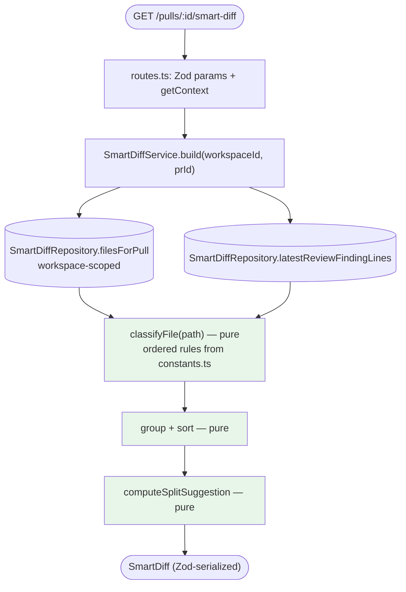

# Smart Diff — risk-ordered file review, with zero new model calls

## Context

The "Files changed" tab renders a PR's files in GitHub's order: a 4 000-line
`pnpm-lock.yaml` sits next to the twelve lines that actually changed behaviour,
and the reviewer pays attention in the order the API happened to return. Smart
Diff reorders that list by **risk** — `core` business logic first, `wiring`
next, `boilerplate` last and collapsed — and, once a review exists, marks which
files carry findings so the reviewer opens those first.

Three things make this a small feature rather than a large one, and all three
are already true in the repo today:

1. **The data is already imported.** `GET /pulls/:id` persists every changed
   file into `pr_files` — `path`, `additions`, `deletions`, `patch`
   (`server/src/modules/pulls/routes.ts:220-231`; schema at
   `server/src/db/schema/pulls.ts:36-45`). A path is enough to classify a file
   deterministically.
2. **The findings are already persisted.** `findings` carries `file`,
   `start_line`, `end_line`, `severity`
   (`server/src/db/schema/reviews.ts:32-53`), and `GET /pulls/:id/reviews`
   already serves them to the PR-detail page
   (`server/src/modules/reviews/routes.ts:129-132`, consumed at
   `client/src/app/repos/[repoId]/pulls/[number]/page.tsx:39`).
3. **The contract is already written.** `SmartDiffRole` / `SmartDiffFile` /
   `SmartDiffGroup` / `SmartDiff`
   (`server/src/vendor/shared/contracts/brief.ts:98-131`) and the response alias
   `SmartDiffResponse` (`server/src/vendor/shared/contracts/review-api.ts:68-70`)
   exist and are **byte-identical in both vendored copies** — verified with
   `diff server/src/vendor/shared/contracts/brief.ts
   client/src/vendor/shared/contracts/brief.ts` → no output. `SmartDiff` is even
   already re-exported from `client/src/lib/types.ts:34`. **This feature is
   designed to need no contract edit at all** (see "Vendored-contract
   duplication" below for why that matters).

The single defining constraint, stated as an acceptance criterion: **Smart Diff
makes no model call.** Not "a cheap one", not "a cached one" — none. That is
what separates this plan from `specs/intent-layer-plan.md`, whose whole design
(feature-model registry, `input_hash` cache, `pr_intent` table, degrade-on-
failure policy) exists to manage an LLM round-trip. Smart Diff needs none of
that machinery: it is two indexed reads and a set of pure functions. **No new
table, no migration, no `pnpm db:generate`.** The absence of an LLM call is
enforced *structurally* — the service's constructor never receives an
`LLMProvider` — not by a comment promising restraint (see §2).

`pseudocode_summary` (`brief.ts:104`) is populated nowhere in the codebase
today and generating it would require exactly the model call this feature
forbids. It is wired through as `null` and is **explicitly out of scope** —
§7 and "Out of scope".

## Modules affected

| Module | Why | Key files |
|---|---|---|
| `server/` **(primary owner)** | New `modules/smart-diff/` — pure classifier, constants file, repository, service, one route. Container getter + module registry entry. No schema change. | `src/modules/smart-diff/**` (new: `constants.ts`, `classify.ts`, `split.ts`, `repository.ts`, `service.ts`, `routes.ts`), `src/modules/index.ts:26-38`, `src/platform/container.ts:101-130`, `test/smart-diff-*.test.ts` (new) |
| `client/` | `SmartDiffViewer` + role-group sections + "Smart order / Original order" toggle in `DiffTab`; `useSmartDiff` hook; additive `defaultOpen` / `findingLines` props on the existing `FileCard` + `CodeLine`; widen the `diff-viewer` barrel; new i18n keys | `src/app/.../[number]/_components/DiffTab/DiffTab.tsx:19-68`, `.../DiffTab/_components/SmartDiffViewer/**` (new), `src/components/diff-viewer/{index.ts,constants.ts}`, `src/components/diff-viewer/FileCard/FileCard.tsx:33-37`, `src/components/diff-viewer/CodeLine/CodeLine.tsx`, `src/lib/hooks/smart-diff.ts` (new), `src/lib/hooks/index.ts:10`, `messages/en/prReview.json` |
| `reviewer-core/` | **Not touched — deliberate.** See §1. | — |
| `e2e/` | Not touched in v1 (see Out of scope) | — |

**`reviewer-core/` is not touched, and that is a decision, not an oversight.**
Onion R6 keeps that ring sterile (TypeScript + Zod + an injected
`LLMProvider`), and its entire reason to exist is prompt assembly and review
grounding. Smart Diff assembles no prompt, injects nothing into a review, and
calls no model — it is a *presentation* concern computed from data the server
already holds. Putting the classifier there would be placing a Fastify-facing
read-model in the engine that the CI runner consumes as source. If a later
lesson wants role-awareness *inside* the review prompt, that is a separate
plan with a separate justification. **Do not create
`reviewer-core/src/smart-diff/`.**

## Architectural constraints

### Onion (`server/`) — the rules this design was checked against

- **R5 — siblings don't import siblings.** `modules/smart-diff/` must not
  import from `modules/pulls/` or `modules/reviews/`, and this feature *wants*
  data owned by both (`pr_files` from pulls' territory, `reviews`/`findings`
  from reviews'). The resolution is the one the skill prescribes and this repo
  already uses: **a repository may read any table.**
  `SmartDiffRepository` reads `pull_requests` / `pr_files` / `reviews` /
  `findings` directly through `db/**`, exactly as
  `IntentContextRepository` reads `pull_requests` / `repos` / `pr_commits` /
  `pr_files` (`server/src/modules/intent/repository.ts:1-20`, whose own doc
  comment records the rationale, itself citing
  `server/src/modules/conventions/repository.ts:7-12`).
  If any shape from a sibling is ever needed, **declare a narrow local
  interface** — never `import type` from the sibling. `pnpm arch` runs with
  `tsPreCompilationDeps: true`, so a type-only import trips `no-cross-module`
  just as a runtime one does (`server/INSIGHTS.md`, Codebase Patterns
  2026-08-12, which records this exact trap costing a baseline warning).
- **R2 — a service takes ports, not the `Container`.**
  `new SmartDiffService(repo)` — one argument, and that argument is a
  repository. The container is resolved in `routes.ts` (or via a lazy
  container getter, as `intentService` does at
  `server/src/platform/container.ts:121-130`) and stops there.
  **This constructor is the enforcement mechanism for "no LLM call"** (§2).
- **R4 — `routes.ts` stays thin.** Zod schema → `getContext` → one service
  call → return. Model it on `server/src/modules/intent/routes.ts:21-47`.
  **Do not copy `server/src/modules/pulls/routes.ts`**, which queries Drizzle
  straight from the handler (`:28-31`, `:200-211`, `:259-260`, `:297-303`).
  `specs/intent-layer-plan.md` already calls that out as part of the
  41-warning `pnpm arch` baseline — pre-existing debt, not a pattern to
  extend.
- **R6 — `reviewer-core` stays sterile.** Satisfied by not touching it at all
  (see above).
- **R3 — Drizzle stops at the repository.** The service works in contract
  types (`SmartDiffFile`, `SmartDiffRole`); no `*Row` type appears in a
  service or route signature.
- **The gate.** `cd server && pnpm arch` — snapshot **41 warnings across 8
  rules, 0 errors** (`.claude/skills/onion-architecture/references/
  this-project.md:3`). New code must not add to any warn rule. **A new module
  built this way adds zero.** Verify before opening the PR.

### Data / schema

**No schema change, no migration.** Smart Diff is derived on read from data
that is already persisted; there is nothing to store that cannot be recomputed
in microseconds from two indexed queries. Both queries hit existing indexes —
`pr_files` by `pr_id`, `reviews` via `reviews_pr_idx`
(`server/src/db/schema/reviews.ts:29`), `findings` via `findings_review_idx`
(`:52`). If a later profile shows this is hot, caching is a separate,
measured change — not speculative denormalisation
(`postgresql-table-design`: denormalise only for *measured* high-ROI reads).

### Frontend (`client/`) — local conventions override the generic skills

`client/INSIGHTS.md`, Decisions 2026-08-09, is **binding inside `client/`**:

- Per-component `index.ts` barrel + a `styles.ts` exporting `CSSProperties`
  objects. Do **not** "clean these up" toward Tailwind or drop the barrels —
  a partial migration is strictly worse than either end state.
- New component folders live under `_components/<Name>/` with a colocated
  `*.test.tsx` (`client/CLAUDE.md`; only 11 of 38 folders have one today —
  treat the line as the target and add ours).
- Use `@/lib/...` / `@/components/...` aliases in new code, not seven-deep
  `../` chains (`client/INSIGHTS.md`, Codebase Patterns 2026-08-09).
- Direction rule (`frontend-architecture` §5): shared code never learns about
  a feature. `src/components/diff-viewer/` is cross-route shared UI, so
  **Smart Diff domain knowledge stays in the route**; the only things pushed
  down into `FileCard` are two domain-free props (§6).

### Vendored-contract duplication — the silent failure mode

`client/src/vendor/shared/contracts/*` is a **separate hand-maintained copy**,
not a symlink or a generated artifact (`client/INSIGHTS.md`, Codebase Patterns
2026-08-06). **As scoped, this feature needs no contract change** — verified
identical today. But if implementation discovers it needs one, **both copies
must be hand-edited**, or the client silently never sees the new field, **with
no build error and no test failure**. §6 is designed specifically to avoid
this: the per-line severity badges are joined client-side from data already in
the React Query cache rather than by widening `SmartDiffFile`.

Separately, and **already solved — do not re-fix**: the first *runtime*
(non-`import type`) import from `@devdigest/shared` in a browser bundle used to
500 with `Module not found: Can't resolve './contracts/findings.js'`. Fixed by
`resolve.extensionAlias` in `client/next.config.mjs`
(`client/INSIGHTS.md`, Recurring Errors 2026-08-12). It is in place. Just know
that `pnpm test` and `pnpm typecheck` would both stay green if it ever
regressed — only a running dev/build catches it — so do a manual
`pnpm dev` pass on the Files-changed tab before opening the PR.

## Skills implementer will apply

| Module | Skills |
|---|---|
| `server/` | `onion-architecture` (module placement, R2/R4/R5, `pnpm arch` baseline), `fastify-best-practices` (route + Zod schema shape, rate limiting), `drizzle-orm-patterns` (two read queries, no write path), `postgresql-table-design` (used only to justify *not* adding a table), `zod` (implement against the existing contract; `safeParse` at the boundary; no redesign), `typescript-expert` (exhaustive `switch` on `SmartDiffRole` via `never`), `security` (A01 workspace scoping / IDOR on `:id`) |
| `client/` | `frontend-architecture` (placement — `references/this-project.md` wins inside `client/`; the shared→feature direction rule), `react-best-practices` (derive-don't-store: grouping and open/closed defaults are computed, not mirrored into state), `next-best-practices`, `react-testing-library` (1–3 flow tests, `getByRole` first, `userEvent`), `typescript-expert` |
| Shared | `mermaid-diagram` (the flow diagram in §2), `engineering-insights` (read at start — done; record at end) |

`pr-self-review` is **not** invoked by this plan; it runs automatically via the
existing `PreToolUse` hook before `git push` / `gh pr create`.

---

## 1. Decision — a new `modules/smart-diff/`, not a route on `modules/pulls/`

**Recommendation: a new module.** Four reasons, in descending weight:

1. **It needs both siblings' data, so it belongs to neither.** Smart Diff
   joins `pr_files` (pulls' territory) with `findings` (reviews' territory).
   Put it in `modules/pulls/` and the findings query either becomes a
   `modules/pulls → modules/reviews` import (**R5 violation, +1 `pnpm arch`
   warning**) or a duplicated findings query inside the pulls module. A
   dedicated module with its own repository reading both tables directly
   through `db/**` is the sanctioned answer, and the repo already has two
   precedents for it (`modules/intent/repository.ts:11-19`,
   `modules/conventions/repository.ts:7-12`).
2. **`modules/pulls/routes.ts` is baseline debt.** It queries Drizzle straight
   from four handlers (`:28-31`, `:200-211`, `:259-260`, `:297-303`) and is
   already counted in the 41-warning `pnpm arch` baseline. `onion-architecture`
   §7 forbids growing a warn. A new module starts clean at zero.
3. **Independent lifecycle and its own query key.** `GET /pulls/:id` is the
   heaviest read in the app — a live GitHub round-trip that **deletes and
   re-inserts** `pr_files` and `pr_commits` on every call (`:220-243`), with a
   divergent offline fallback branch (`:257-289`). Folding a third concern into
   a ~90-line handler with two return paths invites exactly the drift that
   already left `linked_issue` missing from the offline branch. Smart Diff wants
   its own React Query key and its own invalidation (on review completion), not
   coupling to the PR-detail poll.
4. **The contract authors already decided this.** `SmartDiffResponse` exists as
   its own top-level response alias (`review-api.ts:68-70`) rather than as a
   field on `PrDetail`. Following that costs nothing and honours the shape the
   repo was scaffolded with. (`PrDetail` is also consumed by the CI/GitHub
   runner path; Smart Diff is a studio concern.)

**Rejected alternative:** `GET /pulls/:id/smart-diff` implemented inside
`modules/pulls/routes.ts` reusing the handler's existing `container.db` reads.
It is fewer files, but it buys that by extending the one file in the module the
architecture skill points at as the counter-example, and it does not solve (1).

## 2. Call sequence, and how "no LLM call" is *enforced*

### Where it runs

**On read only.** `GET /pulls/:id/smart-diff` computes the response from
persisted rows on every call. There is no background job, no write path, and no
cache — because there is nothing expensive to cache. A `GET` stays safe, free,
and idempotent.



Everything green is a pure function: no `Date.now()`, no randomness, no I/O.
Same inputs → byte-identical output, which is what makes the classifier
unit-testable without Docker and what makes the "lock file is ALWAYS
boilerplate" criterion provable rather than observed.

### Order of operations (`SmartDiffService.build`)

1. **Resolve + scope the PR.** `repo.getPull(workspaceId, prId)` — joined on
   `pull_requests.workspace_id`, exactly as
   `IntentContextRepository.getPullWithRepo`
   (`server/src/modules/intent/repository.ts:35-52`). Not found → `404`
   `NotFoundError`. **This is the A01/IDOR control: never look a PR up by id
   alone.**
2. **Read the files.** `repo.filesForPull(prId)` → `{ path, additions,
   deletions }[]`. **`patch` is deliberately not selected** — the classifier
   never reads patch text (§3), and not fetching it keeps a 4 000-line lock
   file's diff out of the response path entirely.
3. **Read the finding lines.** `repo.findingLinesForLatestReview(prId)` →
   `Map<path, number[]>`. Empty map when the PR has never been reviewed — the
   normal case, and the reason sorting must work with no findings data.
4. **Classify** each file (pure, §3) → `SmartDiffRole`.
5. **Group and sort** (pure, §4).
6. **Compute the split suggestion** (pure, §5).
7. **Return** the `SmartDiff`. `pseudocode_summary` is `null` on every file
   (§7).

### How the no-LLM guarantee is structural, not aspirational

Three independent mechanisms, in order of strength:

| # | Mechanism | Why it holds |
|---|---|---|
| 1 | **`SmartDiffService`'s constructor takes only `(repo: SmartDiffRepository)`** | There is no `llmFor`, no `LLMProvider`, no `resolveModel`, and no `Container`. Adding a model call would require changing the constructor signature — a visible, reviewable diff, not a one-line slip. Contrast `IntentService`'s five-port constructor (`container.ts:122-129`). |
| 2 | **`pnpm arch`** | `modules/*/service` may not reach a concrete adapter; the LLM is reachable only through the container or an injected port, and this service has neither. |
| 3 | **A hermetic test** | `test/smart-diff-service.test.ts` builds the service with a repository stub and a spy `LLMProvider` that throws on any method; the assertion is that a full `build()` completes and the spy was never constructed or called. |

**Server-log verification** (the literal acceptance criterion) is then a
confirmation, not the guarantee — §9.

## 3. The classifier (`modules/smart-diff/classify.ts`, pure)

### Shape: an ordered rule list, evaluated first-match, defaulting to `core`

```
classifyFile(path) → SmartDiffRole
  for rule of SMART_DIFF_RULES:        // ordered, from constants.ts
    if rule.matches(path) return rule.role
  return 'core'                        // the DEFAULT, never a pattern list
```

Two design properties worth stating explicitly, because they are what the
acceptance criteria actually test:

- **Order is `boilerplate` → `wiring` → `core`-fallback.** A generated
  `dist/index.js` is both "generated" and "named index"; boilerplate must win.
  Encoding priority as list order (rather than as branching inside the
  function) is what lets the rules live wholly in `constants.ts`.
- **`core` is the fallback, and there is no `core` pattern list.** An
  unrecognised file is treated as substance. This is a deliberate
  **fail-toward-attention** default: a file wrongly marked `boilerplate`
  is silently collapsed away from the reviewer, while a file wrongly marked
  `core` costs a few seconds of scrolling. The asymmetry is the whole point of
  the feature, so the default must lean the safe way.

### Constants live in `modules/smart-diff/constants.ts` — never inline

This is an explicit acceptance criterion. `classify.ts` contains **control
flow only**; every pattern, extension, filename, and numeric threshold is
imported. Sketch of the file's contents (names are the contract; exact regexes
are the implementer's):

```
BOILERPLATE_LOCKFILES      // exact filenames — see below
BOILERPLATE_FILENAMES      // exact filenames beyond lock files: package.json
                           //   (Open Question 1 — resolved: match the mockup)
BOILERPLATE_DIR_SEGMENTS   // path segments: node_modules, dist, build, out,
                           //   coverage, .next, __generated__, __snapshots__,
                           //   vendor, migrations/meta
BOILERPLATE_EXTENSIONS     // .map, .min.js, .min.css, .snap, .lock
BOILERPLATE_FILENAME_RES   // *.generated.*, *.gen.ts, *.pb.go, *.d.ts
WIRING_FILENAMES           // index.ts|tsx|js|jsx, routes.ts, container.ts
WIRING_FILENAME_RES        // *.config.*, tsconfig*.json, .eslintrc*,
                           //   Dockerfile*, docker-compose*.y?ml,
                           //   .github/workflows/**
SMART_DIFF_RULES           // the ordered list assembled from the above
SMART_DIFF_ROLE_ORDER      // ['core','wiring','boilerplate'] — group order
ROLE_DEFAULT_OPEN          // per-role expand policy (§6), server-agnostic
SPLIT_TOO_BIG_LINES = 400  // §5
SPLIT_GROUP_PATH_DEPTH = 2
MIN_SPLIT_GROUP_FILES = 2
MAX_PROPOSED_SPLITS = 4
```

### Prior art behind each pattern set — and where there is none

**Lock files (`boilerplate`) — strong, cross-ecosystem prior art.** GitHub
Linguist's `generated.rb` treats lock files as generated by exact filename, and
the list spans ecosystems (`package-lock.json`, `pnpm-lock.yaml`, `yarn.lock`,
`Cargo.lock`, `go.sum`, `composer.lock`, …). GitLab runs a parallel
`.gitattributes`-driven `gitlab-generated` mechanism that **auto-collapses**
matching diff files specifically so reviewers can focus on what matters —
direct prior art for the collapsed-by-default requirement, not just the
classification.

This repo is a set of four JS/TS pnpm packages, so `BOILERPLATE_LOCKFILES`
must at minimum cover **`package-lock.json`, `pnpm-lock.yaml`, `yarn.lock`,
`npm-shrinkwrap.json`**, matched on the **basename**, at any depth — a
monorepo-ish layout puts `pnpm-lock.yaml` at four different paths here.
Including the other ecosystems' lock files costs one array entry each and
makes the rule correct for any imported repo, which is what the tool is for.
**This rule is unconditional: no size threshold, no findings override, no
"usually".** It is the first entry in the first rule set, and it has a
dedicated test.

**Generated directories / extensions (`boilerplate`) — same source.**
Linguist's heuristic is layered: path/dir patterns (`node_modules/`, `dist/`,
`__generated__/`), filename patterns (lock files), extensions (`.map`,
`.min.js`), and **content markers** (`@generated`, `DO NOT EDIT` headers). The
first three layers are adopted; the fourth is not — see below.

**`wiring` — no industry standard exists. Say so, don't dress it up.** The only
genuinely recognised concept in the neighbourhood is the **barrel file** (an
`index.ts` re-export aggregator — a real, documented JS/TS convention), plus a
general folk notion of "config files". Nothing standard covers DI-container or
route-registration files as a category. So `WIRING_*` is **repo-specific
judgement**, and should be written down as such in a comment at the top of the
constant, not presented as an adopted convention. The proposed set —
`index.*`, `routes.ts`, `container.ts`, `*.config.*`, `tsconfig*.json`,
`Dockerfile*`, `docker-compose*`, `.github/workflows/**` — is drawn from this
repo's own layout (`server/src/modules/index.ts`, `*/routes.ts`,
`platform/container.ts`, `client/next.config.mjs`). Expect it to need tuning
against a real imported repo; keeping it in `constants.ts` is precisely what
makes that a one-line change.

**Decision — content-based generated-file detection is OUT of scope.** Three
reasons, in order:

1. **We do not have the file content.** `pr_files.patch` holds the *diff
   hunks*, not the file. A `@generated` / `DO NOT EDIT` marker lives on line 1,
   which is only present in the patch if the first hunk happens to start at
   line 1. So the signal is available for some PRs touching a file and absent
   for others.
2. **That makes it non-deterministic across PRs**, which breaks the property
   the whole feature rests on: the same file must get the same role every
   time. A file that is `boilerplate` in PR #10 and `core` in PR #11 is worse
   than one that is consistently wrong.
3. `patch` is nullable (`schema/pulls.ts:44`) and GitHub omits/truncates it for
   binaries and very large files — precisely the files a content heuristic
   would most want to read.

Path/filename/extension matching is deterministic from data we always have.
Revisit only if the classifier is ever given real file contents (e.g. via the
repo clone), which is its own plan.

**Decision — `package.json` is `boilerplate`, matching the reference mockup.**
The plan initially recommended `wiring` (a dependency change is a supply-chain
decision the `security` skill's A03 flags as worth a human's attention), but
this was raised as Open Question 1 and the product call came back: match the
mockup exactly, which groups `package.json` with `package-lock.json` under
Boilerplate. `BOILERPLATE_FILENAMES` therefore includes `package.json`
(exact basename, any depth) alongside the lock files. Note the residual risk
this accepts: a dependency bump collapses by default same as its lock file,
and only surfaces if it carries a finding (§6c) — accepted as the explicit
product decision, not an oversight.

## 4. Grouping and ordering (pure)

- **Group order** is fixed by `SMART_DIFF_ROLE_ORDER = ['core', 'wiring',
  'boilerplate']`. The **server emits `groups` already in that order**; the
  client renders in received order and does **not** re-sort. One source of
  truth for "core first", and the acceptance criterion is then testable on the
  API response alone.
- **Empty groups are omitted.** `groups` contains only roles with ≥ 1 file, so
  the client never renders a section header with nothing under it. (The
  contract permits either; omitting is the kinder default and needs no
  client-side filtering.)
- **File order within a group** is deterministic and three-keyed:
  1. `finding_lines.length` **descending** — files with findings surface first
     inside `core`, which is the reviewer's real priority;
  2. `additions + deletions` **descending** — bigger changes before trivial
     ones;
  3. `path` **ascending** — the tiebreak that makes the output stable, so a
     snapshot test is meaningful.
- **`finding_lines`** is the set of **distinct `findings.start_line` values**
  for that path, deduped and sorted ascending. *Not* the expanded
  `start_line..end_line` range: the UI anchors one badge per finding at its
  start line, and expanding a 200-line finding would put 200 entries in an
  array whose only consumers are a count and a set-membership test.
- **Which review counts as "the latest".** The single newest `reviews` row of
  `kind = 'review'` for the PR, by `created_at desc` — the same semantics
  `modules/pulls` already uses for the PR-list score and severity badges
  (`server/src/modules/pulls/routes.ts:120-128`). Consistency across the two
  surfaces matters more here than completeness. **Open Question 2** covers
  whether it should instead union all agents' reviews from the latest run
  batch.
- **No findings yet** → every `finding_lines` is `[]`, ordering falls through
  to keys 2 and 3, and the feature works exactly as specified before any
  review has run.

## 5. `split_suggestion` (pure, `modules/smart-diff/split.ts`)

### `total_lines` — boilerplate is excluded from the count

`total_lines = Σ(additions + deletions)` over **`core` + `wiring` files only**.

This follows the widely-reused `noqcks/pull-request-size` GitHub Action, which
explicitly subtracts generated/boilerplate files' line counts before bucketing
a PR into its size bands. The rationale transfers exactly: a 4 000-line lock
file makes a PR *large on disk* and *unchanged in review effort*. Counting it
would flag nearly every dependency bump as "too big to review", which is both
wrong and the fastest way to get the whole signal ignored.

### `too_big` — threshold 400, as a named constant

`too_big = total_lines > SPLIT_TOO_BIG_LINES`, `SPLIT_TOO_BIG_LINES = 400`.

No canonical industry threshold exists; ~400 changed lines is the most commonly
cited convergence point (bssw.io) for "too large to review effectively", and it
lands at the top of `pull-request-size`'s **L** band (L = 100–499, XL = 500–999,
XXL = 1000+). Choosing the top of L rather than the bottom means we only flag
PRs that are already large by that widely-used scale — an ordinary 150-line
feature PR stays quiet, which keeps the flag credible. Chosen over 500 (XL's
floor: too permissive; a 480-line review is genuinely degraded) and over 250
(too noisy for this repo's own PR sizes).

### `proposed_splits` — genuinely new logic; state the tradeoff plainly

**No tool researched — GitHub, GitLab, CodeRabbit, Graphite, Sourcegraph —
automatically proposes how to decompose a large PR into named groups.** This is
not adapted prior art; it is a heuristic we are inventing. It should therefore
be the simplest defensible thing, and it should degrade to silence rather than
to a guess.

```
computeProposedSplits(files) →
  candidates = files where role ∈ {core, wiring}        // boilerplate never split
  bucket by directory prefix at SPLIT_GROUP_PATH_DEPTH = 2
      e.g. server/src/modules/pulls/routes.ts → "server/src"
  drop buckets with < MIN_SPLIT_GROUP_FILES (2) files
  sort buckets by Σ(additions+deletions) desc, then name asc
  take first MAX_PROPOSED_SPLITS (4)
  if fewer than 2 buckets survive → return []           // honest silence
```

**The tradeoff, stated without dressing it up:** directory proximity is a
*proxy* for logical cohesion. It is right for the common case (a PR that
touches a server module and a client route splits cleanly along that seam) and
wrong for a cross-cutting change that touches one file in each of twelve
directories. In that wrong case the heuristic produces fewer than two buckets
and returns `[]` — so `too_big: true, proposed_splits: []` is a valid and
meaningful response meaning *"this is large and does not decompose cleanly."*
That degradation is the design, not a gap. Do not add a fallback that invents
groups to fill the array.

`ProposedSplit.name` is the bucket's directory prefix verbatim (e.g.
`server/src`, `client/src`) — a path, not prose. Naming a split requires
understanding what the code does, which requires the model call this feature
does not make.

## 6. Client

### 6a. Decision — `SmartDiffViewer` is a new route component that **reuses `FileCard`**

**Recommendation:** a new component at
`.../[number]/_components/DiffTab/_components/SmartDiffViewer/`, which owns
grouping/collapse/badges and delegates **all** file rendering to the existing
`FileCard` (`client/src/components/diff-viewer/FileCard/FileCard.tsx`).

Reasoning, both directions:

- **Why not re-implement file rendering.** `FileCard` is not a thin wrapper —
  it parses the patch (`parsePatch`), builds comment threads, partitions
  matched vs. outdated threads, renders `CodeLine` with the hover-"+" inline
  composer, and renders `OutdatedComments` (`FileCard.tsx:33-98`). Duplicating
  that is ~100 lines of copy plus a permanent obligation to keep the inline-
  comment feature working in two places. Inline commenting must keep working in
  Smart order; it is the tab's existing headline feature.
- **Why not extend the shared `DiffViewer` with a `groups` prop.**
  `src/components/diff-viewer/` is cross-route shared UI. Teaching it about
  `SmartDiffRole` pushes feature knowledge **down** into the shared layer,
  against `frontend-architecture` §5's one-way `shared → features → app`
  direction. `DiffViewer` itself is a 30-line flat map (`DiffViewer.tsx:14-31`)
  — there is no logic there worth inheriting, only the `FileCard` call, which
  we make directly.
- **Where the seam lands.** `SmartDiffViewer` knows the domain and has exactly
  one consumer (`DiffTab`), so it stays colocated under it —
  `frontend-architecture`'s second-consumer rule. Promote it to
  `src/components/` only if a second route ever renders it.

**Two additive, domain-free props on `FileCard`** (this is the whole surface
change to shared code):

| Prop | Type | Purpose |
|---|---|---|
| `defaultOpen` | `boolean \| undefined` | Overrides the current size-based initializer (`FileCard.tsx:35-37`, `AUTO_EXPAND_MAX_LINES`). Required because a small `pnpm-lock.yaml` under 200 lines would otherwise auto-expand, breaking the unconditional criterion. `undefined` → today's behaviour exactly, so `DiffViewer` is untouched. |
| `findingLines` | `number[] \| undefined` | Renders the "N findings" count in the header, and is passed to `CodeLine` so a line in the set gets the marker + a stable anchor id. |

Both are optional; the existing `DiffViewer` passes neither and behaves
identically. **`FileCard` must also be exported from
`src/components/diff-viewer/index.ts`** (which today exports only `DiffViewer`
and `DiffCommentApi`) — a deliberate widening of that module's public API, per
`frontend-architecture` §4 ("across a module boundary import the barrel"). Do
not deep-import `../../../../components/diff-viewer/FileCard/FileCard`.

### 6b. Per-line severity badges — joined client-side, with **no contract change**

The mockup shows inline `suggestion` / `warning` / `blocker` badges at the
finding's line. `SmartDiffFile` carries `finding_lines: number[]` but **no
severity** — and widening it would mean editing both vendored contract copies,
the exact silent-failure trap recorded in `client/INSIGHTS.md`.

**It is not necessary.** The PR-detail page **already** fetches
`usePrReviews(prId)` (`page.tsx:39`), and each `ReviewRecord.findings[]` entry
carries `severity`, `file`, `start_line`, and `title`
(`contracts/findings.ts:47-62`). So:

- **Per-line severity badge** — `SmartDiffViewer` reads the same
  `usePrReviews(prId)` query (already cached; React Query dedupes, so this
  costs **zero extra requests**) and builds a
  `Map<\`${file}:${start_line}\`, Severity[]>` in a module-scope pure helper.
  Render with the existing `SeverityBadge` primitive, which is icon+label by
  design (WCAG AA: never colour alone).
- **Per-file "N findings" count and the auto-expand decision** come from the
  server's `finding_lines`, so they are correct even before the reviews query
  resolves and do not depend on the join.

Two sources, each used for what it is authoritative about. State this in the
component's header comment so a later session does not "simplify" it by adding
`severity` to the contract.

### 6c. Default-open policy — the acceptance criteria, encoded

A constant table, not scattered conditionals
(`ROLE_DEFAULT_OPEN`, in the diff-viewer or SmartDiffViewer constants file):

| Role | Open by default? |
|---|---|
| `core` | `finding_lines.length > 0 \|\| (additions + deletions) <= AUTO_EXPAND_MAX_LINES` |
| `wiring` | `finding_lines.length > 0` — collapsed otherwise |
| `boilerplate` | **`false`, unconditionally** — regardless of size *or* findings |

The `boilerplate` row is the acceptance criterion verbatim, and it is the
reason `defaultOpen` must be an explicit prop rather than a tweak to
`AUTO_EXPAND_MAX_LINES`. A finding in a boilerplate file still shows its
"N findings" header badge — the user can open it; it just never opens itself.
This matches the mockup (wiring collapsed *except* the one with a blocker;
boilerplate all collapsed).

### 6d. Click-to-line navigation

Follow the pattern already in this route rather than inventing one:
`ReviewRunAccordion` opens itself and calls
`rootRef.current?.scrollIntoView({ behavior: "smooth", block: "start" })` from
an effect keyed on a `targetRunId` + `targetNonce` pair
(`ReviewRunAccordion.tsx:48-60`). The nonce exists so clicking the same target
twice re-fires; the same problem exists here.

- `SmartDiffViewer` holds `{ path, line, nonce }` in one `useState`.
- Clicking a file's "N findings" badge sets the target to that file's first
  `finding_lines` entry.
- `FileCard` receives the target for its own path, forces `open`, and the
  matching `CodeLine` scrolls itself into view and takes a transient highlight.
- Each rendered `CodeLine` gets a stable `id={\`d-${path}-${newNo}\`}` so the
  anchor works and so an RTL test can assert on it.

This is an **effect synchronising an external system (the DOM scroll
position)** — a legitimate `useEffect`, unlike the derived-state misuse
`react-best-practices` warns about. Everything else in the component
(groups, counts, open defaults, the severity map) is **computed during render**
from props and query data. **No `useState` mirroring of fetched data, no
`useEffect` syncing derived values.**

### 6e. `DiffTab` integration and the order toggle

`DiffTab` (`DiffTab.tsx:19-68`) keeps everything it does today and gains:

- `const smart = useSmartDiff(prId, { enabled: !!prId && !!files.length })`.
- Local `React.useState<"smart" | "original">("smart")` — deliberately **not**
  a URL param. `react-best-practices` puts filter/view state in the URL, but
  `DiffTab` has no access to the page's `setParam` (`page.tsx:69-75`) and
  threading it down for a view preference is scope the acceptance criteria do
  not ask for. Noted as future work, not a gap.
- A segmented **"Smart order" / "Original order"** control in the existing
  `SectionLabel`'s `right` slot, beside the current comments toggle. **Two
  `Button kind="ghost" size="sm"` with `aria-pressed`**, not the `Toggle`
  primitive — `Toggle` is a `role="switch"` on/off control
  (`vendor/ui/primitives/Toggle.tsx:12-14`), which reads wrong for two named
  modes and is awkward to query. Two buttons give
  `getByRole("button", { name: /original order/i })` for free.
- **Fallback:** if the smart-diff query errors, or returns no groups, render
  the existing flat `<DiffViewer files={files} commenting={commenting} />` and
  **hide the toggle entirely**. The Files-changed tab must never break because
  an enrichment failed — the same best-effort contract the server uses for
  review enrichments.

**Sequencing hazard, worth stating because it is easy to get wrong:**
`pr_files` is populated by `GET /pulls/:id` (`pulls/routes.ts:220-231`), **not**
by the PR *import* in `GET /repos/:id/pulls`. So the smart-diff query must not
fire before the detail query has settled, or it reads an empty table on a
first-ever visit. Gating on `enabled: !!prId && !!files.length` (i.e. the
detail response is in hand) is sufficient, since `DiffTab` already receives
`files` from `pr.files`. Correspondingly, the **server returns an empty-but-
valid `SmartDiff`** (`groups: []`, `split_suggestion: { too_big: false,
total_lines: 0, proposed_splits: [] }`) when a PR has no persisted files —
`404` is reserved for "no such PR in this workspace".

### 6f. Hook and i18n

New `client/src/lib/hooks/smart-diff.ts`, modelled exactly on
`lib/hooks/intent.ts:10-16`:

```ts
export function useSmartDiff(prId: string | null | undefined, opts?: { enabled?: boolean }) {
  return useQuery({
    queryKey: ["smart-diff", prId],
    queryFn: () => api.get<SmartDiff>(`/pulls/${prId}/smart-diff`),
    enabled: (opts?.enabled ?? true) && !!prId,
  });
}
```

Add `export * from "./smart-diff";` to `src/lib/hooks/index.ts:10`. Invalidate
`["smart-diff", prId]` in `page.tsx`'s `onRunDone` (`page.tsx:58-66`, beside
the existing `["intent", prId]` invalidation) — a finished run produces
findings, which change `finding_lines` and therefore the ordering and badges.

**i18n:** add a `"smartDiff"` block to `client/messages/en/prReview.json`
(PR-review UI copy already lives there; `shell.json`'s `diffViewer` namespace is
for the shared viewer's own strings). Keys needed: the order-toggle labels, and
per-role heading + subtitle matching the mockup —
`Core logic` / "The substance of the change — review closely",
`Wiring` / "Hooks the core into the app",
`Boilerplate` / "Generated / mechanical — skim" — plus a `{count} files` count
and an `{count} findings` badge label.

## 7. `pseudocode_summary` — explicitly out of scope, wired through as `null`

`SmartDiffFile.pseudocode_summary` (`brief.ts:104`, `z.string().nullish()`)
exists in the contract and is populated **nowhere** in the codebase — verified:
zero non-contract references across `server/src`, `client/src`, and
`reviewer-core/src`.

**Decision: leave it `null`, name the decision, do not drop the field.**

- Generating a per-file "What this does:" summary is, by definition, a language
  task — it needs a model call. That is precisely what the acceptance criterion
  "server logs show no new model/LLM call" forbids. Adding it would not be
  scope creep; it would be a direct contradiction of the feature's defining
  constraint.
- None of the written acceptance criteria mention it. The reference mockup
  shows it, which is exactly why it must be stated rather than silently
  omitted — otherwise the next reader sees an unpopulated field and assumes a
  bug.
- The service sets `pseudocode_summary: null` explicitly (not `undefined`,
  not omitted) so the field is visibly present-and-empty in every API response,
  and the client renders nothing for it. A later "pseudocode" lesson fills the
  same field with no contract change and no client-shape change.

Leave a one-line comment at the assignment site pointing at this section.

## 8. Steps

Ordered. Cross-module dependencies called out; within a phase, order is free.

### Phase A — `server/` pure core (blocks everything; no dependencies)

- [ ] A1. `src/modules/smart-diff/constants.ts` — every pattern set, the role
      order, and every numeric threshold from §3 and §5. Head the `WIRING_*`
      constants with a comment recording that they are repo-specific judgement
      with no industry standard behind them (§3).
- [ ] A2. `src/modules/smart-diff/classify.ts` (**pure**) — `classifyFile(path)`,
      ordered first-match over `SMART_DIFF_RULES`, `core` as the fallback.
      **Control flow only; zero inline patterns or numbers.**
- [ ] A3. `src/modules/smart-diff/split.ts` (**pure**) —
      `computeSplitSuggestion(classifiedFiles)` per §5, boilerplate excluded
      from `total_lines`, `[]` when fewer than 2 buckets survive.
- [ ] A4. Tests: `test/smart-diff-classify.test.ts`,
      `test/smart-diff-split.test.ts` (hermetic — see Testing plan).

### Phase B — `server/` module wiring (needs A)

- [ ] B1. `src/modules/smart-diff/repository.ts` — `SmartDiffRepository` with
      `getPull(workspaceId, prId)` (**workspace-joined**), `filesForPull(prId)`
      (does **not** select `patch`), `findingLinesForLatestReview(prId)`.
      Reads `pull_requests` / `pr_files` / `reviews` / `findings` directly
      through `db/**` — no sibling import (R5); precedent
      `src/modules/intent/repository.ts:11-19`.
- [ ] B2. `src/modules/smart-diff/service.ts` — `SmartDiffService`, constructor
      `(repo: SmartDiffRepository)` **and nothing else** (§2). Implements the
      §2 order of operations; sets `pseudocode_summary: null` with a comment
      pointing at §7.
- [ ] B3. `src/modules/smart-diff/routes.ts` — `GET /pulls/:id/smart-diff`,
      thin per R4, `schema: { params: IdParams, response: { 200:
      SmartDiffResponse } }`. Modelled on `src/modules/intent/routes.ts:29-38`.
      **No per-route rate-limit override** — this is a cheap read; the global
      120/min applies (`server/CLAUDE.md`). Contrast the intent refresh
      endpoint, which is capped precisely because it costs money.
- [ ] B4. `src/platform/container.ts` — a lazy `smartDiffService` getter beside
      `intentService` (`:121-130`). (Only strictly needed if a second consumer
      appears; adding it now keeps `routes.ts` a one-liner and matches the
      established shape.)
- [ ] B5. `src/modules/index.ts:26-38` — one import + one registry entry.
- [ ] B6. `test/smart-diff-service.test.ts` — including the **zero-LLM-calls**
      assertion (§2, mechanism 3).
- [ ] B7. `test/smart-diff.it.test.ts` — DB-backed. **Must** use the
      `.it.test.ts` suffix or the CI split breaks (`server/CLAUDE.md`).
- [ ] B8. `cd server && pnpm typecheck && pnpm arch && pnpm test`.
      **`pnpm arch` must still report 41 warnings / 0 errors** — not 42.

### Phase C — `client/` shared-viewer prop additions (needs nothing; unblocks D)

- [ ] C1. `src/components/diff-viewer/FileCard/FileCard.tsx` — add optional
      `defaultOpen` and `findingLines` props (§6a). `undefined` for both must
      reproduce today's behaviour byte-for-byte.
- [ ] C2. `src/components/diff-viewer/CodeLine/CodeLine.tsx` — accept the
      finding marker + stable line `id`; render the severity badge slot.
- [ ] C3. `src/components/diff-viewer/index.ts` — export `FileCard` (deliberate
      public-API widening, §6a).
- [ ] C4. Confirm `DiffViewer.tsx` needs **no change** — if it did, the props
      were not additive.

### Phase D — `client/` Smart Diff UI (needs B3 for the endpoint, C for the props)

- [ ] D1. `src/lib/hooks/smart-diff.ts` (§6f); export from
      `src/lib/hooks/index.ts:10`.
- [ ] D2. `.../DiffTab/_components/SmartDiffViewer/{SmartDiffViewer.tsx,
      styles.ts, index.ts, SmartDiffViewer.test.tsx}` — per-component barrel
      and `CSSProperties` `styles.ts` are **binding** local conventions
      (`client/INSIGHTS.md` 2026-08-09).
- [ ] D3. Role-group section rendering + `ROLE_DEFAULT_OPEN` (§6c) + the
      client-side severity join (§6b, a **module-scope pure helper**, not
      computed in the component body).
- [ ] D4. Click-to-line target state + scroll effect (§6d).
- [ ] D5. `DiffTab.tsx` — the order toggle, the `useSmartDiff` call with its
      `enabled` gate, and the fallback-to-`DiffViewer` path (§6e).
- [ ] D6. `page.tsx:58-66` — invalidate `["smart-diff", prId]` in `onRunDone`.
- [ ] D7. `messages/en/prReview.json` — the `smartDiff` block (§6f).
- [ ] D8. `cd client && pnpm test && pnpm typecheck`.
- [ ] D9. **Manual `pnpm dev` pass on the Files-changed tab.** `pnpm test` and
      `pnpm typecheck` both stay green even if the `@devdigest/shared` runtime-
      import resolution regresses — only a running dev/build catches it
      (`client/INSIGHTS.md`, Recurring Errors 2026-08-12).

### Phase E — verification and wrap-up

- [ ] E1. Walk the "How to verify" section below end to end against a real
      large PR.
- [ ] E2. Confirm **no** contract file was edited in either
      `server/src/vendor/shared/` or `client/src/vendor/shared/`. If one was,
      the other **must** be hand-edited to match — there is no build error to
      catch it.
- [ ] E3. Run `engineering-insights` and record anything non-obvious in the
      right module's `INSIGHTS.md` (cap 3 entries; skip if nothing durable was
      learned).
- [ ] E4. Open a PR describing the implementation and the checks performed —
      in particular the classification rules chosen, the 400-line threshold
      rationale, the `package.json` role decision (Open Question 1, resolved
      as `boilerplate` to match the mockup), and the
      `pnpm arch` count before/after. `pr-self-review` runs automatically via
      the `PreToolUse` hook before `git push` / `gh pr create` — **do not
      invoke it manually.**

## 9. How to verify — mapped to the acceptance criteria

| # | Acceptance criterion | How to verify |
|---|---|---|
| 1 | **On a large PR, `core` renders first and the lock file is collapsed by default** | Import a repo with a dependency-bump PR. Open PR detail → Files changed. Assert visually: the first section header is `Core logic`; `Boilerplate` is last and every file under it shows a closed chevron. API-level: `curl localhost:3001/pulls/<id>/smart-diff \| jq '.groups[].role'` → `"core"` first. Automated: `test/smart-diff.it.test.ts` asserts group order on the response; `SmartDiffViewer.test.tsx` asserts the lock file's body is not in the document. |
| 2 | **The lock file is ALWAYS `boilerplate` and starts collapsed — unconditionally** | `test/smart-diff-classify.test.ts` is the proof, and must be table-driven over every entry in `BOILERPLATE_LOCKFILES` at several depths (`pnpm-lock.yaml`, `server/pnpm-lock.yaml`, `a/b/c/package-lock.json`, `yarn.lock`, `npm-shrinkwrap.json`) **plus the adversarial cases**: a 3-line lock diff (below `AUTO_EXPAND_MAX_LINES`) and a lock file that carries a finding. Both must still classify `boilerplate` and yield `defaultOpen === false`. A visual check alone cannot establish "always". |
| 3 | **After running a review, findings badges appear and are clickable, navigating to the right spot in the diff** | Run a review on the PR (`POST /pulls/:id/review`). The `onRunDone` invalidation refetches `smart-diff`; files with findings gain an "N findings" header badge and auto-expand (`core`/`wiring`). Click the badge → the file opens and the browser scrolls to the finding's line, which takes a transient highlight. Automated: `SmartDiffViewer.test.tsx` flow test — render with fixture findings, `await user.click(screen.getByRole("button", { name: /2 findings/i }))`, assert the target `CodeLine` is in the document with the expected `id`. Inline severity badges (`suggestion`/`warning`/`blocker`) come from the `usePrReviews` join (§6b) — assert one renders at the right line. |
| 4 | **Server logs show no new model/LLM call when Smart Diff is requested or viewed** | Structural first: `grep -rn "llm\|LLMProvider\|completeStructured" server/src/modules/smart-diff/` → **no matches**, and `SmartDiffService`'s constructor takes one repository argument. Test: `test/smart-diff-service.test.ts` injects an `LLMProvider` spy that throws on any call and asserts a full `build()` completes untouched. Observationally: `pnpm dev`, tail the server log, open Files changed, toggle Smart/Original several times — the only new lines are the request log for `GET /pulls/:id/smart-diff`; no provider/model/token/cost lines appear, and `agent_runs` gains no row. |
| 5 | **Classification thresholds and patterns are extracted into constants, not inlined** | Read `src/modules/smart-diff/classify.ts` and `split.ts`: they must contain **no string literal pattern and no numeric literal** other than array indices. Mechanical check: `grep -nE "/[^/]+/[gimsuy]*|[0-9]{2,}" server/src/modules/smart-diff/{classify,split}.ts` → no hits outside imports. Every pattern and threshold resolves to an import from `constants.ts`. |
| 6 | **A PR is opened with a clear description of the implementation and checks performed** | Step E4. Not part of this document. |

## Testing plan

**`server/` — `cd server && pnpm test && pnpm typecheck && pnpm arch`**

Hermetic (no Docker, no keys) — judge correctness by these:

| File | Covers |
|---|---|
| `test/smart-diff-classify.test.ts` | Table-driven over every rule set. Lock files at every depth → `boilerplate` (criterion 2, incl. the adversarial small/with-findings cases). `dist/index.js` → `boilerplate`, **not** `wiring` (rule order). `src/modules/pulls/routes.ts` → `wiring`. `next.config.mjs`, `tsconfig.json` → `wiring`. An unrecognised path (`src/lib/checkout.ts`, `weird.xyz`) → `core` (fail-toward-attention default). `package.json` → `boilerplate` (Open Question 1, resolved). |
| `test/smart-diff-split.test.ts` | `total_lines` **excludes** boilerplate (a 4 000-line lock file + 50 core lines → `total_lines: 50`, `too_big: false`). Threshold boundary at exactly 400 / 401. `proposed_splits: []` when fewer than 2 buckets survive, even with `too_big: true`. Bucket ordering and the `MAX_PROPOSED_SPLITS` cap. |
| `test/smart-diff-service.test.ts` | Stubbed repository. **Zero LLM calls** (criterion 4). Group order is `core, wiring, boilerplate`; empty groups omitted. Within-group ordering across all three sort keys, incl. the `path` tiebreak. **No findings → still ordered correctly** (the pre-review case). `finding_lines` are deduped `start_line` values, sorted ascending, never expanded ranges. `pseudocode_summary` is `null` on every file. A PR with zero files → empty-but-valid `SmartDiff`, not a throw. |

DB-backed — **must** use the `.it.test.ts` suffix (`server/CLAUDE.md`):

| File | Covers |
|---|---|
| `test/smart-diff.it.test.ts` | `GET /pulls/:id/smart-diff` end to end against seeded `pr_files` + `findings`. **Workspace scoping: another workspace's PR id → 404** (A01/IDOR). Response validates against `SmartDiffResponse`. Only the *latest* review's findings appear when two reviews exist. |

Known environment caveats (`server/INSIGHTS.md`, Recurring Errors): `.it.test.ts`
suites hang without a reachable Docker daemon — run `docker ps` first, and judge
a change from the hermetic suite when Docker is unavailable. If the
testcontainers reaper flakes (`Error: Failed to connect to Reaper`), re-run with
`pnpm exec vitest run --no-file-parallelism`.

**`client/` — `cd client && pnpm test && pnpm typecheck`** (vitest + jsdom,
`fetch` mocked — no API, no browser).

`SmartDiffViewer.test.tsx`, **3 flow tests** per `react-testing-library` (fewer,
longer, `getByRole` first, `userEvent.setup()`, never `fireEvent`):

1. **Smart order renders, boilerplate stays shut.** Given a fixture SmartDiff
   with all three roles: the `Core logic` heading precedes `Boilerplate` in the
   DOM; a core file's diff lines are visible; the lock file's are not.
2. **Findings drive badges and navigation.** With `finding_lines` populated and
   a matching `usePrReviews` fixture: the file shows an "N findings" badge, a
   severity badge renders at the right line, `await user.click(badge)` opens
   the file and the target line is in the document.
3. **Toggle back to Original order.** `await user.click(getByRole("button",
   { name: /original order/i }))` → group headings disappear and the flat file
   list renders in the original `PrFile[]` order.

Plus one guard in `DiffTab.test.tsx` (or test 3's file): when the smart-diff
query errors, the flat `DiffViewer` renders and the toggle is absent.

`pnpm typecheck` may fail on a stale `.next/types` cache with a
`TS2344 … AppRoutes` error — re-run after dev/build settles, or
`rm -rf .next/types`; do **not** "fix" the page (`client/INSIGHTS.md`).

**Not run here:** `reviewer-core/` (untouched — §Modules affected) and `e2e/`
(see Out of scope).

## Out of scope

- **Architecture review and security review** — separate agents. This plan
  states the constraints it was designed against; it does not self-certify.
- **`pseudocode_summary` generation** — §7. Wired through as `null`. It needs
  a model call, which the feature's defining constraint forbids.
- **Any change to `reviewer-core/`** — §Modules affected. Smart Diff does not
  reach the review prompt in v1.
- **Persisting Smart Diff / a `smart_diff` table / a migration.** Derived on
  read from two indexed queries. Revisit only with a measurement.
- **Content-based generated-file detection** (`@generated` / `DO NOT EDIT`
  markers) — §3. We hold diff hunks, not file contents, so the signal is
  non-deterministic across PRs.
- **`repo-intel` file-rank percentiles as a classification signal.** The
  `file_rank` percentile helper exists and even name-checks smart-diff
  (`server/src/modules/repo-intel/repository.ts:439`), but using it would need
  a narrow local port, adds an index dependency, and breaks the "works
  immediately after import, before any indexing" requirement. Revisit once the
  path-based classifier's error rate is observable.
- **Persisting the Smart/Original preference in the URL or in settings** —
  §6e. Local component state in v1.
- **Splitting on anything but directory proximity** (call graph, symbol
  overlap, commit grouping) — §5. Would need repo-intel and a model.
- **`e2e/` coverage.** Covered by client unit tests; an e2e flow would need a
  deterministic fixture PR with a lock file and seeded findings — its own
  piece of work.
- **Fixing `modules/pulls/routes.ts`'s Drizzle-in-routes drift** — pre-existing
  baseline debt, unrelated, and explicitly not to be extended (§1).

## Open questions

1. ~~Is `package.json` `wiring` or `boilerplate`?~~ **Resolved 2026-08-27:**
   `boilerplate`, matching the reference mockup exactly. See §3.
2. **"Latest review" — one review, or the latest run batch across all agents?**
   The plan takes the single newest `reviews` row of kind `'review'`, matching
   the PR-list badges (`pulls/routes.ts:120-128`). If three agents review a PR
   in one batch, only one agent's findings drive the badges. Unioning the
   batch is more useful but diverges from the existing surface, and "the
   batch" has no explicit representation in the schema (it would be inferred
   from `created_at` proximity or a shared `run_id` grouping). Recommend
   shipping the consistent version and revisiting once multi-agent review is
   the common case.
3. **Should `too_big` / `proposed_splits` surface in the UI at all in v1?**
   The contract requires computing them and the plan does, and the API returns
   them — but the reference mockup shows no split banner, so nothing renders
   them. Confirm that computing-without-displaying is intended for v1 (the
   plan assumes yes), or add a one-line banner above the `Core logic` section
   when `too_big` is true.
